# C++/Win32 プログラミング（2020年版）

## 片山博文MZ（かたやまひろふみエムゼッド）

# はじめに

## この文書について

スマホに親しんだ若者がWindows 10で現代的な C++/Win32 のプログラムを作る場合に役立てばいいなと思って作りました。

## 基本精神

文字がわからなければ、親か先生に「あいうえお」と「アルファベット」を教えてもらって下さい。

パソコンの使い方が分からなければ、パソコン関係の本を調べる。Windowsを知らなければWindowsの本を調べる。

単語がわからなかったらGoogleで調べる。https://google.co.jp

漢字がわからなかったら漢和辞典を見る。

無関係なことや細かいことは飛ばしてもよい。

調べても調べてもわからなかったらひとまず、ほっといて先読みしてみる。

## テキストファイルの作り方

最初に高機能なテキストエディタ（サクラエディタ、秀丸、VS Code など）をダウンロード＆インストールしないといけない。この本ではサクラエディタの使用を推奨する。

- サクラエディタ [https://sakura-editor.github.io/download.html](https://sakura-editor.github.io/download.html)

テキストエディタを起動して文字を書いて保存する。保存するには、右上の「ファイル」メニューから「上書き保存」を選ぶ。保存したい場所を選んで「保存」。これでテキストファイルが作成できる。

ファイルを編集したいなら、テキストエディタにファイルアイコンをドラッグ＆ドロップしてそれを開き、エディタで編集して保存する。

サクラエディタが嫌いであれば、Visual Studio Code (VS Code) などを使用してもよい。

## 日本語入力

キーボードの左上の「半角／全角」キーを押すと、日本語入力モードに入ったり出ることができる。日本語入力モードで適当に入力して「変換」キーを押して漢字交じりに変換、Enterキーで確定を繰り返すと日本語が入力できる。

## 全角文字と半角文字について

以下の２つの文字列を比較してほしい：

- `ＡＢＣＤＥＦＧＨＩＪＫＬＭＮＯＰＱＲＳＴＵＶＷＸＹＺａｂｃｄｅｆｇｈｉｊｋｌｍｎｏｐｑｒｓｔｕｖｗｘｙｚ０１２３４５６７８９＃！＠`
- `ABCDEFGHIJKLMNOPQRSTUVWXYZabcdefghijklmnopqrstuvwxyz0123456789#!@`

前者が全角（ぜんかく）文字で、後者が半角（はんかく）文字である。昔のパソコンでは全角文字は半角文字の二倍の幅を持っていた。半角文字の多くは英語のASCII文字と互換性があり、英語圏でも同じデータでやり取りできるが、全角文字を日本語ではないパソコンで表示しようとすると問題が発生することがある。

プログラミングでは主に半角文字を使う。

## ファイル名

プログラミングで使うファイルや識別子の名前は、基本的に日本語や全角文字は使えないと考えた方がいいだろう。ファイル名には使えない特殊な文字がいくつかある。

ファイル名は1字でも間違うと動かないことがあるので、全角半角の区別、大文字小文字の区別ができるようになろう。

Windowsではファイル名には大文字小文字の区別がないが、他のシステムでも使うファイルについては大文字小文字を意識する必要がある。

## 拡張子

ファイル名の最後に「.txt」「.png」などのドット（dot）で始まる文字列が付いているのが拡張子。拡張子は、ファイルの種類を表している。

拡張子は半角でなければならない。Windowsでは拡張子がファイルの種類を区別している。拡張子が1字でも違うとファイルが開かないことがある。

- [https://ja.wikipedia.org/wiki/拡張子](https://ja.wikipedia.org/wiki/%E6%8B%A1%E5%BC%B5%E5%AD%90)

拡張子が見えなければ、Windowsで拡張子が見える設定にしないといけない。開発現場では拡張子表示は必須。

## フォルダとは

フォルダとは、ファイルを入れる入れ物であり、エクスプローラやデスクトップを右クリックして出てくる「新規作成」メニューの「フォルダー」を選べば作成できる。さらにフォルダの中に別のフォルダや複数のファイルを入れることができる。ファイルをまとめたり、分類するときに便利だ。

例えば、Windows 10 には、`C:`ドライブに`Windows`というフォルダ（`C:\Windows`）があり、この中にWindowsのシステムファイルが含まれている。さらにこの中に`system32`フォルダ（`C:\Windows\system32`）がある。

## フォルダのパスとは

この`C:\Windows`や`C:\Windows\system32`というのが、フォルダのパス（path）と呼ばれる文字列で、フォルダの位置を表す。passwordとまぎらわしいので、混同しないように。`\`（バックスラッシュ）は、パスの区切りと呼ばれる。パスの区切りは環境によって異なり、Windowsでは`\`であり、Bashでは`/`（スラッシュ）である。

`\`はバックスラッシュ（backslash）という記号であり、`/`はスラッシュ（slash）という記号である。日本語キーボードでは半角モードで「ろ」や「め」を押すと入力できる。日本語環境では、バックスラッシュは半角の円記号（￥）で表示されることもある。

パスは、相対的な位置を表す「相対パス」と、絶対的な位置を表す「絶対パス」に分類される。

1個のドット（`.`）は、現在のフォルダを表す特殊なフォルダ名で、2個のドット（`..`）は、一つ上のフォルダを表す特殊なフォルダ名である。例えば、`C:\Windows\system32\..`は`C:\Windows\system32`の一つ上、すなわち、`C:\Windows`と同じ意味である。

`C:\Windows\system32`は絶対パスで、`..\system32`は相対パスである。

## 検索機能

### Ctrl+F

テキストデータの中から素早く文字列を探すには、検索機能を使う。サクラエディタでは、`Ctrl+F`キー（`Ctrl`キーを押しながら`F`キー）で検索を開始できる。

### Grep

複数のテキストファイルからある文字列を探すには、サクラエディタで`grep`（グレップ）機能を使う（「検索」メニュー→「Grep...」）。

## ファイルのロックについて

Windowsでは、アプリでファイルを開くと、アプリはそのファイルが変更されないようにロックすることができる。ロックされたファイルは開いたり、変更できない。ファイルが開けない場合は、すでに開いているプログラムがないか確認しよう。

## プログラムとプロセスについて

### EXEファイルとDLLファイル

Windowsのプログラムのほとんどは、`.exe`という拡張子を持ったEXEファイルで出来ている。EXEファイルをダブルクリックするとプログラムを起動できるかもしれない。`.exe`の実行に必要な`DLL`ファイル（拡張子`.dll`）が足りないと、実行に失敗する。DLLとはdynamic linked libraryの略で、EXEの機能を拡張するために、実行の際に読み込まれる外部ライブラリのことである。ライブラリ（library）というのは、C言語などで使用できる関数をまとめたものである。

### プロセス

Windowsで実行したプログラムは、「プロセス」という単位で実行される。プロセスはタスクバーを右クリックすれば出てくる「タスクマネージャ」から操作できる。1個のEXEファイルから複数のプロセスを同時に起動できる。

### 実行中のロック

プロセスは、使用しているEXEファイルとDLLファイルをロックする。そのため、実行中はEXEファイルを変更できないので、ビルドの前にそのプログラムを終了させる必要がある。終了できない場合はタスクマネージャからプロセスを強制終了しよう。

# 開発環境の整備

## どんなパソコンが必要か

パソコン（PC）の OS は64ビット版のWindows 10で決まり。記憶媒体には、ハードディスク（HDD）は遅いので SSD の 200GB 以上を選択する。メインメモリは4GB以上を選択する。

ノートパソコンとデスクトップパソコンの2種類あるが、デスクトップの方が安い。オフィスソフトは必要になったときに買えばいい。LibreOfficeという無料のオフィス互換ソフトもある。これでだいたい6万円くらいになる。中古を選べば5万円くらいで購入できるが、品質が保証されないので注意。

## リファレンスは便利

開発を進めるとき、「リファレンス マニュアル」というものがあれば、関数の使い方をすぐ確認できて便利だし、時間の節約になる。C/C++のマニュアルや「Win32 Programmer's Reference」などをパソコンに入れて使うとよい。

## どんな開発環境を使うか

通常、WindowsでC/C++コンパイラを使いたい場合、Visual Studio か MSYS2 を使うといい。Visual Studio（以下VS）はパワフルな統合開発環境（IDE）で非常に使いやすい。MSYS2はCUIベースの開発環境で、低スペックのPCでも使える。MSYS2は最小限のWindows開発環境「MinGW」にLinuxライクなBashシェルを追加したようなもので、ちょびっとLinux風に使える開発環境だ。

簡単なプログラムをコンパイルしたい場合は、最近ではオンラインコンパイラという選択肢もあるが、ソースファイルが1つしか使えないとか、そもそもWin32をサポートしていないなどの制限がある。

この文書では簡単のため、開発環境として ReactOS Build Environment (RosBE) を使用する。RosBEなら

- 標準でC/C++/Win32コンパイラがある
- ビルドしたアプリはそのままWindows XPで実行できる
- CMakeがついてくる

という利点がある。

## RosBEのインストール

では早速、Windows版のReactOS Build Environment (RosBE) をインストールしてみよう。次のリンクからWindows版のRosBEを選択すれば、ダウンロードできる。

- RosBE [https://reactos.org/wiki/Build_Environment](https://reactos.org/wiki/Build_Environment)

ダウンロードに成功したらインストールしよう。ファイルアイコンをダブルクリックすれば、インストールが始まる。

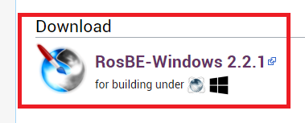

## RosBEの起動

インストールに成功したら、デスクトップにRosBEのアイコンが出来ているはずである。ダブルクリックしてRosBEを起動しよう。

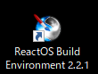

起動すると次のようなRosBEのコマンドプロンプトが表示される。

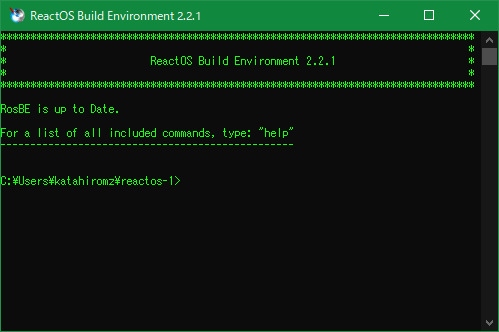

著者のユーザ名は`katahiromz`なので、読者の環境ではいくつか表示が異なるかもしれない。

## コマンドプロンプトの練習

コマンドプロンプトは、コマンドを受けとって、何かの処理を行う対話型端末である。１コマンドを入力し、Enterキーを押すと、コマンドプロンプトでコマンドを実行できる。

以下では、コマンドプロンプトの使い方を少し解説する。

### CDコマンド

`CD`コマンドはディレクトリ（フォルダの位置）を移動するコマンドである。

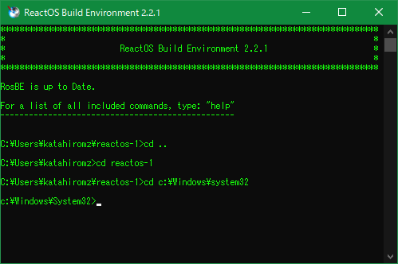

`cd ..`で一つ上のフォルダに移動できる。`cd (フォルダパス)`で現在のディレクトリを移動できる。相対パスと絶対パスのいずれかを指定できる。

試しに、マイドキュメントに移動してみよう。マイドキュメントの位置（例えば、筆者の環境では`C:\User\katahiromz\Documents`）を確認して、CDコマンドで指定すると移動できる。

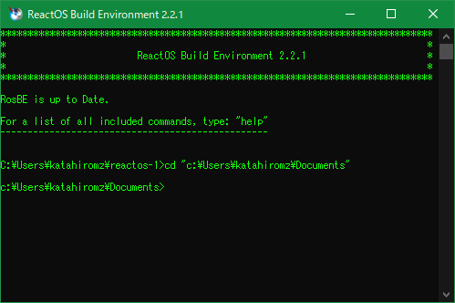

## `DIR`コマンド

`DIR`コマンドで現在のフォルダにあるファイルやフォルダの一覧を見ることができる。`CD`コマンドで`C:\Windows\system32`に移動して`dir`を実行してみよう。

## コマンドを中断するには

`C:\Windows\system32`には、大量のファイルがあるので、ここで`DIR`コマンドを実行すると、実行が止まらなくなるかもしれない。`Ctrl+C`を押すと、現在実行中のコマンドを中断することができる。

## `MD`/`MKDIR`コマンド

`MD`コマンド（`MKDIR`コマンド）でフォルダを作成できる。

`C:`ドライブのルートに「`dev`」というフォルダを作り、その中に「`cxx`」というフォルダを作ってみよう。

```cmd
cd C:\
md dev
cd dev
md cxx
dir
```

このようにコマンドを入力すると以下のような表示になる。

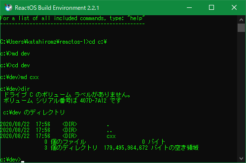

## `START .`コマンド

`start .`（スタート、スペース、ドット）コマンドを使えば現在のフォルダをエクスプローラーで開くことができる。

# C++/Win32開発の実践

## 初めてのC++プログラム（hello.cpp）

C/C++では、ソースファイル（拡張子`.c`/`.cpp`）をC++コンパイラでコンパイルしてできたオブジェクトファイル（拡張子`.o`/`.obj`）をライブラリ（`lib*.a`/`*.lib`）とリンクすると、EXEファイルやDLLファイルができる。コンパイルとリンクを合わせてEXEファイルやDLLファイルなどを作ることを構築（ビルド; build）という。ビルドのイメージは次のようになる。

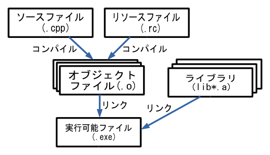

それでは、実際にソースファイルを作成しよう。`C:\dev\cxx`に次のような内容の`hello.cpp`というテキストファイルを作成して下さい。

```cpp
#include <cstdio>
int main(void) 
{
    printf("Hello, world\n");
}
```

念のため、プログラミングで使う記号について確認しよう。以下は半角英数モードで入力する。

1. `#include` の`#`はシャープ記号で、キーボードの`Shift`キーを押しながらキーボード左上の「`3`」を押せば入力できる。
2. `<cstdio>` の`<`と`>`は、不等号であり、`Shift`キーを押しながらキーボードの「`ね`」、もしくは「`る`」を押せば入力できる。
3. `(`と`)`は、丸カッコであり、`Shift`キーを押しながらキーボード中央の「`8`」または「`9`」を押せば入力できる。
4. `"`は、二重引用符であり、`Shift`キーを押しながらキーボード左上の「`2`」を押せば入力できる。
5. `\`は、バックスラッシュ（\）または半角の円記号（￥）であり、半角英数モードでキーボード右下の「`ろ`」を押せば入力できる。
6. `;`は、セミコロンである。半角英数モードでキーボードの「`れ`」を押せば入力できる。

`printf`の呼び出しが右にずれているのは、インデント（indent; 字下げ）といって、プログラムの構造を見やすくするためである。キーボードの左側の`Tab`キーを押せばインデントできる。

## コンパイルの方法

RosBEではC++コンパイラとして`g++`を使用する。`CD`コマンドで`C:\dev\cxx`に移動し、次のように入力すれば`hello.cpp`をコンパイル・実行できる。

```cmd
g++ hello.cpp -o hello
hello
```

エラーメッセージが表示されたら、何か文字を間違えているかもしれません。`hello.cpp`の内容を注意深く確認して下さい。

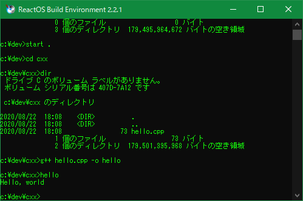

無事にコンパイルが終了すると、EXEファイル`C:\dev\cxx\hello.exe`が作成され、`hello.exe`が実行可能になる。`hello`と入力すると、同じフォルダにある`hello.exe`が実行され、`Hello, world`と表示される。

このようにしてRosBEで作成したプログラムは、おそらくWindows XPでも実行可能である。

これで、あなたはWindowsXP以降で動作するC++プログラムを作成できた。

## 初めてのWin32プログラム（hello2.cpp）

次はWin32プログラムを作ってみよう。次のような内容の`hello2.cpp`を作って下さい。

```cpp
#include <windows.h>
#include <cstdio>
int main(void) 
{
    if (MessageBoxA(NULL, "Yes or No?", "Test",
                    MB_ICONINFORMATION | MB_YESNO) == IDYES)
    {
        printf("You chose YES\n");
    }
    else
    {
        printf("You chose NO\n");
    }
}
```

```cmd
g++ hello2.cpp -o hello2
hello2
```

これを実行すると、黒い画面の上にメッセージボックスが表示され「はい」か「いいえ」の選択を促される。「はい」を選択すると`"You chose YES"`と表示される。「いいえ」を選択すると`"You chose NO"`と表示される。`MessageBoxA`はメッセージボックスを表示するWin32 API関数`MessageBox`のANSI版であり、これを使うために事前に`#include <windows.h>`が必要になる。

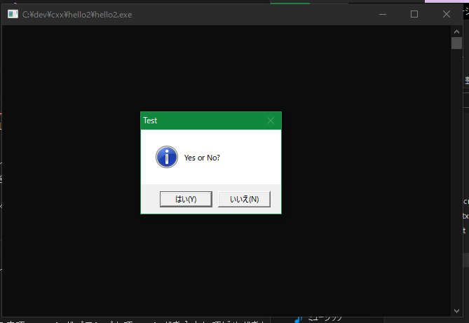

コマンドプロンプトから`hello2.exe`を実行できるし、`hello2.exe`をダブルクリックしても実行可能である。

これであなたもWin32プログラムを作り、Win32 API関数を呼び出すことでWin32 APIの入口に入ったのである。「見習いWin32プログラマ」の称号を授けよう。

## CMake/Ninjaとは

ここまで、コマンドプロンプトでいちいちコマンドを入力してビルドをしていたが、複雑なプロジェクトになると、コマンド入力では対応できない。C/C++ではCMakeというビルド支援ソフトを使うと、ビルド処理を自動化できる。

CMakeでは次のような手順でプロジェクトをビルドする。

1. プロジェクトのフォルダに`CMakeLists.txt`というテキストファイルを作成する。`CMakeLists.txt`には、プロジェクトのビルド方法をCMakeの言葉で記述する。
2. CMakeプログラムを起動して`CMakeLists.txt`からビルドに必要なファイルを生成させる。
3. 生成されたファイルを使ってプロジェクトをビルドする。

RosBEでは実際にビルドを実行させるのはNinjaという名のジェネレータ（generator）である。MinGWやMSYS2ではMakefile であり、Visual Studioではプロジェクトファイル＆ソリューションファイルである。`cmake`の`-G`オプションでジェネレータを指定できる。ジェネレータの一覧は`cmake -G`コマンドで見ることができる。

## CMake/Ninjaによるビルド

それではCMake/Ninjaによるビルドを試してみよう。まずは、プロジェクトに必要なファイルをフォルダで分けないといけない。`C:\dev\cxx`に`hello2`というフォルダを作成し、そこに先ほど作成した`hello2.cpp`を移動する。そして、`C:\dev\cxx`に次のようなファイル`CMakeLists.txt`を作成する。

```txt
cmake_minimum_required(VERSION 2.4)
project(hello2 C CXX RC)
add_executable(hello2 hello2.cpp)
```

一行目の`cmake_minimum_required`は、CMakeの最小バージョンを指定するものである。次の`project`はプロジェクト名と使用する言語（`C CXX RC`）を指定するものである。最後の行の`add_executable(hello2 hello2.cpp)`は`hello2.exe`というEXEファイルのビルド方法を指定するものである。

RosBEで`CD`コマンドで`C:\dev\cxx\hello2`フォルダに移動し、次のようにコマンドを実行すると、`hello2`のビルドが完了する。

```cmd
cmake -G "Ninja" .
ninja
```

実行結果は次の通り。

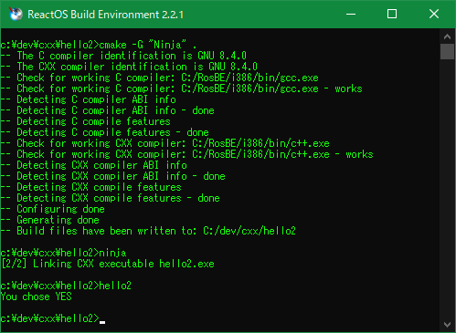

ビルドの際にEXE以外にさまざまなファイルが作成されるが、無視してもよい。

## リソーエディタのインストール

次は、ダイアログ ボックス（dialog box; 通称ダイアログ）を表示するプログラムを作成してみよう。ダイアログとはユーザーに対して対話的なウィンドウのことであり、メッセージボックスもダイアログの一種である。

しかし、簡単にダイアログを作成するには「リソースファイル」（拡張子`.rc`）というものが必要になる。そこで、リソースを編集・作成するための「リソースエディタ」というものが必要になる。

この文書ではリソースエディタとして「リソーエディタ」（RisohEditor）を使用する。次のリンクからリソーエディタをダウンロード＆インストールして下さい。

- リソーエディタ [https://katahiromz.web.fc2.com/re/ja/](https://katahiromz.web.fc2.com/re/ja/)

リソーエディタをインストールすれば、次のようなアイコンがデスクトップに作成される。

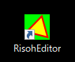

リソーエディタの詳しい使い方については、次のまとめサイトを参照されたい。

- まとめサイト [https://katahiromz.web.fc2.com/colony3rd/risoheditor/](https://katahiromz.web.fc2.com/colony3rd/risoheditor/)

## 初めてのダイアログアプリ（dialog.cpp）

ではダイアログアプリを作成しよう。`C:\dev\cxx`に`dialog`というフォルダを作成し、次のC++ソースファイル`dialog.cpp`を作成する。

```cpp
#include <windows.h>
#include <windowsx.h>

BOOL OnInitDialog(HWND hwnd, HWND hwndFocus, LPARAM lParam)
{
    return TRUE;
}

void OnCommand(HWND hwnd, int id, HWND hwndCtl, UINT codeNotify)
{
    switch (id)
    {
    case IDOK:
    case IDCANCEL:
        EndDialog(hwnd, id);
        break;
    }
}

INT_PTR CALLBACK
DialogProc(HWND hwnd, UINT uMsg, WPARAM wParam, LPARAM lParam)
{
    switch (uMsg)
    {
        HANDLE_MSG(hwnd, WM_INITDIALOG, OnInitDialog);
        HANDLE_MSG(hwnd, WM_COMMAND, OnCommand);
    }
    return 0;
}

INT WINAPI
WinMain(HINSTANCE   hInstance,
        HINSTANCE   hPrevInstance,
        LPSTR       lpCmdLine,
        INT         nCmdShow)
{
    DialogBox(hInstance, MAKEINTRESOURCE(1), NULL, DialogProc);
    return 0;
}
```

急にプログラムがややこしくなったが、１つ１つ理解していけば問題ない。
`#include <windows.h>`は、Win32 APIを使うために必要なヘッダをインクルードする。`#include <windowsx.h>`は、`HANDLE_MSG`マクロを使用するために必要である。`HANDLE_MSG`マクロは、メッセージハンドラとウィンドウプロシージャ（もしくはダイアログプロシージャ）を結び付けるのに使う。メッセージハンドラとは、ウィンドウで発生したイベントに応じて発生するメッセージを処理する関数である。ダイアログプロシージャは、ここでは`DialogProc`関数のことである。ダイアログプロシージャは典型的なイベント駆動型プログラミングを実装する。`WM_INITDIALOG`メッセージはダイアログの初期化のときに発生する。`WM_COMMAND`メッセージはダイアログでコマンドが発生したとき（ボタンが押されたときなど）に発生する。

ここでは、main関数の代わりに`WinMain`という関数を使う。main関数を使うと黒い画面が表示されるが、ウィンドウアプリでは黒い画面は不必要なので`main`関数は使わない。`DialogBox`関数はダイアログを表示するAPI関数である。`HWND`は、ウィンドウのハンドルを格納する型である。`UINT`は`unsigned int`型と同じである。`WPARAM`や`LPARAM`は、ポインタと同じサイズの整数型である。`DialogProc`関数では`WM_INITDIALOG`メッセージと`WM_COMMAND`メッセージを処理している。`DialogBox`や`WM_INITDIALOG`などの意味については、それをインターネットで検索すれば出てくる。

開発が進むにつれて、複雑なコードを何度も入力するはめになるが、`WinMain`や`DialogProc`などのよく使うコードは、コピーしたり、テンプレートを使ったり、マクロなどで自動入力すれば問題ない。入力補助として`MsgCrack`というソフトがあるので活用されたい。

- MsgCrack [https://katahiromz.web.fc2.com/msgcrack/ja/](https://katahiromz.web.fc2.com/msgcrack/ja/)

次はリソースファイルである。リソーエディタで以下の手順に従って`dialog_res.rc`ファイルを作成する。`dialog_res`の下線（`_`）は、`Shift`キーを押しながら「`ろ`」で入力する。名前に`_res`を付けたのはオブジェクトファイルの名前を衝突させないためである。

1. リソーエディタを開く。
2. 「編集」メニューから「追加」→「ダイアログを追加」を選び、「リソースの名前」に「1」（いち）を入力し、「OK」ボタンを押す。`RT_DIALOG`→`1`→`日本語`が追加される。
3. 「ファイル」メニューから「名前を付けて保存」を選び、`c:\dev\cxx\dialog`に「`dialog_res.rc`」という名前で保存する。
4. 「保存」オプションが表示されたら、「言語別にファイルを分ける」のチェックを外し、「OK」ボタンを押す。
5. 左下に「ファイルを保存しました」と表示されたら完了。リソーエディタを閉じる。

このように保存すると、`dialog_res.rc`ファイルは次のような内容になる。

```rc
// dialog_res.rc
// This file is automatically generated by RisohEditor.
// † <-- This dagger helps UTF-8 detection.

#define APSTUDIO_HIDDEN_SYMBOLS
#include <windows.h>
#include <commctrl.h>
#undef APSTUDIO_HIDDEN_SYMBOLS
#pragma code_page(65001) // UTF-8

//////////////////////////////////////////////////////////////////////////////

LANGUAGE LANG_JAPANESE, SUBLANG_DEFAULT

//////////////////////////////////////////////////////////////////////////////
// RT_DIALOG

1 DIALOG 0, 0, 215, 135
CAPTION "サンプル ダイアログ"
STYLE DS_CENTER | DS_MODALFRAME | WS_POPUPWINDOW | WS_CAPTION
FONT 9, "MS UI Gothic"
{
    DEFPUSHBUTTON "OK", IDOK, 35, 115, 60, 14
    PUSHBUTTON "キャンセル", IDCANCEL, 115, 115, 60, 14
}

...(以下略)...
```

このようにリソースを使えば、日本語の埋め込みも問題ない。

次に次のような内容の`CMakeLists.txt`を作成する。

```txt
cmake_minimum_required(VERSION 2.4)
project(dialog C CXX RC)
add_executable(dialog WIN32 dialog.cpp dialog_res.rc)
target_link_libraries(dialog PRIVATE comctl32)
```

さらに、`cmake -G "Ninja" .`と`ninja`を実行すれば、`dialog.exe`がビルドされる。

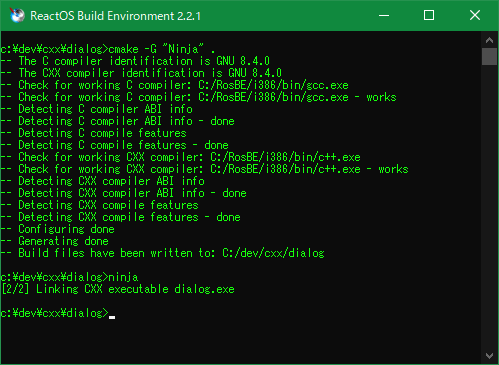

解説しよう。`CMakeLists.txt`の`add_executable`に`WIN32`があるのは、`main`関数を使わず、`WinMain`関数を使うためである。`WinMain`関数を使えば起動時に黒い画面は表示されない。リソースをコンパイルするために、`dialog_res.rc`を追加した。`target_link_libraries`については`dialog.exe`にリンクするDLLファイル`comctl32`を指定している。

それでは`dialog.exe`を実行してみよう。次のようなダイアログが開かれるはずである。

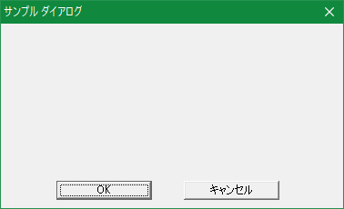

「OK」や「キャンセル」を押したら`EndDialog`関数でダイアログを終了するだけだ。

## 「OK」ボタンの処理を追加する

`EndDialog`の呼び出しの前に処理を追加すれば、ボタンを押したときに何か処理を行うことができる。例えば、「OK」ボタンを押したときに、`test.txt`というテキストファイルを作成するプログラムに改造してみよう。`WM_COMMAND`メッセージのプロシージャの`OnCommand`関数を次のように改造し、`OnOK`関数を追加する。

```cpp
void OnOK(HWND hwnd)
{
    if (FILE *fp = fopen("test.txt", "w"))
    {
        fprint(fp, "This is a test.\n");
        fclose(fp);
    }
    EndDialog(hwnd, IDOK);
}

void OnCommand(HWND hwnd, int id, HWND hwndCtl, UINT codeNotify)
{
    switch (id)
    {
    case IDOK:
        OnOK(hwnd);
        break;
    case IDCANCEL:
        EndDialog(hwnd, id);
        break;
    }
}
```

これで「OK」ボタンを押すと、`"test.txt"`というファイルを作成するようになった。

## ダイアログアプリにアイコンを追加する

このダイアログアプリにメインアイコンを追加しよう。アイコンを追加すれば、アプリのアイコンを変更することができる。

1. インターネットから「無料素材」のアイコンファイル (拡張子`.ico`)を探してダウンロードする。
1. リソーエディタで`dialog_res.rc`を開く。
2. 「編集」メニューから「追加」→「アイコンを追加」を順番に選ぶ。
3. 「参照」ボタンを押してアイコンファイルを指定する。
4. リソースの名前に「1」（いち）と入力する
5. 「OK」ボタンを押すと、`RT_GROUP_ICON`と`RT_ICON`が追加される。
6. 上書き保存する。

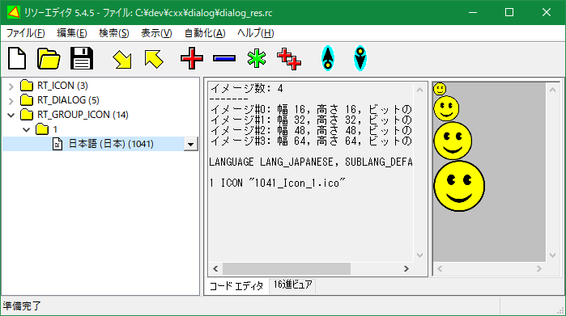

さらにダイアログでこのアイコンを使うように`WM_INITDIALOG`のプロシージャを変更しよう。

```cpp
static HICON s_hIcon = NULL;
static HICON s_hIconSmall = NULL;

BOOL OnInitDialog(HWND hwnd, HWND hwndFocus, LPARAM lParam)
{
    HINSTANCE hinst = GetModuleHandle(NULL);
    s_hIcon = LoadIcon(hinst, MAKEINTRESOURCE(1));
    s_hIconSmall = 
        (HICON)LoadImage(hinst, MAKEINTRESOURCE(1), IMAGE_ICON,
            GetSystemMetrics(SM_CXSMICON),
            GetSystemMetrics(SM_CYSMICON), 0);
    SendMessage(hwnd, WM_SETICON, ICON_BIG, (LPARAM)s_hIcon);
    SendMessage(hwnd, WM_SETICON, ICON_SMALL, (LPARAM)s_hIconSmall);

    return TRUE;
}
```

一つずつ説明しよう。`s_hIcon`と`s_hIconSmall`はアイコンのハンドルを格納するための変数である。ハンドルというものを使えば、Win32の様々な操作対象を操作できる。`GetModuleHandle(NULL)`は現在のアプリのインスタンス（モジュール）を取得する。これは現在のEXEのアイコンを読み込むために使用する。`LoadIcon`は通常の大きさ(32x32)のアイコンを読み込むAPI関数だ。リソース名には`1`を指定している。`LoadImage` API 関数は小さいアイコン(16x16)を読み込むために使っている。`GetSystemMetrics` API 関数は小さいアイコンのサイズを取得するために使用する。小さいアイコンは通常16x16ピクセルだが、システムによっては違う値の可能性もある。

`SendMessage`関数でダイアログのウィンドウに`WM_SETICON`メッセージを送信すると、ダイアログにアイコンをセットできる。

使い終わったアイコンは、`DestroyIcon`関数で破棄した方がよい。`WinMain`関数にアイコンの破棄コードを追記する。

```cpp
INT WINAPI
WinMain(HINSTANCE   hInstance,
        HINSTANCE   hPrevInstance,
        LPSTR       lpCmdLine,
        INT         nCmdShow)
{
    DialogBox(hInstance, MAKEINTRESOURCE(1), NULL, DialogProc);
    DestroyIcon(s_hIcon);
    DestroyIcon(s_hIconSmall);
    return 0;
}
```

では、再び`ninja`を実行してビルドしよう。EXEファイルのアイコンが変更され、実行するとアイコン付きのダイアログになる。

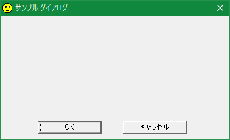

ここまでのソース`dialog.cpp`は以下の通り。

```cpp
#include <windows.h>
#include <windowsx.h>

static HICON s_hIcon = NULL;
static HICON s_hIconSmall = NULL;

BOOL OnInitDialog(HWND hwnd, HWND hwndFocus, LPARAM lParam)
{
    HINSTANCE hinst = GetModuleHandle(NULL);
    s_hIcon = LoadIcon(hinst, MAKEINTRESOURCE(1));
    s_hIconSmall = 
        (HICON)LoadImage(hinst, MAKEINTRESOURCE(1), IMAGE_ICON,
            GetSystemMetrics(SM_CXSMICON),
            GetSystemMetrics(SM_CYSMICON), 0);
    SendMessage(hwnd, WM_SETICON, ICON_BIG, (LPARAM)s_hIcon);
    SendMessage(hwnd, WM_SETICON, ICON_SMALL, (LPARAM)s_hIconSmall);
    return TRUE;
}

void OnOK(HWND hwnd)
{
    if (FILE *fp = fopen("test.txt", "w"))
    {
        fprint(fp, "This is a test.\n");
        fclose(fp);
    }
    EndDialog(hwnd, IDOK);
}

void OnCommand(HWND hwnd, int id, HWND hwndCtl, UINT codeNotify)
{
    switch (id)
    {
    case IDOK:
        OnOK(hwnd);
        break;
    case IDCANCEL:
        EndDialog(hwnd, id);
        break;
    }
}

INT_PTR CALLBACK
DialogProc(HWND hwnd, UINT uMsg, WPARAM wParam, LPARAM lParam)
{
    switch (uMsg)
    {
        HANDLE_MSG(hwnd, WM_INITDIALOG, OnInitDialog);
        HANDLE_MSG(hwnd, WM_COMMAND, OnCommand);
    }
    return 0;
}

INT WINAPI
WinMain(HINSTANCE   hInstance,
        HINSTANCE   hPrevInstance,
        LPSTR       lpCmdLine,
        INT         nCmdShow)
{
    DialogBox(hInstance, MAKEINTRESOURCE(1), NULL, DialogProc);
    DestroyIcon(s_hIcon);
    DestroyIcon(s_hIconSmall);
    return 0;
}
```

リソースファイル`dialog_res.rc`は次のようになる。

```rc
// dialog_res.rc
// This file is automatically generated by RisohEditor.
// † <-- This dagger helps UTF-8 detection.

#define APSTUDIO_HIDDEN_SYMBOLS
#include <windows.h>
#include <commctrl.h>
#undef APSTUDIO_HIDDEN_SYMBOLS
#pragma code_page(65001) // UTF-8

//////////////////////////////////////////////////////////////////////////////

LANGUAGE LANG_JAPANESE, SUBLANG_DEFAULT

//////////////////////////////////////////////////////////////////////////////
// RT_DIALOG

1 DIALOG 0, 0, 215, 135
CAPTION "サンプル ダイアログ"
STYLE DS_CENTER | DS_MODALFRAME | WS_POPUPWINDOW | WS_CAPTION
FONT 9, "MS UI Gothic"
{
    DEFPUSHBUTTON "OK", IDOK, 35, 115, 60, 14
    PUSHBUTTON "キャンセル", IDCANCEL, 115, 115, 60, 14
}

//////////////////////////////////////////////////////////////////////////////
// RT_GROUP_ICON

1 ICON "res/1041_Icon_1.ico"

...(以下略)...
```


## ラベルとテキストボックスを追加する

次にダイアログにラベルとテキストボックスを追加・配置する。

リソーエディタで`dialog_res.rc`を開く。`RT_DIALOG`→`1`→`日本語`を選択し、ダブルクリックする。「ダイアログの編集」が開かれる。

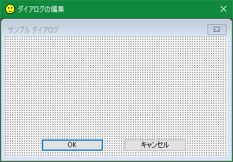

ラベルを追加する。右クリックして「コントロールの追加」を選ぶ。

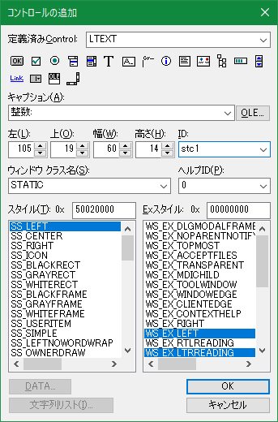

「定義済みControl:」に`LTEXT`と入力する。「キャプション:」に「整数:」と入力する。「ID:」に「`stc1`」と入力する。「OK」ボタンを押す。

ラベル「整数:」が追加されるのでサイズと位置を調整する。

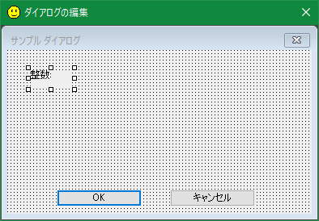

次にテキストボックスを追加する。右クリックして「コントロールの追加」を選ぶ。

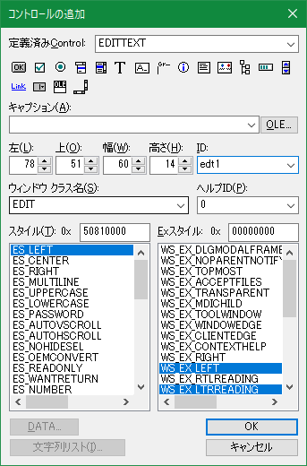

「定義済みControl:」に「EDITTEXT」と入力し、「ID:」に「edt1」と入力する。「OK」ボタンを押す。

ボタンが追加される。位置とサイズを調整する。

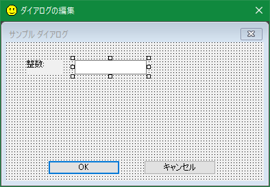

「ダイアログの編集」を閉じ、変更内容を上書き保存する。

これでラベル（`LTEXT`）とテキストボックス（`EDITTEXT`）を追加できた。`ninja`を再び実行してビルドしよう。

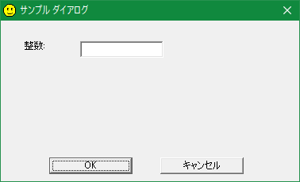

２個のコントロールが追加されている。リソースファイル`dialog_res.rc`は次のようになる。

```rc
// dialog_res.rc
// This file is automatically generated by RisohEditor.
// † <-- This dagger helps UTF-8 detection.

#define APSTUDIO_HIDDEN_SYMBOLS
#include <windows.h>
#include <commctrl.h>
#undef APSTUDIO_HIDDEN_SYMBOLS
#pragma code_page(65001) // UTF-8

//////////////////////////////////////////////////////////////////////////////

LANGUAGE LANG_JAPANESE, SUBLANG_DEFAULT

//////////////////////////////////////////////////////////////////////////////
// RT_DIALOG

1 DIALOG 0, 0, 215, 135
CAPTION "サンプル ダイアログ"
STYLE DS_CENTER | DS_MODALFRAME | WS_POPUPWINDOW | WS_CAPTION
FONT 9, "MS UI Gothic"
{
    DEFPUSHBUTTON "OK", IDOK, 35, 115, 60, 14
    PUSHBUTTON "キャンセル", IDCANCEL, 115, 115, 60, 14
    LTEXT "整数:", stc1, 17, 17, 29, 14
    EDITTEXT edt1, 57, 17, 60, 14
}

//////////////////////////////////////////////////////////////////////////////
// RT_GROUP_ICON

1 ICON "res/1041_Icon_1.ico"

...(以下略)...
```

## 処理を追加

これでコントロールIDが`stc1`のSTATICコントロール（ラベル）と、コントロールIDが`edt1`のEDITコントロール（テキストボックス）が追加された。

入力された整数の２倍の整数を求めるという処理を追加してみよう。現在、`OnOK`関数は次のようになっている。

```cpp
void OnOK(HWND hwnd)
{
    if (FILE *fp = fopen("test.txt", "w"))
    {
        fprint(fp, "This is a test.\n");
        fclose(fp);
    }
    EndDialog(hwnd, IDOK);
}
```

これを書き換えて２倍の整数を求めるようにする。

```cpp
void OnOK(HWND hwnd)
{
    INT n = GetDlgItemInt(hwnd, edt1, NULL, TRUE) * 2;
    WCHAR szText[64];
    wsprintfW(szText, L"%d", n);
    MessageBoxW(hwnd, szText, L"Nibai", MB_ICONINFORMATION);
    EndDialog(hwnd, IDOK);
}
```

テキストボックスに入力された整数を取得するには、`GetDlgItemInt`というAPI 関数が用意されているのでこれを使う。`wsprintfW`はC言語の`sprint`に似た関数だが、Unicodeに対応しているところと浮動小数点数に対応していないところが違う。C言語の文字列リテラルの最初に`L`が付いていると、Unicode文字列になる。よって`L"%d"`は、Unicode文字列リテラルである。`MessageBoxW`関数はメッセージボックスを表示してボタンが押されるまで待つ関数`MessageBox`のUnicode版である。

では`ninja`を実行して再びビルドして`dialog.exe`を実行しよう。

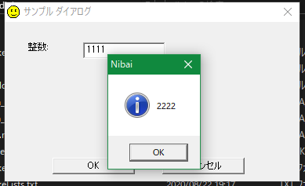

テキストボックスに「1111」と入力して「OK」ボタンをクリックすればメッセージボックスで「2222」と返ってくる。その後、メッセージボックスを閉じると、ダイアログは自動的に閉じられる。

ここまでのソースを以下に示す。

```cpp
#include <windows.h>
#include <windowsx.h>

static HICON s_hIcon = NULL;
static HICON s_hIconSmall = NULL;

BOOL OnInitDialog(HWND hwnd, HWND hwndFocus, LPARAM lParam)
{
    HINSTANCE hinst = GetModuleHandle(NULL);
    s_hIcon = LoadIcon(hinst, MAKEINTRESOURCE(1));
    s_hIconSmall = 
        (HICON)LoadImage(hinst, MAKEINTRESOURCE(1), IMAGE_ICON,
            GetSystemMetrics(SM_CXSMICON),
            GetSystemMetrics(SM_CYSMICON), 0);
    SendMessage(hwnd, WM_SETICON, ICON_BIG, (LPARAM)s_hIcon);
    SendMessage(hwnd, WM_SETICON, ICON_SMALL, (LPARAM)s_hIconSmall);
    return TRUE;
}

void OnOK(HWND hwnd)
{
    INT n = GetDlgItemInt(hwnd, edt1, NULL, TRUE) * 2;
    WCHAR szText[64];
    wsprintfW(szText, L"%d", n);
    MessageBoxW(hwnd, szText, L"Nibai", MB_ICONINFORMATION);
    EndDialog(hwnd, IDOK);
}

void OnCommand(HWND hwnd, int id, HWND hwndCtl, UINT codeNotify)
{
    switch (id)
    {
    case IDOK:
        OnOK(hwnd);
        break;
    case IDCANCEL:
        EndDialog(hwnd, id);
        break;
    }
}

INT_PTR CALLBACK
DialogProc(HWND hwnd, UINT uMsg, WPARAM wParam, LPARAM lParam)
{
    switch (uMsg)
    {
        HANDLE_MSG(hwnd, WM_INITDIALOG, OnInitDialog);
        HANDLE_MSG(hwnd, WM_COMMAND, OnCommand);
    }
    return 0;
}

INT WINAPI
WinMain(HINSTANCE   hInstance,
        HINSTANCE   hPrevInstance,
        LPSTR       lpCmdLine,
        INT         nCmdShow)
{
    DialogBox(hInstance, MAKEINTRESOURCE(1), NULL, DialogProc);
    DestroyIcon(s_hIcon);
    DestroyIcon(s_hIconSmall);
    return 0;
}
```

リソースファイル`dialog_res.rc`は以下の通りである。

```rc
// dialog_res.rc
// This file is automatically generated by RisohEditor.
// † <-- This dagger helps UTF-8 detection.

#define APSTUDIO_HIDDEN_SYMBOLS
#include <windows.h>
#include <commctrl.h>
#undef APSTUDIO_HIDDEN_SYMBOLS
#pragma code_page(65001) // UTF-8

//////////////////////////////////////////////////////////////////////////////

LANGUAGE LANG_JAPANESE, SUBLANG_DEFAULT

//////////////////////////////////////////////////////////////////////////////
// RT_DIALOG

1 DIALOG 0, 0, 215, 135
CAPTION "サンプル ダイアログ"
STYLE DS_CENTER | DS_MODALFRAME | WS_POPUPWINDOW | WS_CAPTION
FONT 9, "MS UI Gothic"
{
    DEFPUSHBUTTON "OK", IDOK, 35, 115, 60, 14
    PUSHBUTTON "キャンセル", IDCANCEL, 115, 115, 60, 14
    LTEXT "整数:", stc1, 17, 17, 29, 14
    EDITTEXT edt1, 57, 17, 60, 14
}

//////////////////////////////////////////////////////////////////////////////
// RT_GROUP_ICON

1 ICON "res/1041_Icon_1.ico"

...(以下略)...
```

## キーボード操作を考慮する

ダイアログを開いて`Tab`キーを何度か押してみよう。


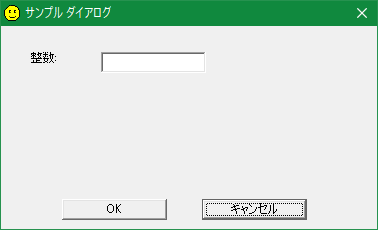
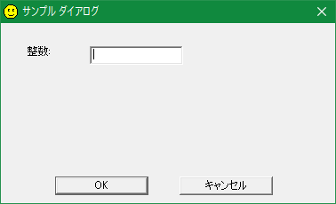

見ればわかるように、`Tab`キーは「キーボード フォーカス」というものを移動させる。フォーカスというのは、現在のキーボード操作対象のコントロールのことである。最初は「OK」ボタンにフォーカスがある。次は「キャンセル」ボタンにフォーカスが移る。最後にテキストボックスにフォーカスが移る。もう一度`Tab`キーを押すと「OK」ボタンに戻る。

テキストボックスはフォーカスがないと入力できない。最初にテキストボックスにフォーカスがある方がユーザーにとって親切だろう。そこで、コントロールの順序を次のように変えて、上書き保存する。

```rc
1 DIALOG 0, 0, 215, 135
CAPTION "サンプル ダイアログ"
STYLE DS_CENTER | DS_MODALFRAME | WS_POPUPWINDOW | WS_CAPTION
FONT 9, "MS UI Gothic"
{
    LTEXT "整数:", stc1, 17, 17, 29, 14
    EDITTEXT edt1, 57, 17, 60, 14
    DEFPUSHBUTTON "OK", IDOK, 35, 115, 60, 14
    PUSHBUTTON "キャンセル", IDCANCEL, 115, 115, 60, 14
}
```

これで`WM_INITDIALOG`メッセージで`TRUE`を返すと、自動的にedt1にフォーカスが当たるようになる。`ninja`を実行してもう一度試してみよう。


今度は、最初に`edt1`にフォーカスが当たる。これでダイアログを開いたらすぐに整数を入力できる。

ダイアログを開いているときは、キーボードで`Enter`を押すと、デフォルトのボタン（`DEFPUSHBUTTON`）が押されるようになっている。`Esc`キーは「キャンセル」ボタン（`IDCANCEL`）と同じである。

## 数字のみを受け付ける

テキストボックスで数字のみ入力を許可し、それ以外の入力を禁止する場合は、`ES_NUMBER`スタイルを使うとよい。スタイルというのは、ウィンドウやコントロールの振る舞いを変えるものである。

```rc
1 DIALOG 0, 0, 215, 135
CAPTION "サンプル ダイアログ"
STYLE DS_CENTER | DS_MODALFRAME | WS_POPUPWINDOW | WS_CAPTION
FONT 9, "MS UI Gothic"
{
    LTEXT "整数:", stc1, 17, 17, 29, 14
    EDITTEXT edt1, 57, 17, 60, 14, ES_NUMBER
    DEFPUSHBUTTON "OK", IDOK, 35, 115, 60, 14
    PUSHBUTTON "キャンセル", IDCANCEL, 115, 115, 60, 14
}
```

`EDITTEXT`に「`, ES_NUMBER`」を追記して上書き保存する。`ninja`を実行。これで数字以外を入力できなくなった。

## 文字列テーブルで国際化

```cpp
    MessageBoxW(hwnd, szText, L"Nibai", MB_ICONINFORMATION);
```

に`L"Nibai"というテキストがあるが、これを日本語化したい。しかしソースコードに直接日本語の`L"二倍"`と書くのは、互換性がない。

そこでリソースの「文字列テーブル」というものを使う。

1. `dialog_res.rc`をリソーエディタで開く。
2. 「編集」メニューの「追加」→「文字列テーブルを追加」を選ぶ。
3. 「OK」ボタンを押す。文字列テーブル「`RT_STRING`」→「日本語」が追加される。
4. 次のように編集する。

```rc
LANGUAGE LANG_JAPANESE, SUBLANG_DEFAULT

STRINGTABLE
{
    100, "二倍した結果"
}
```

二重引用符（`"`）は半角で入力しなければならない。ツールバーの一番左のボタン「再コンパイル」をクリックする。「再コンパイルしました。」と表示されたら成功。上書き保存する。これでリソース側の準備ができた。

文字列テーブルの文字列を読み込むには`LoadString`というAPI関数を使う。

```c
int WINAPI LoadStringW (HINSTANCE hInstance, UINT uID, LPWSTR lpBuffer, int cchBufferMax);
```

しかし、`LoadStringW`という関数には４つも引数がある。これを毎回呼び出すのは手間が掛かるので次のようなヘルパー関数`LoadStringDx`を追加する。

```cpp
LPWSTR LoadStringDx(INT nID)
{
    static UINT s_index = 0;
    const UINT cchBuffMax = 1024;
    static WCHAR s_sz[4][cchBuffMax];

    WCHAR *pszBuff = s_sz[s_index];
    s_index = (s_index + 1) % _countof(s_sz);
    pszBuff[0] = 0;
    ::LoadStringW(NULL, nID, pszBuff, cchBuffMax);
    return pszBuff;
}
```

これで`LoadStringDx(100)`のように呼ぶと100番の文字列を読み込むことができる。

```cpp
void OnOK(HWND hwnd)
{
    INT n = GetDlgItemInt(hwnd, edt1, NULL, TRUE) * 2;
    WCHAR szText[64];
    wsprintfW(szText, L"%d", n);
    MessageBoxW(hwnd, szText, LoadStringDx(100), MB_ICONINFORMATION);
    EndDialog(hwnd, IDOK);
}
```

文字列テーブルには日本語バージョン以外に英語やフランス語バージョンなどを追加できるので、これで国際化ができるようになった。

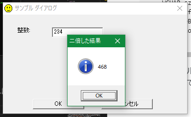

ソース（`dialog.cpp`）は次の通りである。

```cpp
#include <windows.h>
#include <windowsx.h>

static HICON s_hIcon = NULL;
static HICON s_hIconSmall = NULL;

LPWSTR LoadStringDx(INT nID)
{
    static UINT s_index = 0;
    const UINT cchBuffMax = 1024;
    static WCHAR s_sz[4][cchBuffMax];

    WCHAR *pszBuff = s_sz[s_index];
    s_index = (s_index + 1) % _countof(s_sz);
    pszBuff[0] = 0;
    ::LoadStringW(NULL, nID, pszBuff, cchBuffMax);
    return pszBuff;
}

BOOL OnInitDialog(HWND hwnd, HWND hwndFocus, LPARAM lParam)
{
    HINSTANCE hinst = GetModuleHandle(NULL);
    s_hIcon = LoadIcon(hinst, MAKEINTRESOURCE(1));
    s_hIconSmall = 
        (HICON)LoadImage(hinst, MAKEINTRESOURCE(1), IMAGE_ICON,
            GetSystemMetrics(SM_CXSMICON),
            GetSystemMetrics(SM_CYSMICON), 0);
    SendMessage(hwnd, WM_SETICON, ICON_BIG, (LPARAM)s_hIcon);
    SendMessage(hwnd, WM_SETICON, ICON_SMALL, (LPARAM)s_hIconSmall);
    return TRUE;
}

void OnOK(HWND hwnd)
{
    INT n = GetDlgItemInt(hwnd, edt1, NULL, TRUE) * 2;
    WCHAR szText[64];
    wsprintfW(szText, L"%d", n);
    MessageBoxW(hwnd, szText, LoadStringDx(100), MB_ICONINFORMATION);
    EndDialog(hwnd, IDOK);
}

void OnCommand(HWND hwnd, int id, HWND hwndCtl, UINT codeNotify)
{
    switch (id)
    {
    case IDOK:
        OnOK(hwnd);
        break;
    case IDCANCEL:
        EndDialog(hwnd, id);
        break;
    }
}

INT_PTR CALLBACK
DialogProc(HWND hwnd, UINT uMsg, WPARAM wParam, LPARAM lParam)
{
    switch (uMsg)
    {
        HANDLE_MSG(hwnd, WM_INITDIALOG, OnInitDialog);
        HANDLE_MSG(hwnd, WM_COMMAND, OnCommand);
    }
    return 0;
}

INT WINAPI
WinMain(HINSTANCE   hInstance,
        HINSTANCE   hPrevInstance,
        LPSTR       lpCmdLine,
        INT         nCmdShow)
{
    DialogBox(hInstance, MAKEINTRESOURCE(1), NULL, DialogProc);
    DestroyIcon(s_hIcon);
    DestroyIcon(s_hIconSmall);
    return 0;
}
```

リソース（`dialog_res.rc`）は次の通りである。

```rc
// dialog_res.rc
// This file is automatically generated by RisohEditor.
// † <-- This dagger helps UTF-8 detection.

#define APSTUDIO_HIDDEN_SYMBOLS
#include <windows.h>
#include <commctrl.h>
#undef APSTUDIO_HIDDEN_SYMBOLS
#pragma code_page(65001) // UTF-8

//////////////////////////////////////////////////////////////////////////////

LANGUAGE LANG_JAPANESE, SUBLANG_DEFAULT

//////////////////////////////////////////////////////////////////////////////
// RT_DIALOG

1 DIALOG 0, 0, 215, 135
CAPTION "サンプル ダイアログ"
STYLE DS_CENTER | DS_MODALFRAME | WS_POPUPWINDOW | WS_CAPTION
FONT 9, "MS UI Gothic"
{
    LTEXT "整数:", -1, 17, 17, 29, 14
    EDITTEXT edt1, 57, 17, 60, 14, ES_NUMBER
    DEFPUSHBUTTON "OK", IDOK, 35, 115, 60, 14
    PUSHBUTTON "キャンセル", IDCANCEL, 115, 115, 60, 14
}

//////////////////////////////////////////////////////////////////////////////
// RT_GROUP_ICON

1 ICON "res/1041_Icon_1.ico"

//////////////////////////////////////////////////////////////////////////////
// RT_STRING

STRINGTABLE
{
    100, "二倍した結果"
}

...(以下略)...
```
