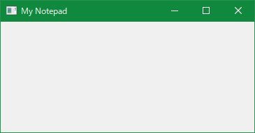
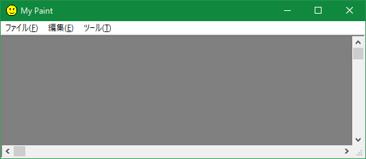

# はじめに

## この文書について

スマホに親しんだ若者がWindows 10で現代的な C++/Win32 のプログラムを作る場合に役立てばいいなと思って作りました。

## 基本精神

文字がわからなければ、親か先生に「あいうえお」と「アルファベット」を教えてもらって下さい。

パソコンの使い方が分からなければ、パソコン関係の本を調べる。Windowsを知らなければWindowsの本を調べる。

単語がわからなかったらGoogleで調べる。

- Google [https://google.co.jp](https://google.co.jp)

漢字がわからなかったら漢和辞典を見る。

無関係なことや細かいことは飛ばしてもよい。

調べても調べてもわからなかったらひとまず、ほっといて先読みしてみる。

## テキストファイルの作り方

最初に高機能なテキストエディタ（サクラエディタ、秀丸、VS Code など）をダウンロード＆インストールしないといけない。この本ではサクラエディタの使用を推奨する。

- サクラエディタ [https://sakura-editor.github.io/download.html](https://sakura-editor.github.io/download.html)

テキストエディタを起動して文字を書いて保存する。保存するには、右上の「ファイル」メニューから「上書き保存」を選ぶ。保存したい場所を選んで「保存」。これでテキストファイルが作成できる。

ファイルを編集したいなら、テキストエディタにファイルアイコンをドラッグ＆ドロップしてそれを開き、エディタで編集して保存する。

サクラエディタが嫌いであれば、Visual Studio Code (VS Code) などを使用してもよい。

## 日本語入力

キーボードの左上の「半角／全角」キーを押すと、日本語入力モードに入ったり出ることができる。日本語入力モードで適当に入力して「変換」キーを押して漢字交じりに変換、Enterキーで確定を繰り返すと日本語が入力できる。

## 大文字と小文字について

英語のアルファベットでは、`ABCDEF...`が大文字で、`abcdef...`が小文字である。

## 全角文字と半角文字について

以下の２つの文字列を比較してほしい：

- `ＡＢＣＤＥＦＧＨＩＪＫＬＭＮ`
- `ABCDEFGHIJKLMN`

前者が全角（ぜんかく）文字で、後者が半角（はんかく）文字である。昔のパソコンでは全角文字は半角文字の二倍の幅を持っていた。半角文字の多くは英語のASCII文字と互換性があり、英語圏でも同じデータでやり取りできるが、全角文字を日本語ではないパソコンで表示しようとすると問題が発生することがある。

プログラミングでは主に半角文字を使う。

## ファイル名

プログラミングで使うファイルや識別子の名前は、基本的に日本語や全角文字は使えないと考えた方がいいだろう。ファイル名には使えない特殊な文字がいくつかある。

ファイル名は1字でも間違うと動かないことがあるので、全角半角の区別、大文字小文字の区別ができるようになろう。

Windowsではファイル名には大文字小文字の区別がないが、他のシステムでも使うファイルについては大文字小文字を意識する必要がある。

## ファイルと拡張子

ファイル名の最後に「.txt」「.png」などのドット（dot）で始まる文字列が付いているのが拡張子。拡張子は、ファイルの種類を表している。

拡張子は半角でなければならない。Windowsでは拡張子がファイルの種類を区別している。拡張子が1字でも違うとファイルが開かないことがある。

- [https://ja.wikipedia.org/wiki/拡張子](https://ja.wikipedia.org/wiki/%E6%8B%A1%E5%BC%B5%E5%AD%90)

拡張子が見えなければ、Windowsで拡張子が見える設定にしないといけない。開発現場では拡張子表示は必須。

## フォルダとは

フォルダとは、ファイルを入れる入れ物であり、エクスプローラやデスクトップを右クリックして出てくる「新規作成」メニューの「フォルダー」を選べば作成できる。さらにフォルダの中に別のフォルダや複数のファイルを入れることができる。ファイルをまとめたり、分類するときに便利だ。

例えば、Windows 10 には、`C:`ドライブに`Windows`というフォルダ（`C:\Windows`）があり、この中にWindowsのシステムファイルが含まれている。さらにこの中に`system32`フォルダ（`C:\Windows\system32`）がある。

## フォルダのパスとは

この`C:\Windows`や`C:\Windows\system32`というのが、フォルダのパス（path）と呼ばれる文字列で、フォルダの位置を表す。passwordとまぎらわしいので、混同しないように。`\`（バックスラッシュ）は、パスの区切りと呼ばれる。パスの区切りは環境によって異なり、Windowsでは`\`であり、Bashでは`/`（スラッシュ）である。

`\`はバックスラッシュ（backslash）という記号であり、`/`はスラッシュ（slash）という記号である。日本語キーボードでは半角モードで「ろ」や「め」を押すと入力できる。日本語環境では、バックスラッシュは半角の円記号（￥）で表示されることもある。

パスは、相対的な位置を表す「相対パス」と、絶対的な位置を表す「絶対パス」に分類される。

1個のドット（`.`）は、現在のフォルダを表す特殊なフォルダ名で、2個のドット（`..`）は、一つ上のフォルダを表す特殊なフォルダ名である。例えば、`C:\Windows\system32\..`は`C:\Windows\system32`の一つ上、すなわち、`C:\Windows`と同じ意味である。

`C:\Windows\system32`は絶対パスで、`..\system32`は相対パスである。

## 検索機能

### Ctrl+F

テキストデータの中から素早く文字列を探すには、検索機能を使う。サクラエディタでは、`Ctrl+F`キー（`Ctrl`キーを押しながら`F`キー）で検索を開始できる。

### Grep

複数のテキストファイルからある文字列を探すには、サクラエディタで`grep`（グレップ）機能を使う（「検索」メニュー→「Grep...」）。

## ファイルのロックについて

Windowsでは、アプリでファイルを開くと、アプリはそのファイルが変更されないようにロックすることができる。ロックされたファイルは開いたり、変更できない。ファイルが開けない場合は、すでに開いているプログラムがないか確認しよう。

## プログラムとプロセスについて

### EXEファイルとDLLファイル

Windowsのプログラムのほとんどは、`.exe`という拡張子を持ったEXEファイルで出来ている。EXEファイルをダブルクリックするとプログラムを起動できるかもしれない。`.exe`の実行に必要な`DLL`ファイル（拡張子`.dll`）が足りないと、実行に失敗する。DLLとはdynamic linked libraryの略で、EXEの機能を拡張するために、実行の際に読み込まれる外部ライブラリのことである。ライブラリ（library）というのは、C言語などで使用できる関数をまとめたものである。

### プロセス

Windowsで実行したプログラムは、「プロセス」という単位で実行される。プロセスはタスクバーを右クリックすれば出てくる「タスクマネージャ」から操作できる。1個のEXEファイルから複数のプロセスを同時に起動できる。

### 実行中のロック

プロセスは、使用しているEXEファイルとDLLファイルをロックする。そのため、実行中はEXEファイルを変更できないので、ビルドの前にそのプログラムを終了させる必要がある。終了できない場合はタスクマネージャからプロセスを強制終了しよう。

# 開発環境の整備

## どんなパソコンが必要か

パソコン（PC）の OS は64ビット版のWindows 10で決まり。記憶媒体には、ハードディスク（HDD）は遅いので SSD の 200GB 以上を選択する。メインメモリは4GB以上を選択する。

ノートパソコンとデスクトップパソコンの2種類あるが、デスクトップの方が安い。オフィスソフトは必要になったときに買えばいい。LibreOfficeという無料のオフィス互換ソフトもある。これで全部でだいたい6万円くらいになる。中古を選べば5万円くらいで購入できるが、品質が保証されないので注意。

## リファレンスは便利

開発を進めるとき、「リファレンス マニュアル」というものがあれば、関数の使い方をすぐ確認できて便利だし、時間の節約になる。C/C++のマニュアルや「Win32 Programmer's Reference」などをパソコンに入れて使うとよい。

## どんな開発環境を使うか

通常、WindowsでC/C++コンパイラを使いたい場合、Visual Studio か MSYS2 を使うといい。Visual Studio（以下VS）はパワフルな統合開発環境（IDE）で非常に使いやすい。MSYS2はCUIベースの開発環境で、低スペックのPCでも使える。MSYS2は最小限のWindows開発環境「MinGW」にLinuxライクなBashシェルを追加したようなもので、ちょびっとLinux風に使える開発環境だ。

簡単なプログラムをコンパイルしたい場合は、最近ではオンラインコンパイラという選択肢もあるが、ソースファイルが1つしか使えないとか、そもそもWin32をサポートしていないなどの制限がある。

この文書では簡単のため、開発環境として ReactOS Build Environment (RosBE) を使用する。RosBEなら

- 標準でC/C++/Win32コンパイラがある
- ビルドしたアプリはそのままWindows XPで実行できる
- ビルド支援のCMake/Ninjaがついてくる

という利点がある。

## RosBEのインストール

では早速、Windows版のReactOS Build Environment (RosBE) をインストールしてみよう。次のリンクからWindows版のRosBEを選択すれば、ダウンロードできる。

- RosBE [https://reactos.org/wiki/Build_Environment](https://reactos.org/wiki/Build_Environment)

ダウンロードに成功したらインストールしよう。ファイルアイコンをダブルクリックすれば、インストールが始まる。

\

## RosBEの起動

インストールに成功したら、デスクトップにRosBEのアイコンが出来ているはずである。ダブルクリックしてRosBEを起動しよう。

\

起動すると次のようなRosBEのコマンドプロンプトが表示される。

\

著者のユーザ名は`katahiromz`なので、読者の環境ではいくつか表示が異なるかもしれない。

# コマンドプロンプトの練習

コマンドプロンプトは、コマンドを受けとって、何かの処理を行う対話型端末である。１コマンドを入力し、Enterキーを押すと、コマンドプロンプトでコマンドを実行できる。

以下では、コマンドプロンプトの使い方を少し解説する。

## CDコマンド

`CD`コマンドはディレクトリ（フォルダの位置）を移動するコマンドである。

\

`cd ..`で一つ上のフォルダに移動できる。`cd (フォルダパス)`で現在のディレクトリを移動できる。相対パスと絶対パスのいずれかを指定できる。

試しに、マイドキュメントに移動してみよう。マイドキュメントの位置（例えば、筆者の環境では`C:\User\katahiromz\Documents`）を確認して、CDコマンドで指定すると移動できる。

\

## `DIR`コマンド

`DIR`コマンドで現在のフォルダにあるファイルやフォルダの一覧を見ることができる。`CD`コマンドで`C:\Windows\system32`に移動して`dir`を実行してみよう。

## コマンドを中断するには

`C:\Windows\system32`には、大量のファイルがあるので、ここで`DIR`コマンドを実行すると、実行が止まらなくなるかもしれない。`Ctrl+C`を押すと、現在実行中のコマンドを中断することができる。

## `DEL`コマンド

`DEL`コマンドでファイルを削除できる。マイドキュメントに移動して、`DEL "(重要なファイルの名前)"`を実行して、重要なファイルを消してみよう。貴重な記録を消すことができる。

## `MD`/`MKDIR`コマンド

`MD`コマンド（`MKDIR`コマンド）でフォルダを作成できる。

`C:`ドライブのルートに「`dev`」というフォルダを作り、その中に「`cxx`」というフォルダを作ってみよう。

```cmd
cd C:\
md dev
cd dev
md cxx
dir
```

このようにコマンドを入力すると以下のような表示になる。

\

## `START .`コマンド

`start .`（スタート、スペース、ドット）コマンドを使えば現在のフォルダをエクスプローラーで開くことができる。

# C++/Win32開発の実践

## 初めてのC++プログラム（hello）

C/C++では、ソースファイル（拡張子`.c`/`.cpp`）をC++コンパイラでコンパイルしてできたオブジェクトファイル（拡張子`.o`/`.obj`）をライブラリ（`lib*.a`/`*.lib`）とリンクすると、EXEファイルやDLLファイルができる。コンパイルとリンクを合わせてEXEファイルやDLLファイルなどを作ることを構築（ビルド; build）という。ビルドのイメージは次のようになる。

\

それでは、実際にソースファイルを作成しよう。`C:\dev\cxx`に次のような内容の`hello.cpp`というテキストファイルを作成して下さい。

```cpp
#include <cstdio>
int main(void) 
{
    printf("Hello, world\n");
}
```

念のため、プログラミングで使う記号の打ち方と名前について確認しよう。以下は半角英数モードで入力する。

1. `#include` の`#`はシャープ記号で、キーボードの`Shift`キーを押しながらキーボード左上の「`3`」を押せば入力できる。
2. `<cstdio>` の`<`と`>`は、不等号であり、`Shift`キーを押しながらキーボードの「`ね`」、もしくは「`る`」を押せば入力できる。
3. `(`と`)`は、丸カッコであり、`Shift`キーを押しながらキーボード中央の「`8`」または「`9`」を押せば入力できる。
4. `"`は、二重引用符であり、`Shift`キーを押しながらキーボード左上の「`2`」を押せば入力できる。
5. `\`は、バックスラッシュ（\）または半角の円記号（￥）であり、半角英数モードでキーボード右下の「`ろ`」を押せば入力できる。
6. `;`は、セミコロンである。半角英数モードでキーボードの「`れ`」を押せば入力できる。

`printf`の呼び出しが右にずれているのは、インデント（indent; 字下げ）といって、プログラムの構造を見やすくするためである。キーボードの左側の`Tab`キーを押せばインデントできる。

## コンパイルの方法

RosBEではC/C++コンパイラとして`gcc`/`g++`を使用する。`CD`コマンドで`C:\dev\cxx`に移動し、次のように入力すれば`hello.cpp`をコンパイル・実行できる。

```cmd
g++ hello.cpp -o hello
hello
```

エラーメッセージが表示されたら、何か文字を間違えているのでしょう。`hello.cpp`の内容を注意深く確認して下さい。

\

無事にコンパイルが終了すると、EXEファイル`C:\dev\cxx\hello.exe`が作成され、`hello.exe`が実行可能になる。`hello`と入力すると、同じフォルダにある`hello.exe`が実行され、`Hello, world`と表示される。

このようにしてRosBEで作成したプログラムは、おそらくWindows XPでも実行可能である。

これで、あなたはWindows XP以降で動作するC++プログラムを作成できた。

## 初めてのWin32プログラム（hello2）

次はWin32プログラム（アプリ）を作ってみよう。次のような内容の`hello2.cpp`を作って下さい。

```cpp
#include <windows.h>
#include <cstdio>
int main(void) 
{
    if (MessageBoxA(NULL, "Yes or No?", "Test",
                    MB_ICONINFORMATION | MB_YESNO) == IDYES)
    {
        printf("You chose YES\n");
    }
    else
    {
        printf("You chose NO\n");
    }
}
```

```cmd
g++ hello2.cpp -o hello2
hello2
```

これを実行すると、黒い画面の上にメッセージボックスが表示され「はい」か「いいえ」の選択を促される。「はい」を選択すると`"You chose YES"`と表示されてアプリが終了する。「いいえ」を選択すると`"You chose NO"`と表示される。`MessageBoxA`はメッセージボックスを表示するWin32 API関数`MessageBox`のANSI版であり、これを使うために事前に`#include <windows.h>`が必要になる。

\

コマンドプロンプトから`hello2.exe`を実行できるし、`hello2.exe`をダブルクリックしても実行可能である。

これであなたもWin32プログラムを作り、Win32 API関数を呼び出すことでWin32 APIの入口に入ったのである。「見習いWin32プログラマ」の称号を授けよう。

## CMake/Ninjaとは

ここまで、コマンドプロンプトでいちいちコマンドを入力してビルドをしていたが、複雑なプロジェクトになると、コマンド入力では対応できない。C/C++ではCMakeというビルド支援ソフトを使うと、ビルド処理を自動化できる。

CMakeでは次のような手順でプロジェクトをビルドする。

1. プロジェクトのフォルダに`CMakeLists.txt`というテキストファイルを作成する。`CMakeLists.txt`には、プロジェクトのビルド方法をCMakeの言葉で記述する。
2. CMakeプログラムを起動して`CMakeLists.txt`からビルドに必要なファイルを生成させる。
3. 生成されたファイルを使ってプロジェクトをビルドする。

RosBEでは実際にビルドを実行させるのはNinjaという名のジェネレータ（generator）である。MinGWやMSYS2ではMakefile であり、Visual Studioではプロジェクトファイル＆ソリューションファイルである。`cmake`の`-G`オプションでジェネレータを指定できる。ジェネレータの一覧は`cmake -G`コマンドで見ることができる。

## CMake/Ninjaによるビルド

それではCMake/Ninjaによるビルドを試してみよう。まずは、プロジェクトに必要なファイルをフォルダで分けないといけない。`C:\dev\cxx`に`hello2`というフォルダを作成し、そこに先ほど作成した`hello2.cpp`を移動する。そして、`C:\dev\cxx\hello2`フォルダに次のようなファイル`CMakeLists.txt`を作成する。

```txt
cmake_minimum_required(VERSION 2.4)
project(hello2 C CXX RC)
add_executable(hello2 hello2.cpp)
```

一行目の`cmake_minimum_required`は、CMakeの最小バージョンを指定するものである。次の`project`はプロジェクト名と使用する言語（`C CXX RC`）を指定するものである。最後の行の`add_executable(hello2 hello2.cpp)`は`hello2.exe`というEXEファイルのビルド方法を指定するものである。

RosBEで`CD`コマンドで`C:\dev\cxx\hello2`フォルダに移動し、次のようにコマンドを実行すると、`hello2`のビルドが完了する。

```cmd
cmake -G "Ninja" .
ninja
```

実行結果は次の通り。

\

ビルドの際にEXE以外にさまざまなファイルが作成されるが、無視してもよい。

## リソーエディタのインストール

次は、ダイアログ ボックス（dialog box; 通称ダイアログ）を表示するプログラムを作成してみよう。ダイアログとはユーザーに対して対話的なウィンドウのことであり、メッセージボックスもダイアログの一種である。

しかし、簡単にダイアログを作成するには「リソースファイル」（拡張子`.rc`）というものが必要になる。そこで、リソースを編集・作成するための「リソースエディタ」というものが必要になる。

この文書ではリソースエディタとして「リソーエディタ」（RisohEditor）を使用する。次のリンクからリソーエディタをダウンロード＆インストールして下さい。

- リソーエディタ [https://katahiromz.web.fc2.com/re/ja/](https://katahiromz.web.fc2.com/re/ja/)

リソーエディタをインストールすれば、次のようなアイコンがデスクトップに作成される。

\

リソーエディタの詳しい使い方については、次のまとめサイトを参照されたい。

- まとめサイト [https://katahiromz.web.fc2.com/colony3rd/risoheditor/](https://katahiromz.web.fc2.com/colony3rd/risoheditor/)

## 初めてのダイアログアプリ（dialog）

ではダイアログアプリを作成しよう。`C:\dev\cxx`に`dialog`というフォルダを作成し、次のC++ソースファイル`dialog.cpp`を作成する。

```cpp
#include <windows.h>
#include <windowsx.h>

BOOL OnInitDialog(HWND hwnd, HWND hwndFocus, LPARAM lParam)
{
    return TRUE;
}

void OnCommand(HWND hwnd, int id, HWND hwndCtl, UINT codeNotify)
{
    switch (id)
    {
    case IDOK:
    case IDCANCEL:
        EndDialog(hwnd, id);
        break;
    }
}

INT_PTR CALLBACK
DialogProc(HWND hwnd, UINT uMsg, WPARAM wParam, LPARAM lParam)
{
    switch (uMsg)
    {
        HANDLE_MSG(hwnd, WM_INITDIALOG, OnInitDialog);
        HANDLE_MSG(hwnd, WM_COMMAND, OnCommand);
    }
    return 0;
}

INT WINAPI
WinMain(HINSTANCE   hInstance,
        HINSTANCE   hPrevInstance,
        LPSTR       lpCmdLine,
        INT         nCmdShow)
{
    DialogBox(hInstance, MAKEINTRESOURCE(1), NULL, DialogProc);
    return 0;
}
```

急にプログラムがややこしくなったが、１つ１つ理解していけば問題ない。
`#include <windows.h>`は、Win32 APIを使うために必要なヘッダをインクルードする。`#include <windowsx.h>`は、`HANDLE_MSG`マクロを使用するために必要である。`HANDLE_MSG`マクロは、メッセージハンドラとウィンドウプロシージャ（もしくはダイアログプロシージャ）を結び付けるのに使う。メッセージハンドラとは、ウィンドウで発生したイベントに応じて発生するメッセージを処理する関数である。ダイアログプロシージャは、ここでは`DialogProc`関数のことである。ダイアログプロシージャは典型的なイベント駆動型プログラミングを実装する。`WM_INITDIALOG`メッセージはダイアログの初期化のときに発生する。`WM_COMMAND`メッセージはダイアログでコマンドが発生したとき（ボタンが押されたときなど）に発生する。

ここでは、C言語で慣れ親しんだ`main`関数の代わりに`WinMain`という関数を使う。`main`関数を使うと黒い画面が表示されるが、ウィンドウアプリでは黒い画面は不要なので`main`関数は使わない。`DialogBox`関数はダイアログを表示するAPI関数である。`HWND`は、ウィンドウのハンドルを格納する型である。`UINT`は`unsigned int`型と同じである。`WPARAM`や`LPARAM`は、ポインタと同じサイズの整数型である。`DialogProc`関数では`WM_INITDIALOG`メッセージと`WM_COMMAND`メッセージを処理している。`DialogBox`や`WM_INITDIALOG`などの意味については、それをインターネットで検索すれば出てくる。`MAKEINTRESOURCE`マクロは、整数のリソース名を指定するのに使う。

開発が進むにつれて、複雑なコードを何度も入力するはめになるが、`WinMain`や`DialogProc`、`OnInitDialog`などのよく使うコードは、コピーしたり、テンプレートを使ったり、マクロなどで自動入力すれば問題ない。入力補助として`MsgCrack`というソフトがあるので活用されたい。

- MsgCrack [https://katahiromz.web.fc2.com/msgcrack/ja/](https://katahiromz.web.fc2.com/msgcrack/ja/)

次はリソースファイルである。リソーエディタで以下の手順に従って`dialog_res.rc`ファイルを作成する。`dialog_res`の下線（`_`）は、`Shift`キーを押しながら「`ろ`」で入力する。名前に`_res`を付けたのはオブジェクトファイルの名前を衝突させないためである。

1. リソーエディタを開く。
2. 「編集」メニューから「追加」→「ダイアログを追加」を選び、「リソースの名前」に「1」（いち）を入力し、「OK」ボタンを押す。`RT_DIALOG`→`1`→`日本語`が追加される。
3. 「ファイル」メニューから「名前を付けて保存」を選び、`c:\dev\cxx\dialog`に「`dialog_res.rc`」という名前で保存する。
4. 「保存」オプションが表示されたら、「言語別にファイルを分ける」のチェックを外し、「OK」ボタンを押す。
5. 左下に「ファイルを保存しました」と表示されたら完了。リソーエディタを閉じる。

このように保存すると、`dialog_res.rc`ファイルは次のような内容になる。

```rc
// dialog_res.rc
// This file is automatically generated by RisohEditor.
// † <-- This dagger helps UTF-8 detection.

#define APSTUDIO_HIDDEN_SYMBOLS
#include <windows.h>
#include <commctrl.h>
#undef APSTUDIO_HIDDEN_SYMBOLS
#pragma code_page(65001) // UTF-8

//////////////////////////////////////////////////////////////////////////////

LANGUAGE LANG_JAPANESE, SUBLANG_DEFAULT

//////////////////////////////////////////////////////////////////////////////
// RT_DIALOG

1 DIALOG 0, 0, 215, 135
CAPTION "サンプル ダイアログ"
STYLE DS_CENTER | DS_MODALFRAME | WS_POPUPWINDOW | WS_CAPTION
FONT 9, "MS UI Gothic"
{
    DEFPUSHBUTTON "OK", IDOK, 35, 115, 60, 14
    PUSHBUTTON "キャンセル", IDCANCEL, 115, 115, 60, 14
}

...(以下略)...
```

このようにリソースを使えば、日本語の埋め込みも問題ない。

次に次のような内容の`CMakeLists.txt`を作成する。

```txt
cmake_minimum_required(VERSION 2.4)
project(dialog C CXX RC)
add_executable(dialog WIN32 dialog.cpp dialog_res.rc)
target_link_libraries(dialog PRIVATE comctl32)
```

さらに、`cmake -G "Ninja" .`と`ninja`を実行すれば、`dialog.exe`がビルドされる。

\

一行ずつ解説しよう。`CMakeLists.txt`の`add_executable`に`WIN32`があるのは、`main`関数を使わず、`WinMain`関数を使うためである。`WinMain`関数を使えば起動時に黒い画面は表示されない。
リソースをコンパイルするために、`dialog_res.rc`を追加した。

`target_link_libraries`については`dialog.exe`にリンクするDLLファイル`comctl32`を指定している。この`comctl32`については後述する。
よく使うDLLファイルの`kernel32`と`user32`については明示的にリンクしなくても勝手にリンクされる。

それでは`dialog.exe`を実行してみよう。次のような何の変哲もないダイアログが開かれるはずである。

\

「OK」や「キャンセル」を押したら`EndDialog`関数でダイアログを終了するだけだ。`EndDialog`がなければ終了しないダイアログアプリになる。

## 「OK」ボタンの処理を追加する

`EndDialog`の呼び出しの前に処理を追加すれば、ボタンを押したときに何か処理を行うことができる。例えば、「OK」ボタンを押したときに、`test.txt`というテキストファイルを作成するプログラムに改造してみよう。`WM_COMMAND`メッセージのプロシージャの`OnCommand`関数を次のように改造し、`OnOK`関数を追加する。

```cpp
void OnOK(HWND hwnd)
{
    if (FILE *fp = fopen("test.txt", "w"))
    {
        fprint(fp, "This is a test.\n");
        fclose(fp);
    }
    EndDialog(hwnd, IDOK);
}

void OnCommand(HWND hwnd, int id, HWND hwndCtl, UINT codeNotify)
{
    switch (id)
    {
    case IDOK:
        OnOK(hwnd);
        break;
    case IDCANCEL:
        EndDialog(hwnd, id);
        break;
    }
}
```

これで「OK」ボタンを押すと、`"test.txt"`というファイルを作成するようになった。

## ダイアログアプリにアイコンを追加する

このダイアログアプリにメインアイコンを追加しよう。アイコンを追加すれば、アプリのアイコンを変更することができる。

1. インターネットから「無料素材」のアイコンファイル (拡張子`.ico`)を探してダウンロードする。
1. リソーエディタで`dialog_res.rc`を開く。
2. 「編集」メニューから「追加」→「アイコンを追加」を順番に選ぶ。
3. 「参照」ボタンを押してアイコンファイルを指定する。
4. リソースの名前に「1」（いち）と入力する
5. 「OK」ボタンを押すと、`RT_GROUP_ICON`と`RT_ICON`が追加される。
6. 上書き保存する。

\

さらにダイアログでこのアイコンを使うように`WM_INITDIALOG`のプロシージャを変更しよう。

```cpp
static HICON s_hIcon = NULL;
static HICON s_hIconSmall = NULL;

BOOL OnInitDialog(HWND hwnd, HWND hwndFocus, LPARAM lParam)
{
    HINSTANCE hinst = GetModuleHandle(NULL);
    s_hIcon = LoadIcon(hinst, MAKEINTRESOURCE(1));
    s_hIconSmall = 
        (HICON)LoadImage(hinst, MAKEINTRESOURCE(1), IMAGE_ICON,
            GetSystemMetrics(SM_CXSMICON),
            GetSystemMetrics(SM_CYSMICON), 0);
    SendMessage(hwnd, WM_SETICON, ICON_BIG, (LPARAM)s_hIcon);
    SendMessage(hwnd, WM_SETICON, ICON_SMALL, (LPARAM)s_hIconSmall);

    return TRUE;
}
```

一つずつ説明しよう。`s_hIcon`と`s_hIconSmall`はアイコンのハンドルを格納するための変数である。ハンドルというものを使えば、Win32の様々な操作対象を操作できる。`GetModuleHandle(NULL)`は現在のアプリのインスタンス（モジュール）を取得する。これは現在のEXEのアイコンを読み込むために使用する。`LoadIcon`は通常の大きさ(32x32)のアイコンを読み込むAPI関数だ。リソース名には`1`を指定している。`LoadImage` API 関数は小さいアイコン(16x16)を読み込むために使っている。`GetSystemMetrics` API 関数は小さいアイコンのサイズを取得するために使用する。小さいアイコンは通常16x16ピクセルだが、システムによっては違う値の可能性もある。

`SendMessage`関数でダイアログのウィンドウに`WM_SETICON`メッセージを送信すると、ダイアログにアイコンをセットできる。

使い終わったアイコンは、`DestroyIcon`関数で破棄した方がよい。`WinMain`関数にアイコンの破棄コードを追記する。

```cpp
INT WINAPI
WinMain(HINSTANCE   hInstance,
        HINSTANCE   hPrevInstance,
        LPSTR       lpCmdLine,
        INT         nCmdShow)
{
    DialogBox(hInstance, MAKEINTRESOURCE(1), NULL, DialogProc);
    DestroyIcon(s_hIcon);
    DestroyIcon(s_hIconSmall);
    return 0;
}
```

では、再び`ninja`を実行してビルドしよう。EXEファイルのアイコンが変更され、実行するとアイコン付きのダイアログになる。

\

ここまでのソース`dialog.cpp`は以下の通り。

```cpp
#include <windows.h>
#include <windowsx.h>

static HICON s_hIcon = NULL;
static HICON s_hIconSmall = NULL;

BOOL OnInitDialog(HWND hwnd, HWND hwndFocus, LPARAM lParam)
{
    HINSTANCE hinst = GetModuleHandle(NULL);
    s_hIcon = LoadIcon(hinst, MAKEINTRESOURCE(1));
    s_hIconSmall = 
        (HICON)LoadImage(hinst, MAKEINTRESOURCE(1), IMAGE_ICON,
            GetSystemMetrics(SM_CXSMICON),
            GetSystemMetrics(SM_CYSMICON), 0);
    SendMessage(hwnd, WM_SETICON, ICON_BIG, (LPARAM)s_hIcon);
    SendMessage(hwnd, WM_SETICON, ICON_SMALL, (LPARAM)s_hIconSmall);
    return TRUE;
}

void OnOK(HWND hwnd)
{
    if (FILE *fp = fopen("test.txt", "w"))
    {
        fprint(fp, "This is a test.\n");
        fclose(fp);
    }
    EndDialog(hwnd, IDOK);
}

void OnCommand(HWND hwnd, int id, HWND hwndCtl, UINT codeNotify)
{
    switch (id)
    {
    case IDOK:
        OnOK(hwnd);
        break;
    case IDCANCEL:
        EndDialog(hwnd, id);
        break;
    }
}

INT_PTR CALLBACK
DialogProc(HWND hwnd, UINT uMsg, WPARAM wParam, LPARAM lParam)
{
    switch (uMsg)
    {
        HANDLE_MSG(hwnd, WM_INITDIALOG, OnInitDialog);
        HANDLE_MSG(hwnd, WM_COMMAND, OnCommand);
    }
    return 0;
}

INT WINAPI
WinMain(HINSTANCE   hInstance,
        HINSTANCE   hPrevInstance,
        LPSTR       lpCmdLine,
        INT         nCmdShow)
{
    DialogBox(hInstance, MAKEINTRESOURCE(1), NULL, DialogProc);
    DestroyIcon(s_hIcon);
    DestroyIcon(s_hIconSmall);
    return 0;
}
```

リソースファイル`dialog_res.rc`は次のようになる。

```rc
// dialog_res.rc
// This file is automatically generated by RisohEditor.
// † <-- This dagger helps UTF-8 detection.

#define APSTUDIO_HIDDEN_SYMBOLS
#include <windows.h>
#include <commctrl.h>
#undef APSTUDIO_HIDDEN_SYMBOLS
#pragma code_page(65001) // UTF-8

//////////////////////////////////////////////////////////////////////////////

LANGUAGE LANG_JAPANESE, SUBLANG_DEFAULT

//////////////////////////////////////////////////////////////////////////////
// RT_DIALOG

1 DIALOG 0, 0, 215, 135
CAPTION "サンプル ダイアログ"
STYLE DS_CENTER | DS_MODALFRAME | WS_POPUPWINDOW | WS_CAPTION
FONT 9, "MS UI Gothic"
{
    DEFPUSHBUTTON "OK", IDOK, 35, 115, 60, 14
    PUSHBUTTON "キャンセル", IDCANCEL, 115, 115, 60, 14
}

//////////////////////////////////////////////////////////////////////////////
// RT_GROUP_ICON

1 ICON "res/1041_Icon_1.ico"

...(以下略)...
```

## ラベルとテキストボックスを追加する

次にダイアログにラベルとテキストボックスを追加・配置する。

リソーエディタで`dialog_res.rc`を開く。`RT_DIALOG`→`1`→`日本語`を選択し、ダブルクリックする。「ダイアログの編集」が開かれる。

\

ラベルを追加する。右クリックして「コントロールの追加」を選ぶ。

\

「定義済みControl:」に`LTEXT`と入力する。「キャプション:」に「整数:」と入力する。「ID:」に「`stc1`」と入力する。「OK」ボタンを押す。

ラベル「整数:」が追加されるのでサイズと位置を調整する。

\

次にテキストボックスを追加する。右クリックして「コントロールの追加」を選ぶ。

\

「定義済みControl:」に「`EDITTEXT`」と入力し、「ID:」に「`edt1`」と入力する。「OK」ボタンを押す。

ボタンが追加される。位置とサイズを調整する。

\

「ダイアログの編集」を閉じ、変更内容を上書き保存する。

これでラベル（`LTEXT`）とテキストボックス（`EDITTEXT`）を追加できた。`ninja`を再び実行してビルドしよう。
ビルドに成功したら、`dialog.exe`を実行してみよう。

\

２個のコントロールが追加されている。リソースファイル`dialog_res.rc`は次のようになる。

```rc
// dialog_res.rc
// This file is automatically generated by RisohEditor.
// † <-- This dagger helps UTF-8 detection.

#define APSTUDIO_HIDDEN_SYMBOLS
#include <windows.h>
#include <commctrl.h>
#undef APSTUDIO_HIDDEN_SYMBOLS
#pragma code_page(65001) // UTF-8

//////////////////////////////////////////////////////////////////////////////

LANGUAGE LANG_JAPANESE, SUBLANG_DEFAULT

//////////////////////////////////////////////////////////////////////////////
// RT_DIALOG

1 DIALOG 0, 0, 215, 135
CAPTION "サンプル ダイアログ"
STYLE DS_CENTER | DS_MODALFRAME | WS_POPUPWINDOW | WS_CAPTION
FONT 9, "MS UI Gothic"
{
    DEFPUSHBUTTON "OK", IDOK, 35, 115, 60, 14
    PUSHBUTTON "キャンセル", IDCANCEL, 115, 115, 60, 14
    LTEXT "整数:", stc1, 17, 17, 29, 14
    EDITTEXT edt1, 57, 17, 60, 14
}

//////////////////////////////////////////////////////////////////////////////
// RT_GROUP_ICON

1 ICON "res/1041_Icon_1.ico"

...(以下略)...
```

## 処理を追加

これでコントロールIDが`stc1`のSTATICコントロール（ラベル）と、コントロールIDが`edt1`のEDITコントロール（テキストボックス）が追加された。

入力された整数の２倍の整数を求めるという処理を追加してみよう。現在、`OnOK`関数は次のようになっている。

```cpp
void OnOK(HWND hwnd)
{
    if (FILE *fp = fopen("test.txt", "w"))
    {
        fprint(fp, "This is a test.\n");
        fclose(fp);
    }
    EndDialog(hwnd, IDOK);
}
```

これを書き換えて２倍の整数を求めるようにする。

```cpp
void OnOK(HWND hwnd)
{
    INT n = GetDlgItemInt(hwnd, edt1, NULL, TRUE) * 2;
    WCHAR szText[64];
    wsprintfW(szText, L"%d", n);
    MessageBoxW(hwnd, szText, L"Nibai", MB_ICONINFORMATION);
    EndDialog(hwnd, IDOK);
}
```

テキストボックスに入力された整数を取得するには、`GetDlgItemInt`というAPI 関数が用意されているのでこれを使う。`wsprintfW`はC言語の`sprintf`に似た関数だが、Unicodeに対応しているところと浮動小数点数に対応していないところが違う。C言語の文字列リテラルの最初に`L`が付いていると、Unicode文字列になる。よって`L"%d"`は、Unicode文字列リテラルである。`MessageBoxW`関数はメッセージボックスを表示してボタンが押されるまで待つ関数`MessageBox`のUnicode版である。

では`ninja`を実行して再びビルドして`dialog.exe`を実行しよう。

\

テキストボックスに「1111」と入力して「OK」ボタンをクリックすればメッセージボックスで「2222」と返ってくる。その後、メッセージボックスを閉じると、ダイアログは自動的に閉じられる。

ここまでのソースを以下に示す。

```cpp
#include <windows.h>
#include <windowsx.h>

static HICON s_hIcon = NULL;
static HICON s_hIconSmall = NULL;

BOOL OnInitDialog(HWND hwnd, HWND hwndFocus, LPARAM lParam)
{
    HINSTANCE hinst = GetModuleHandle(NULL);
    s_hIcon = LoadIcon(hinst, MAKEINTRESOURCE(1));
    s_hIconSmall = 
        (HICON)LoadImage(hinst, MAKEINTRESOURCE(1), IMAGE_ICON,
            GetSystemMetrics(SM_CXSMICON),
            GetSystemMetrics(SM_CYSMICON), 0);
    SendMessage(hwnd, WM_SETICON, ICON_BIG, (LPARAM)s_hIcon);
    SendMessage(hwnd, WM_SETICON, ICON_SMALL, (LPARAM)s_hIconSmall);
    return TRUE;
}

void OnOK(HWND hwnd)
{
    INT n = GetDlgItemInt(hwnd, edt1, NULL, TRUE) * 2;
    WCHAR szText[64];
    wsprintfW(szText, L"%d", n);
    MessageBoxW(hwnd, szText, L"Nibai", MB_ICONINFORMATION);
    EndDialog(hwnd, IDOK);
}

void OnCommand(HWND hwnd, int id, HWND hwndCtl, UINT codeNotify)
{
    switch (id)
    {
    case IDOK:
        OnOK(hwnd);
        break;
    case IDCANCEL:
        EndDialog(hwnd, id);
        break;
    }
}

INT_PTR CALLBACK
DialogProc(HWND hwnd, UINT uMsg, WPARAM wParam, LPARAM lParam)
{
    switch (uMsg)
    {
        HANDLE_MSG(hwnd, WM_INITDIALOG, OnInitDialog);
        HANDLE_MSG(hwnd, WM_COMMAND, OnCommand);
    }
    return 0;
}

INT WINAPI
WinMain(HINSTANCE   hInstance,
        HINSTANCE   hPrevInstance,
        LPSTR       lpCmdLine,
        INT         nCmdShow)
{
    DialogBox(hInstance, MAKEINTRESOURCE(1), NULL, DialogProc);
    DestroyIcon(s_hIcon);
    DestroyIcon(s_hIconSmall);
    return 0;
}
```

リソースファイル`dialog_res.rc`は以下の通りである。

```rc
// dialog_res.rc
// This file is automatically generated by RisohEditor.
// † <-- This dagger helps UTF-8 detection.

#define APSTUDIO_HIDDEN_SYMBOLS
#include <windows.h>
#include <commctrl.h>
#undef APSTUDIO_HIDDEN_SYMBOLS
#pragma code_page(65001) // UTF-8

//////////////////////////////////////////////////////////////////////////////

LANGUAGE LANG_JAPANESE, SUBLANG_DEFAULT

//////////////////////////////////////////////////////////////////////////////
// RT_DIALOG

1 DIALOG 0, 0, 215, 135
CAPTION "サンプル ダイアログ"
STYLE DS_CENTER | DS_MODALFRAME | WS_POPUPWINDOW | WS_CAPTION
FONT 9, "MS UI Gothic"
{
    DEFPUSHBUTTON "OK", IDOK, 35, 115, 60, 14
    PUSHBUTTON "キャンセル", IDCANCEL, 115, 115, 60, 14
    LTEXT "整数:", stc1, 17, 17, 29, 14
    EDITTEXT edt1, 57, 17, 60, 14
}

//////////////////////////////////////////////////////////////////////////////
// RT_GROUP_ICON

1 ICON "res/1041_Icon_1.ico"

...(以下略)...
```

## キーボード操作を考慮する

ダイアログを開いて`Tab`キーを何度か押してみよう。

初めの状態。

\

1回`Tab`キーを押す。

\

2回目。

\

見ればわかるように、`Tab`キーは「キーボード フォーカス」というものを移動させる。フォーカスというのは、現在のキーボード操作対象のコントロールのことである。最初は「OK」ボタンにフォーカスがある。次は「キャンセル」ボタンにフォーカスが移る。最後にテキストボックスにフォーカスが移る。もう一度`Tab`キーを押すと「OK」ボタンに戻る。

テキストボックスにはフォーカスがないと入力できない。最初にテキストボックスにフォーカスがある方がユーザーにとって親切だろう。そこで、`dialog_res.rc`をテキストエディタで開いてコントロールの順序を次のように変えて、上書き保存する。

```rc
1 DIALOG 0, 0, 215, 135
CAPTION "サンプル ダイアログ"
STYLE DS_CENTER | DS_MODALFRAME | WS_POPUPWINDOW | WS_CAPTION
FONT 9, "MS UI Gothic"
{
    LTEXT "整数:", stc1, 17, 17, 29, 14
    EDITTEXT edt1, 57, 17, 60, 14
    DEFPUSHBUTTON "OK", IDOK, 35, 115, 60, 14
    PUSHBUTTON "キャンセル", IDCANCEL, 115, 115, 60, 14
}
```

これで`WM_INITDIALOG`メッセージで`TRUE`を返すと、自動的にedt1にフォーカスが当たるようになる。`ninja`を実行してもう一度試してみよう。

\

今度は、最初に`edt1`にフォーカスが当たる。これでダイアログを開いたらすぐに整数を入力できる。

ダイアログを開いているときは、キーボードで`Enter`を押すと、デフォルトのボタン（`DEFPUSHBUTTON`）が押されるようになっている。キーボードの左上の`Esc`キーは「キャンセル」ボタン（`IDCANCEL`）と同じである。

## 数字のみを受け付ける

テキストボックスで数字のみ入力を許可し、それ以外の入力を禁止する場合は、`ES_NUMBER`スタイルを使うとよい。スタイルというのは、ウィンドウやコントロールの振る舞いを変えるフラグ群の整数値である。

```rc
1 DIALOG 0, 0, 215, 135
CAPTION "サンプル ダイアログ"
STYLE DS_CENTER | DS_MODALFRAME | WS_POPUPWINDOW | WS_CAPTION
FONT 9, "MS UI Gothic"
{
    LTEXT "整数:", stc1, 17, 17, 29, 14
    EDITTEXT edt1, 57, 17, 60, 14, ES_NUMBER
    DEFPUSHBUTTON "OK", IDOK, 35, 115, 60, 14
    PUSHBUTTON "キャンセル", IDCANCEL, 115, 115, 60, 14
}
```

`EDITTEXT`の行に「`, ES_NUMBER`」を追記して上書き保存する。`ninja`を実行。これで数字以外を入力できなくなった。

## 文字列テーブルで国際化

```cpp
    MessageBoxW(hwnd, szText, L"Nibai", MB_ICONINFORMATION);
```

に`L"Nibai"`というテキストがあるが、これを日本語化したい。しかしソースコードに直接日本語の`L"二倍"`と書くのは、ソースコード互換性がない。

そこでリソースの「文字列テーブル」というものを使う。

1. リソーエディタで`dialog_res.rc`を開く。
2. 「編集」メニューの「追加」→「文字列テーブルを追加」を選ぶ。
3. 「OK」ボタンを押す。文字列テーブル「`RT_STRING`」→「日本語」が追加される。
4. 次のように編集する。

```rc
LANGUAGE LANG_JAPANESE, SUBLANG_DEFAULT

STRINGTABLE
{
    100, "二倍した結果"
}
```

二重引用符（`"`）は半角で入力しなければならない。リソーエディタのツールバーの一番左のボタン「再コンパイル」をクリックする。「再コンパイルしました。」と表示されたら成功。上書き保存する。これでリソース側の準備ができた。

文字列テーブルの文字列を読み込むには`LoadString`というAPI関数を使う。

```c
int WINAPI LoadStringW (HINSTANCE hInstance, UINT uID, LPWSTR lpBuffer, int cchBufferMax);
```

しかし、`LoadStringW`という関数には４つも引数がある。これを毎回呼び出すのは手間が掛かるので次のようなヘルパー関数`LoadStringDx`を追加する。

```cpp
LPWSTR LoadStringDx(INT nID)
{
    static UINT s_index = 0;
    const UINT cchBuffMax = 1024;
    static WCHAR s_sz[4][cchBuffMax];

    WCHAR *pszBuff = s_sz[s_index];
    s_index = (s_index + 1) % _countof(s_sz);
    pszBuff[0] = 0;
    ::LoadStringW(NULL, nID, pszBuff, cchBuffMax);
    return pszBuff;
}
```

これで`LoadStringDx(100)`のように呼ぶと100番の文字列を読み込むことができる。

```cpp
void OnOK(HWND hwnd)
{
    INT n = GetDlgItemInt(hwnd, edt1, NULL, TRUE) * 2;
    WCHAR szText[64];
    wsprintfW(szText, L"%d", n);
    MessageBoxW(hwnd, szText, LoadStringDx(100), MB_ICONINFORMATION);
    EndDialog(hwnd, IDOK);
}
```

文字列テーブルには日本語バージョン以外に英語やフランス語バージョンなどを追加できるので、これで国際化ができるようになった。

\

ソース（`dialog.cpp`）は次の通りである。

```cpp
#include <windows.h>
#include <windowsx.h>

static HICON s_hIcon = NULL;
static HICON s_hIconSmall = NULL;

LPWSTR LoadStringDx(INT nID)
{
    static UINT s_index = 0;
    const UINT cchBuffMax = 1024;
    static WCHAR s_sz[4][cchBuffMax];

    WCHAR *pszBuff = s_sz[s_index];
    s_index = (s_index + 1) % _countof(s_sz);
    pszBuff[0] = 0;
    ::LoadStringW(NULL, nID, pszBuff, cchBuffMax);
    return pszBuff;
}

BOOL OnInitDialog(HWND hwnd, HWND hwndFocus, LPARAM lParam)
{
    HINSTANCE hinst = GetModuleHandle(NULL);
    s_hIcon = LoadIcon(hinst, MAKEINTRESOURCE(1));
    s_hIconSmall = 
        (HICON)LoadImage(hinst, MAKEINTRESOURCE(1), IMAGE_ICON,
            GetSystemMetrics(SM_CXSMICON),
            GetSystemMetrics(SM_CYSMICON), 0);
    SendMessage(hwnd, WM_SETICON, ICON_BIG, (LPARAM)s_hIcon);
    SendMessage(hwnd, WM_SETICON, ICON_SMALL, (LPARAM)s_hIconSmall);
    return TRUE;
}

void OnOK(HWND hwnd)
{
    INT n = GetDlgItemInt(hwnd, edt1, NULL, TRUE) * 2;
    WCHAR szText[64];
    wsprintfW(szText, L"%d", n);
    MessageBoxW(hwnd, szText, LoadStringDx(100), MB_ICONINFORMATION);
    EndDialog(hwnd, IDOK);
}

void OnCommand(HWND hwnd, int id, HWND hwndCtl, UINT codeNotify)
{
    switch (id)
    {
    case IDOK:
        OnOK(hwnd);
        break;
    case IDCANCEL:
        EndDialog(hwnd, id);
        break;
    }
}

INT_PTR CALLBACK
DialogProc(HWND hwnd, UINT uMsg, WPARAM wParam, LPARAM lParam)
{
    switch (uMsg)
    {
        HANDLE_MSG(hwnd, WM_INITDIALOG, OnInitDialog);
        HANDLE_MSG(hwnd, WM_COMMAND, OnCommand);
    }
    return 0;
}

INT WINAPI
WinMain(HINSTANCE   hInstance,
        HINSTANCE   hPrevInstance,
        LPSTR       lpCmdLine,
        INT         nCmdShow)
{
    DialogBox(hInstance, MAKEINTRESOURCE(1), NULL, DialogProc);
    DestroyIcon(s_hIcon);
    DestroyIcon(s_hIconSmall);
    return 0;
}
```

リソース（`dialog_res.rc`）は次の通りである。

```rc
// dialog_res.rc
// This file is automatically generated by RisohEditor.
// † <-- This dagger helps UTF-8 detection.

#define APSTUDIO_HIDDEN_SYMBOLS
#include <windows.h>
#include <commctrl.h>
#undef APSTUDIO_HIDDEN_SYMBOLS
#pragma code_page(65001) // UTF-8

//////////////////////////////////////////////////////////////////////////////

LANGUAGE LANG_JAPANESE, SUBLANG_DEFAULT

//////////////////////////////////////////////////////////////////////////////
// RT_DIALOG

1 DIALOG 0, 0, 215, 135
CAPTION "サンプル ダイアログ"
STYLE DS_CENTER | DS_MODALFRAME | WS_POPUPWINDOW | WS_CAPTION
FONT 9, "MS UI Gothic"
{
    LTEXT "整数:", stc1, 17, 17, 29, 14
    EDITTEXT edt1, 57, 17, 60, 14, ES_NUMBER
    DEFPUSHBUTTON "OK", IDOK, 35, 115, 60, 14
    PUSHBUTTON "キャンセル", IDCANCEL, 115, 115, 60, 14
}

//////////////////////////////////////////////////////////////////////////////
// RT_GROUP_ICON

1 ICON "res/1041_Icon_1.ico"

//////////////////////////////////////////////////////////////////////////////
// RT_STRING

STRINGTABLE
{
    100, "二倍した結果"
}

...(以下略)...
```

## 「見た目が古臭い」問題

このままではダイアログが古臭く見える。特にボタンがダサい。

\

そこでマニュフェストと呼ばれるデータを追加し、`comctl32.dll`の`InitCommonControls`関数の呼び出しを追加する。

1. リソーエディタで`dialog_res.rc`を開く。
2. 「編集」メニューから「追加」→「マニフェストを追加」を選ぶ。
3. 「リソースの名前」に「1」を入力して、「OK」ボタンを押す。
4. 上書き保存する。

これでマニフェストを追加できた。次は`InitCommonControls`関数の呼び出しを追加する。

```cpp
INT WINAPI
WinMain(HINSTANCE   hInstance,
        HINSTANCE   hPrevInstance,
        LPSTR       lpCmdLine,
        INT         nCmdShow)
{
    InitCommonControls();
    DialogBox(hInstance, MAKEINTRESOURCE(1), NULL, DialogProc);
    DestroyIcon(s_hIcon);
    DestroyIcon(s_hIconSmall);
    return 0;
}
```

これで`ninja`を実行する。

\

おやおや、ビルドに失敗した。`FAILED:` と書かれているから失敗に間違いない。`error: `と書かれている箇所がエラーメッセージだ。エラーメッセージには行番号（ここでは72）が付いている。この場合、`dialog.cpp`の72行目にエラーが発生している。

実は`InitCommonControls`関数の呼び出しには`#include <commctrl.h>`が必要であった。ソースファイルの最初の方に`#include <commctrl.h>`を追記する。

```cpp
#include <windows.h>
#include <windowsx.h>
#include <commctrl.h>

static HICON s_hIcon = NULL;
...
```

再び`ninja`を実行。ビルド成功。

\

`dialog.exe`を実行すると、ダイアログの見た目が新しくなった。

\

うわ、凄い。いかしてるぜ。

マニフェストと`InitCommonControls`を追加すれば、見た目がカッコ良くなる。わかったかな？

## Unicode版のAPIを優先する

一部のAPI関数はANSI版とUnicode版に分かれている。CMakeでは`A/W`のいずれも指定しないときは、ANSI版が使われる。Unicode版を優先したい場合は次のように、`CMakeLists.txt`に`UNICODE`、`_UNICODE`マクロを定義する。

```txt
cmake_minimum_required(VERSION 2.4)
project(dialog C CXX RC)
add_definitions(-DUNICODE -D_UNICODE)
add_executable(dialog WIN32 dialog.cpp dialog_res.rc)
target_link_libraries(dialog PRIVATE comctl32)
```

`add_executable`の前に`add_definitions(-DUNICODE -D_UNICODE)`を挿入すると、コンパイル時に`UNICODE`、`_UNICODE`マクロが定義される。

## テキストボックスの整数を二倍にする

「OK」ボタンを押したときに、テキストボックスの内容を2倍にしたい場合は、`OnOK`関数を次のようにする。

```cpp
void OnOK(HWND hwnd)
{
    INT n = GetDlgItemInt(hwnd, edt1, NULL, TRUE);
    SetDlgItemInt(hwnd, edt1, n * 2, TRUE);
}
```

整数をセットするのに、`SetDlgItemInt`というAPI関数を使っている。`EndDialog`がないので、「OK」ボタンでは終了しない。終了するには「キャンセル」ボタンを押すことになる。

何度も「OK」ボタンを押すと、最初がゼロでない限り、２倍の２倍の２倍の……となって、急激に増加するだろう。

ここまでのソース（`dialog.cpp`）は以下の通り。

```cpp
#include <windows.h>
#include <windowsx.h>
#include <commctrl.h>

static HICON s_hIcon = NULL;
static HICON s_hIconSmall = NULL;

LPWSTR LoadStringDx(INT nID)
{
    static UINT s_index = 0;
    const UINT cchBuffMax = 1024;
    static WCHAR s_sz[4][cchBuffMax];

    WCHAR *pszBuff = s_sz[s_index];
    s_index = (s_index + 1) % _countof(s_sz);
    pszBuff[0] = 0;
    ::LoadStringW(NULL, nID, pszBuff, cchBuffMax);
    return pszBuff;
}

BOOL OnInitDialog(HWND hwnd, HWND hwndFocus, LPARAM lParam)
{
    HINSTANCE hinst = GetModuleHandle(NULL);
    s_hIcon = LoadIcon(hinst, MAKEINTRESOURCE(1));
    s_hIconSmall = 
        (HICON)LoadImage(hinst, MAKEINTRESOURCE(1), IMAGE_ICON,
            GetSystemMetrics(SM_CXSMICON),
            GetSystemMetrics(SM_CYSMICON), 0);
    SendMessage(hwnd, WM_SETICON, ICON_BIG, (LPARAM)s_hIcon);
    SendMessage(hwnd, WM_SETICON, ICON_SMALL, (LPARAM)s_hIconSmall);
    return TRUE;
}

void OnOK(HWND hwnd)
{
    INT n = GetDlgItemInt(hwnd, edt1, NULL, TRUE);
    SetDlgItemInt(hwnd, edt1, n * 2, TRUE);
}

void OnCommand(HWND hwnd, int id, HWND hwndCtl, UINT codeNotify)
{
    switch (id)
    {
    case IDOK:
        OnOK(hwnd);
        break;
    case IDCANCEL:
        EndDialog(hwnd, id);
        break;
    }
}

INT_PTR CALLBACK
DialogProc(HWND hwnd, UINT uMsg, WPARAM wParam, LPARAM lParam)
{
    switch (uMsg)
    {
        HANDLE_MSG(hwnd, WM_INITDIALOG, OnInitDialog);
        HANDLE_MSG(hwnd, WM_COMMAND, OnCommand);
    }
    return 0;
}

INT WINAPI
WinMain(HINSTANCE   hInstance,
        HINSTANCE   hPrevInstance,
        LPSTR       lpCmdLine,
        INT         nCmdShow)
{
    InitCommonControls();
    DialogBox(hInstance, MAKEINTRESOURCE(1), NULL, DialogProc);
    DestroyIcon(s_hIcon);
    DestroyIcon(s_hIconSmall);
    return 0;
}
```

リソース（`dialog_res.rc`）は以下の通り。

```rc
// dialog_res.rc
// This file is automatically generated by RisohEditor.
// † <-- This dagger helps UTF-8 detection.

#define APSTUDIO_HIDDEN_SYMBOLS
#include <windows.h>
#include <commctrl.h>
#undef APSTUDIO_HIDDEN_SYMBOLS
#pragma code_page(65001) // UTF-8

//////////////////////////////////////////////////////////////////////////////

LANGUAGE LANG_JAPANESE, SUBLANG_DEFAULT

//////////////////////////////////////////////////////////////////////////////
// RT_DIALOG

1 DIALOG 0, 0, 215, 135
CAPTION "サンプル ダイアログ"
STYLE DS_CENTER | DS_MODALFRAME | WS_POPUPWINDOW | WS_CAPTION
FONT 9, "MS UI Gothic"
{
    LTEXT "整数:", -1, 17, 17, 29, 14
    EDITTEXT edt1, 57, 17, 60, 14, ES_NUMBER
    DEFPUSHBUTTON "OK", IDOK, 35, 115, 60, 14
    PUSHBUTTON "キャンセル", IDCANCEL, 115, 115, 60, 14
}

//////////////////////////////////////////////////////////////////////////////
// RT_GROUP_ICON

1 ICON "res/1041_Icon_1.ico"

//////////////////////////////////////////////////////////////////////////////
// RT_MANIFEST

#ifndef MSVC
1 24 "res/1041_Manifest_1.manifest"
#endif

//////////////////////////////////////////////////////////////////////////////
// RT_STRING

STRINGTABLE
{
    100, "二倍した結果"
}

...(以下略)...
```

`CMakeLists.txt`は以下の通り。

```txt
cmake_minimum_required(VERSION 2.4)
project(dialog C CXX RC)
add_definitions(-DUNICODE -D_UNICODE)
add_executable(dialog WIN32 dialog.cpp dialog_res.rc)
target_link_libraries(dialog PRIVATE comctl32)
```

# メモ帳を作る（notepad）

それでは、もう少し冒険してメモ帳を作ってみよう。
今度はダイアログアプリではない、普通のウィンドウアプリなので少しややこしくなる。
`c:\dev\cxx`に`notepad`というフォルダを作り、そこに`CMakeLists.txt`、`notepad.cpp`、`notepad_res.rc`を配置する。

`CMakeLists.txt`は次のような内容である。

```txt
cmake_minimum_required(VERSION 2.4)
project(notepad C CXX RC)
add_definitions(-DUNICODE -D_UNICODE)
add_executable(notepad WIN32 notepad.cpp notepad_res.rc)
target_link_libraries(notepad PRIVATE comctl32)
```

リソース`notepad_res.rc`は、次のように作成する。

1. リソーエディタを開く。
2. リソースの名前が`1`のアイコンを追加する。
3. リソースの名前が`1`のマニフェストを追加する。
4. 名前を「`notepad_res.rc`」にして`c:\dev\cxx\notepad`に保存する。

`notepad.cpp`は次のような内容である。

```cpp
#include <windows.h>
#include <windowsx.h>
#include <commctrl.h>
#include <cstdio>

static const TCHAR s_szName[] = TEXT("My Notepad");

static HINSTANCE s_hInst = NULL;
static HWND s_hMainWnd = NULL;

BOOL OnCreate(HWND hwnd, LPCREATESTRUCT lpCreateStruct)
{
    return TRUE;
}

void OnDestroy(HWND hwnd)
{
    PostQuitMessage(0);
}

LRESULT CALLBACK
WindowProc(HWND hwnd, UINT uMsg, WPARAM wParam, LPARAM lParam)
{
    switch (uMsg)
    {
        HANDLE_MSG(hwnd, WM_CREATE, OnCreate);
        HANDLE_MSG(hwnd, WM_DESTROY, OnDestroy);
    default:
        return DefWindowProc(hwnd, uMsg, wParam, lParam);
    }
    return 0;
}

INT WINAPI
WinMain(HINSTANCE   hInstance,
        HINSTANCE   hPrevInstance,
        LPSTR       lpCmdLine,
        INT         nCmdShow)
{
    s_hInst = hInstance;
    InitCommonControls();

    WNDCLASS wc;
    ZeroMemory(&wc, sizeof(wc));
    wc.style = 0;
    wc.lpfnWndProc = WindowProc;
    wc.hInstance = hInstance;
    wc.hIcon = LoadIcon(NULL, IDI_APPLICATION);
    wc.hCursor = LoadCursor(NULL, IDC_ARROW);
    wc.hbrBackground = (HBRUSH)(COLOR_3DFACE + 1);
    wc.lpszMenuName = NULL;
    wc.lpszClassName = s_szName;
    if (!RegisterClass(&wc))
    {
        MessageBoxA(NULL, "RegisterClass failed", NULL, MB_ICONERROR);
        return -1;
    }

    s_hMainWnd = CreateWindow(s_szName, s_szName, WS_OVERLAPPEDWINDOW,
        CW_USEDEFAULT, CW_USEDEFAULT, CW_USEDEFAULT, CW_USEDEFAULT,
        NULL, NULL, hInstance, NULL);
    if (!s_hMainWnd)
    {
        MessageBoxA(NULL, "CreateWindow failed", NULL, MB_ICONERROR);
        return -2;
    }

    ShowWindow(s_hMainWnd, nCmdShow);
    UpdateWindow(s_hMainWnd);

    MSG msg;
    while (GetMessage(&msg, NULL, 0, 0))
    {
        TranslateMessage(&msg);
        DispatchMessage(&msg);
    }

    return 0;
}
```

ややこしいが、一つ一つ見ていこう。

```cpp
static const TCHAR s_szName[] = TEXT("My Notepad");
```

これは名前である。ウィンドウの名前であり、ウィンドウクラス名の名前でもある。変更しないので`const`キーワードを追加した。

```cpp
static HINSTANCE s_hInst = NULL;
```

これはインスタンスのハンドルを格納する変数である。`GetModuleHandle(NULL)`を呼ぶと返ってくるハンドルと同じである。これは`WinMain`関数で初期化される。

```cpp
static HWND s_hMainWnd = NULL;
```

これはメインウィンドウのハンドルを格納する変数である。

```cpp
BOOL OnCreate(HWND hwnd, LPCREATESTRUCT lpCreateStruct)
{
    return TRUE;
}
```
これは`WM_CREATE`メッセージのプロシージャである。ダイアログアプリでは`WM_INITDIALOG`メッセージが使われたが、ウィンドウアプリでは`WM_CREATE`を使う。

```cpp
void OnDestroy(HWND hwnd)
{
    PostQuitMessage(0);
}
```

これはウィンドウが破棄されたときに呼ばれる`WM_DESTROY`メッセージのプロシージャである。`PostQuitMessage`はメッセージループを終了する（ここではアプリの終了を意味する）。

```cpp
LRESULT CALLBACK
WindowProc(HWND hwnd, UINT uMsg, WPARAM wParam, LPARAM lParam)
{
    switch (uMsg)
    {
        HANDLE_MSG(hwnd, WM_CREATE, OnCreate);
        HANDLE_MSG(hwnd, WM_DESTROY, OnDestroy);
    default:
        return DefWindowProc(hwnd, uMsg, wParam, lParam);
    }
    return 0;
}
```

この`WindowProc`関数はウィンドウプロシージャである。戻り値が`INT_PTR`ではなく`LRESULT`であることがダイアログプロシージャとは異なる。
また、`default:`の処理で`DefWindowProc`関数を呼んでいることに注意。
サブクラス化していないウィンドウプロシージャでは、既定の処理で`DefWindowProc`を呼ぶ決まりになっている。

次は`WinMain`関数の内部を見ていこう。

```cpp
    s_hInst = hInstance;
```
ここでは`hInstance`のハンドルを変数に保存している。

```cpp
    WNDCLASS wc;
    ZeroMemory(&wc, sizeof(wc));
    wc.style = 0;
    wc.lpfnWndProc = WindowProc;
    wc.hInstance = hInstance;
    wc.hIcon = LoadIcon(NULL, IDI_APPLICATION);
    wc.hCursor = LoadCursor(NULL, IDC_ARROW);
    wc.hbrBackground = (HBRUSH)(COLOR_3DFACE + 1);
    wc.lpszMenuName = NULL;
    wc.lpszClassName = s_szName;
    if (!RegisterClass(&wc))
    {
        ...
```

このコードはウィンドウのクラスを新しく登録している。`ZeroMemory`関数で構造体をゼロでクリアし、構造体のメンバーを初期化している。`wc.lpfnWndProc`にウィンドウプロシージャを指定。`wc.hInstance`にモジュールのインスタンスを指定。`wc.hIcon`に既定のアプリのアイコンを指定。`wc.hCursor`に既定の矢印のカーソルを指定。`wc.hbrBackground`に3Dのボタンの表面の色を指定する。`wc.lpszClassName`にウィンドウクラス名を指定する。

構造体の初期化が終わったら、`RegisterClass`関数を呼び、ウィンドウクラスを新しく登録する。

```cpp
    if (!RegisterClass(&wc))
    {
        MessageBoxA(NULL, "RegisterClass failed", NULL, MB_ICONERROR);
        return -1;
    }
```
`RegisterClass`で失敗したら、メッセージボックスを表示して終了する。

次はウィンドウの作成である。

```cpp
    s_hMainWnd = CreateWindow(s_szName, s_szName, WS_OVERLAPPEDWINDOW,
        CW_USEDEFAULT, CW_USEDEFAULT, CW_USEDEFAULT, CW_USEDEFAULT,
        NULL, NULL, hInstance, NULL);
    if (!s_hMainWnd)
    {
        MessageBoxA(NULL, "CreateWindow failed", NULL, MB_ICONERROR);
        return -2;
    }
```

`CreateWindow`関数で指定したウィンドウクラスのウィンドウを作成する。
ウィンドウのスタイルは`WS_OVERLAPPEDWINDOW`スタイルである。

作成時の位置やサイズはピクセル単位で指定できるが、`CW_USEDEFAULT`は特殊な値で、位置やサイズを指定しないという意味である。
作成に失敗したら、これもメッセージボックスを表示して終了する。

```cpp
    ShowWindow(s_hMainWnd, nCmdShow);
    UpdateWindow(s_hMainWnd);
```

作成しただけでは表示されない。`ShowWindow`関数と`UpdateWindow`関数で表示させる。

```cpp
    MSG msg;
    while (GetMessage(&msg, NULL, 0, 0))
    {
        TranslateMessage(&msg);
        DispatchMessage(&msg);
    }
```

これはメッセージループと呼ばれるものである。ここでメッセージを送信したり、処理したりする。`PostQuitMessage`関数はこのメッセージループを終了させる。逆に言えば、`PostQuitMessage`を使わないと、このようなウィンドウアプリは終了しない。

それではいつものようにビルドしてみよう。

```cmd
cmake -G "Ninja"
ninja
```

\

ビルドが完了したら、試しに起動してみる。

\

何の変哲もないウィンドウが表示された。このウィンドウは、`WS_OVERLAPPEDWINDOW`スタイルを指定したので、最小化したり、最大化したりできる。

メモ帳にするためには、`EDIT`コントロールが必要だ。`OnCreate`関数に次のように追記する。

```cpp
BOOL OnCreate(HWND hwnd, LPCREATESTRUCT lpCreateStruct)
{
    RECT rc;
    GetClientRect(hwnd, &rc);

    DWORD style = ES_MULTILINE | ES_WANTRETURN | WS_HSCROLL | WS_VSCROLL |
                  WS_CHILD | WS_VISIBLE;
    DWORD exstyle = WS_EX_CLIENTEDGE;
    HWND hEdit = CreateWindowEx(exstyle, L"EDIT", NULL, style,
        rc.left, rc.top, rc.right - rc.left, rc.bottom - rc.top,
        hwnd, (HMENU)(INT_PTR)edt1, s_hInst, NULL);
    if (hEdit == NULL)
        return FALSE;

    return TRUE;
}
```

`GetClientRect`関数でタイトルバーや枠線を除いたクライアント領域の長方形（`RECT`構造体）を取得する。

次に`CreateWindowEx`関数で`EDIT`コントロールを作成する。`CreateWindowEx`関数は`CreateWindow`を拡張した関数で、拡張スタイルを指定できる。
`WS_EX_CLIENTEDGE`はへこんだ枠線を描画する拡張スタイルである。`ES_MULTILINE | ES_WANTRETURN | WS_HSCROLL | WS_VSCROLL | WS_CHILD | WS_VISIBLE`は`EDIT`コントロールのスタイルである。
`ES_MULTILINE`スタイルは複数行を意味する。`WS_CHILD`スタイルは、子ウィンドウであることを意味する。`WS_VISIBLE`スタイルはすぐに表示することを意味する。
`WS_HSCROLL`と`WS_VSCROLL`スタイルはスクロールバーの表示を表している。

`CreateWindowEx`が失敗すれば、`OnCreate`は`FALSE`を返す。このとき親のメインウィンドウの作成は失敗する。

`ninja`を再び実行して動作を確認しよう。

\

今度は文字が入力できる`EDIT`コントロールが付いてきた。しかしサイズの指定に問題がある。メインウィンドウのサイズが変更されたら、子ウィンドウの`EDIT`コントロールのサイズも変更されるようにしたい。

まずは、`WindowProc`関数に次の行を追加する：

```cpp
        HANDLE_MSG(hwnd, WM_SIZE, OnSize);
```

次に、`OnSize`関数を追加する。MsgCrackで`OnSize`と入力して`Enter`キーでコピー。`WindowProc`関数の定義の前に貼り付ける。そして次のようにコードを追記する。

```cpp
void OnSize(HWND hwnd, UINT state, int cx, int cy)
{
    RECT rc;
    GetClientRect(hwnd, &rc);

    HWND hEdit = GetDlgItem(hwnd, edt1);
    MoveWindow(hEdit, rc.left, rc.top, rc.right - rc.left, rc.bottom - rc.top, TRUE);
}
```

これで親ウィンドウのサイズを変更したら、子ウィンドウの`edt1`のサイズも変更されるようになる。`GetDlgItem`は親ウィンドウハンドルとコントロールIDから子ウィンドウを取得する関数だ。`MoveWindow`はウィンドウの位置とサイズを変更する関数である。

ここまでのソース（`notepad.cpp`）は以下のようになる。


```cpp
#include <windows.h>
#include <windowsx.h>
#include <commctrl.h>
#include <cstdio>

static const TCHAR s_szName[] = TEXT("My Notepad");

static HINSTANCE s_hInst = NULL;
static HWND s_hMainWnd = NULL;

BOOL OnCreate(HWND hwnd, LPCREATESTRUCT lpCreateStruct)
{
    RECT rc;
    GetClientRect(hwnd, &rc);

    DWORD style = ES_MULTILINE | ES_WANTRETURN | WS_HSCROLL | WS_VSCROLL |
                  WS_CHILD | WS_VISIBLE;
    DWORD exstyle = WS_EX_CLIENTEDGE;
    HWND hEdit = CreateWindowEx(exstyle, L"EDIT", NULL, style,
        rc.left, rc.top, rc.right - rc.left, rc.bottom - rc.top,
        hwnd, (HMENU)(INT_PTR)edt1, s_hInst, NULL);
    if (hEdit == NULL)
        return FALSE;

    return TRUE;
}

void OnDestroy(HWND hwnd)
{
    PostQuitMessage(0);
}

void OnSize(HWND hwnd, UINT state, int cx, int cy)
{
    RECT rc;
    GetClientRect(hwnd, &rc);

    HWND hEdit = GetDlgItem(hwnd, edt1);
    MoveWindow(hEdit, rc.left, rc.top, rc.right - rc.left, rc.bottom - rc.top, TRUE);
}

LRESULT CALLBACK
WindowProc(HWND hwnd, UINT uMsg, WPARAM wParam, LPARAM lParam)
{
    switch (uMsg)
    {
        HANDLE_MSG(hwnd, WM_CREATE, OnCreate);
        HANDLE_MSG(hwnd, WM_DESTROY, OnDestroy);
        HANDLE_MSG(hwnd, WM_SIZE, OnSize);
    default:
        return DefWindowProc(hwnd, uMsg, wParam, lParam);
    }
    return 0;
}

INT WINAPI
WinMain(HINSTANCE   hInstance,
        HINSTANCE   hPrevInstance,
        LPSTR       lpCmdLine,
        INT         nCmdShow)
{
    s_hInst = hInstance;
    InitCommonControls();

    WNDCLASS wc;
    ZeroMemory(&wc, sizeof(wc));
    wc.style = 0;
    wc.lpfnWndProc = WindowProc;
    wc.hInstance = hInstance;
    wc.hIcon = LoadIcon(NULL, IDI_APPLICATION);
    wc.hCursor = LoadCursor(NULL, IDC_ARROW);
    wc.hbrBackground = (HBRUSH)(COLOR_3DFACE + 1);
    wc.lpszMenuName = NULL;
    wc.lpszClassName = s_szName;
    if (!RegisterClass(&wc))
    {
        MessageBoxA(NULL, "RegisterClass failed", NULL, MB_ICONERROR);
        return -1;
    }

    s_hMainWnd = CreateWindow(s_szName, s_szName, WS_OVERLAPPEDWINDOW,
        CW_USEDEFAULT, CW_USEDEFAULT, CW_USEDEFAULT, CW_USEDEFAULT,
        NULL, NULL, hInstance, NULL);
    if (!s_hMainWnd)
    {
        MessageBoxA(NULL, "CreateWindow failed", NULL, MB_ICONERROR);
        return -2;
    }

    ShowWindow(s_hMainWnd, nCmdShow);
    UpdateWindow(s_hMainWnd);

    MSG msg;
    while (GetMessage(&msg, NULL, 0, 0))
    {
        TranslateMessage(&msg);
        DispatchMessage(&msg);
    }

    return 0;
}
```

## メインアイコンを設定する

メインアイコンをリソースに追加したんだから、既定のアイコンを使わなくてもいいだろう。次のように修正する。

```cpp
    wc.hIcon = LoadIcon(hInstance, MAKEINTRESOURCE(1));
```

\

## メインメニューを追加する

メインメニューを追加しよう。

1. リソーエディタで`notepad_res.rc`を開く。
2. 「編集」メニューの「追加」→「メニューを追加」を選ぶ。
3. 「リソースの名前」に「1」（いち）を指定して「OK」ボタンを押す。`RT_MENU`→`1`→`日本語`が追加される。
4. 次のように書き換えて上書き保存する。

```rc
LANGUAGE LANG_JAPANESE, SUBLANG_DEFAULT

1 MENU
{
    POPUP "ファイル(&F)"
    {
        MENUITEM "開く(&O)...\tCtrl+O", 100
        MENUITEM "名前を付けて保存(&S)...\tCtrl+S", 101
        MENUITEM SEPARATOR
        MENUITEM "終了(&X)\tAlt+F4", 102
    }
}
```

ソースも次のように書き換える。

```cpp
    wc.lpszMenuName = MAKEINTRESOURCE(1);
```

これでリソース名`1`のメニューが自動的に読み込まれる。`ninja`を実行して確かめてみよう。

\

メニューを追加したが、そのコマンドは定義されていないので、選択されても何も起こらない。メニューのコマンドを実装するには、`WM_COMMAND`メッセージで処理を書かないといけない。

`WindowProc`関数に次の行を追記する。
```cpp
        HANDLE_MSG(hwnd, WM_COMMAND, OnCommand);
```
そして`OnCommand`関数の定義を次のように追記する。

```cpp
void OnCommand(HWND hwnd, int id, HWND hwndCtl, UINT codeNotify)
{
    switch (id)
    {
    case 100:
        // TODO:
        break;
    case 101:
        // TODO:
        break;
    case 102:
        DestroyWindow(hwnd);
        break;
    }
}
```

`TODO:`と書いてあるものは後で実装するという意味である。コマンドIDの`102`は「アプリを終了する」というコマンドであった。よって`DestroyWindow`関数でメインウィンドウを破棄する。

`ninja`を実行して`notepad`を再起動すると、メニューからアプリを終了できることが確認できる。

次はコマンドID `100`だ。コマンドIDの`100`は、「ファイルを開く」という意味だった。次のような`DoLoad`という関数を追加する。

```cpp
BOOL DoLoad(HWND hwnd, LPCTSTR pszFile)
{
    std::string str;
    char buf[256];
    if (FILE *fp = _wfopen(pszFile, L"rb"))
    {
        while (fgets(buf, 256, fp))
        {
            str += buf;
        }
        fclose(fp);

        return SetDlgItemTextA(hwnd, edt1, str.c_str());
    }
    return FALSE;
}
```

C++の`std::string`を使うには`#include <string>`が必要だった。これを追加する。さらに次の`OnOpen`関数を追加する。

```cpp
void OnOpen(HWND hwnd)
{
    TCHAR szFile[MAX_PATH] = TEXT("");
    OPENFILENAME ofn = { OPENFILENAME_SIZE_VERSION_400 };
    ofn.hwndOwner = hwnd;
    ofn.lpstrFile = szFile;
    ofn.nMaxFile = MAX_PATH;
    ofn.Flags = OFN_EXPLORER | OFN_FILEMUSTEXIST | OFN_PATHMUSTEXIST |
                OFN_HIDEREADONLY | OFN_ENABLESIZING;
    ofn.lpstrDefExt = TEXT("txt");
    if (GetOpenFileName(&ofn))
    {
        DoLoad(hwnd, szFile);
    }
}
```

`GetOpenFileName`関数でユーザに、開きたいファイルを問い合わせている。`GetOpenFileName`を使うには`#include <commdlg.h>`と`comdlg32.dll`へのリンクが必要だった。
ソースの最初の方に`#include <commdlg.h>`を追記し、`CMakeLists.txt`の`target_link_libraries`に`comdlg32`を追記する。

`OnCommand`関数に`OnOpen`の呼び出しを追加する。

```cpp
{
    switch (id)
    {
    case 100:
        OnOpen(hwnd);
        break;
    ...
```

これでコマンドID `100`を実行すると、ファイルを開くことができる。`ninja`を実行して試してみよう。

次は「名前を付けて保存」のコマンドID `101`である。`DoSave`という関数
と`OnSave`という関数を次のように追加する。

```cpp
BOOL DoSave(HWND hwnd, LPCTSTR pszFile)
{
    HWND hEdit = GetDlgItem(hwnd, edt1);

    INT cch = GetWindowTextLengthA(hEdit);

    std::string str;
    str.resize(cch);
    GetWindowTextA(hEdit, &str[0], cch + 1);

    if (FILE *fp = _wfopen(pszFile, L"wb"))
    {
        size_t written = fwrite(str.c_str(), str.size(), 1, fp);
        fclose(fp);
        return written > 0;
    }

    return FALSE;
}

void OnSave(HWND hwnd)
{
    TCHAR szFile[MAX_PATH] = TEXT("");
    OPENFILENAME ofn = { OPENFILENAME_SIZE_VERSION_400 };
    ofn.hwndOwner = hwnd;
    ofn.lpstrFile = szFile;
    ofn.nMaxFile = MAX_PATH;
    ofn.Flags = OFN_EXPLORER | OFN_OVERWRITEPROMPT | OFN_PATHMUSTEXIST |
                OFN_HIDEREADONLY | OFN_ENABLESIZING;
    ofn.lpstrDefExt = TEXT("txt");
    if (GetSaveFileName(&ofn))
    {
        DoSave(hwnd, szFile);
    }
}
```

さらに`OnCommand`関数にコマンド`101`の処理を追加する。

```cpp
    case 101:
        OnSave(hwnd);
        break;
```

これで保存もできるようになった。

ここまでのソース（`notepad.cpp`）は以下の通り。

```cpp
#include <windows.h>
#include <windowsx.h>
#include <commctrl.h>
#include <commdlg.h>
#include <cstdio>
#include <string>

static const TCHAR s_szName[] = TEXT("My Notepad");

static HINSTANCE s_hInst = NULL;
static HWND s_hMainWnd = NULL;

BOOL OnCreate(HWND hwnd, LPCREATESTRUCT lpCreateStruct)
{
    RECT rc;
    GetClientRect(hwnd, &rc);

    DWORD style = ES_MULTILINE | ES_WANTRETURN | WS_HSCROLL | WS_VSCROLL |
                  WS_CHILD | WS_VISIBLE;
    DWORD exstyle = WS_EX_CLIENTEDGE;
    HWND hEdit = CreateWindowEx(exstyle, L"EDIT", NULL, style,
        rc.left, rc.top, rc.right - rc.left, rc.bottom - rc.top,
        hwnd, (HMENU)(INT_PTR)edt1, s_hInst, NULL);
    if (hEdit == NULL)
        return FALSE;

    return TRUE;
}

void OnDestroy(HWND hwnd)
{
    PostQuitMessage(0);
}

void OnSize(HWND hwnd, UINT state, int cx, int cy)
{
    RECT rc;
    GetClientRect(hwnd, &rc);

    HWND hEdit = GetDlgItem(hwnd, edt1);
    MoveWindow(hEdit, rc.left, rc.top, rc.right - rc.left, rc.bottom - rc.top, TRUE);
}

BOOL DoLoad(HWND hwnd, LPCTSTR pszFile)
{
    std::string str;
    char buf[256];
    if (FILE *fp = _wfopen(pszFile, L"rb"))
    {
        while (fgets(buf, 256, fp))
        {
            str += buf;
        }
        fclose(fp);

        return SetDlgItemTextA(hwnd, edt1, str.c_str());
    }
    return FALSE;
}

void OnOpen(HWND hwnd)
{
    TCHAR szFile[MAX_PATH] = TEXT("");
    OPENFILENAME ofn = { OPENFILENAME_SIZE_VERSION_400 };
    ofn.hwndOwner = hwnd;
    ofn.lpstrFile = szFile;
    ofn.nMaxFile = MAX_PATH;
    ofn.Flags = OFN_EXPLORER | OFN_FILEMUSTEXIST | OFN_PATHMUSTEXIST |
                OFN_HIDEREADONLY | OFN_ENABLESIZING;
    ofn.lpstrDefExt = TEXT("txt");
    if (GetOpenFileName(&ofn))
    {
        DoLoad(hwnd, szFile);
    }
}

BOOL DoSave(HWND hwnd, LPCTSTR pszFile)
{
    HWND hEdit = GetDlgItem(hwnd, edt1);

    INT cch = GetWindowTextLengthA(hEdit);

    std::string str;
    str.resize(cch);
    GetWindowTextA(hEdit, &str[0], cch + 1);

    if (FILE *fp = _wfopen(pszFile, L"wb"))
    {
        size_t written = fwrite(str.c_str(), str.size(), 1, fp);
        fclose(fp);
        return written > 0;
    }

    return FALSE;
}

void OnSave(HWND hwnd)
{
    TCHAR szFile[MAX_PATH] = TEXT("");
    OPENFILENAME ofn = { OPENFILENAME_SIZE_VERSION_400 };
    ofn.hwndOwner = hwnd;
    ofn.lpstrFile = szFile;
    ofn.nMaxFile = MAX_PATH;
    ofn.Flags = OFN_EXPLORER | OFN_OVERWRITEPROMPT | OFN_PATHMUSTEXIST |
                OFN_HIDEREADONLY | OFN_ENABLESIZING;
    ofn.lpstrDefExt = TEXT("txt");
    if (GetSaveFileName(&ofn))
    {
        DoSave(hwnd, szFile);
    }
}

void OnCommand(HWND hwnd, int id, HWND hwndCtl, UINT codeNotify)
{
    switch (id)
    {
    case 100:
        OnOpen(hwnd);
        break;
    case 101:
        OnSave(hwnd);
        break;
    case 102:
        DestroyWindow(hwnd);
        break;
    }
}

LRESULT CALLBACK
WindowProc(HWND hwnd, UINT uMsg, WPARAM wParam, LPARAM lParam)
{
    switch (uMsg)
    {
        HANDLE_MSG(hwnd, WM_CREATE, OnCreate);
        HANDLE_MSG(hwnd, WM_DESTROY, OnDestroy);
        HANDLE_MSG(hwnd, WM_SIZE, OnSize);
        HANDLE_MSG(hwnd, WM_COMMAND, OnCommand);
    default:
        return DefWindowProc(hwnd, uMsg, wParam, lParam);
    }
    return 0;
}

INT WINAPI
WinMain(HINSTANCE   hInstance,
        HINSTANCE   hPrevInstance,
        LPSTR       lpCmdLine,
        INT         nCmdShow)
{
    s_hInst = hInstance;
    InitCommonControls();

    WNDCLASS wc;
    ZeroMemory(&wc, sizeof(wc));
    wc.style = 0;
    wc.lpfnWndProc = WindowProc;
    wc.hInstance = hInstance;
    wc.hIcon = LoadIcon(hInstance, MAKEINTRESOURCE(1));
    wc.hCursor = LoadCursor(NULL, IDC_ARROW);
    wc.hbrBackground = (HBRUSH)(COLOR_3DFACE + 1);
    wc.lpszMenuName = MAKEINTRESOURCE(1);
    wc.lpszClassName = s_szName;
    if (!RegisterClass(&wc))
    {
        MessageBoxA(NULL, "RegisterClass failed", NULL, MB_ICONERROR);
        return -1;
    }

    s_hMainWnd = CreateWindow(s_szName, s_szName, WS_OVERLAPPEDWINDOW,
        CW_USEDEFAULT, CW_USEDEFAULT, CW_USEDEFAULT, CW_USEDEFAULT,
        NULL, NULL, hInstance, NULL);
    if (!s_hMainWnd)
    {
        MessageBoxA(NULL, "CreateWindow failed", NULL, MB_ICONERROR);
        return -2;
    }

    ShowWindow(s_hMainWnd, nCmdShow);
    UpdateWindow(s_hMainWnd);

    MSG msg;
    while (GetMessage(&msg, NULL, 0, 0))
    {
        TranslateMessage(&msg);
        DispatchMessage(&msg);
    }

    return 0;
}
```

ここまでのリソース（`notepad_res.rc`）は次の通り。

```rc
// notepad_res.rc
// This file is automatically generated by RisohEditor.
// † <-- This dagger helps UTF-8 detection.

#define APSTUDIO_HIDDEN_SYMBOLS
#include <windows.h>
#include <commctrl.h>
#undef APSTUDIO_HIDDEN_SYMBOLS
#pragma code_page(65001) // UTF-8

//////////////////////////////////////////////////////////////////////////////

LANGUAGE LANG_JAPANESE, SUBLANG_DEFAULT

//////////////////////////////////////////////////////////////////////////////
// RT_MENU

1 MENU
{
    POPUP "ファイル(&F)"
    {
        MENUITEM "開く(&O)...\tCtrl+O", 100
        MENUITEM "名前を付けて保存(&S)...\tCtrl+S", 101
        MENUITEM SEPARATOR
        MENUITEM "終了(&X)\tAlt+F4", 102
    }
}

//////////////////////////////////////////////////////////////////////////////
// RT_GROUP_ICON

1 ICON "res/1041_Icon_1.ico"

//////////////////////////////////////////////////////////////////////////////
// RT_MANIFEST

#ifndef MSVC
1 24 "res/1041_Manifest_1.manifest"
#endif

...(以下略)...
```

ここまでの`CMakeLists.txt`は以下の通り。

```txt
cmake_minimum_required(VERSION 2.4)
project(notepad C CXX RC)
add_definitions(-DUNICODE -D_UNICODE)
add_executable(notepad WIN32 notepad.cpp notepad_res.rc)
target_link_libraries(notepad PRIVATE comctl32 comdlg32)
```

## メモ帳を改良する

メモ帳の使いやすさや親切さのため、細かい所を修正する。

- `Ctrl+O`、`Ctrl+S`などのアクセスキーを実装する。
- ファイルドロップでファイルを開けるようにする。
- ファイルを開くとき、保存するときに失敗したらエラーメッセージをちゃんと表示する。
- ウィンドウアクティブ時に`edt1`にフォーカスを当てる。
- `edt1`に等幅フォントを指定する。

### アクセスキー

アクセスキーは、リソースから追加できる。

1. リソーエディタで`notepad_res.rc`を開く。
2. 「編集」メニューから「追加」→「アクセスキーを追加」を選ぶ。
3. 「リソースの名前」に「1」（いち）を指定して、「OK」ボタンを押す。
4. 次のような内容になるよう編集し、上書き保存する。

```rc
LANGUAGE LANG_JAPANESE, SUBLANG_DEFAULT

1 ACCELERATORS
{
    "O", 100, CONTROL, VIRTKEY
    "S", 101, CONTROL, VIRTKEY
}
```

このアクセスキーを有効にするには、メッセージループにちょっとしたトリックが必要である。

```cpp
    HACCEL hAccel = LoadAccelerators(hInstance, MAKEINTRESOURCE(1));

    MSG msg;
    while (GetMessage(&msg, NULL, 0, 0))
    {
        if (TranslateAccelerator(s_hMainWnd, hAccel, &msg))
            continue;
        TranslateMessage(&msg);
        DispatchMessage(&msg);
    }

    DestroyAcceleratorTable(hAccel);
```

これで`Ctrl+O`や`Ctrl+S`が有効になった。

### ファイルドロップの実装

次は、ファイルドロップを実装する。まず、`WM_CREATE`処理時に、ドロップを受け付けるように `DragAcceptFiles(hwnd, TRUE);`を呼ぶ。

次に`WM_DROPFILES`メッセージの処理を追加する。ウィンドウプロシージャ`WindowProc`に`WM_DROPFILES`の処理を追加する。

```cpp
        HANDLE_MSG(hwnd, WM_DROPFILES, OnDropFiles);
```

`OnDropFiles`関数は次の通りである。

```cpp
void OnDropFiles(HWND hwnd, HDROP hdrop)
{
    TCHAR szPath[MAX_PATH];

    DragQueryFile(hdrop, 0, szPath, MAX_PATH);
    DragFinish(hdrop);

    DoLoad(hwnd, szPath);
}
```

これでテキストファイルがドラッグ＆ドロップされたらそのファイルを開くようになる。

### エラーメッセージを表示する

ファイル読み込み時と保存時のエラーメッセージだが、前述の`LoadStringDx`関数と文字列テーブルを使って実装する。`LoadStringDx`は次のような関数だった。

```cpp
LPWSTR LoadStringDx(INT nID)
{
    static UINT s_index = 0;
    const UINT cchBuffMax = 1024;
    static WCHAR s_sz[4][cchBuffMax];

    WCHAR *pszBuff = s_sz[s_index];
    s_index = (s_index + 1) % _countof(s_sz);
    pszBuff[0] = 0;
    ::LoadStringW(NULL, nID, pszBuff, cchBuffMax);
    return pszBuff;
}
```

文字列テーブルは次のようにする。

```rc
LANGUAGE LANG_JAPANESE, SUBLANG_DEFAULT

STRINGTABLE
{
    100, "ファイルの保存に失敗しました。"
    101, "ファイルを開くのに失敗しました。"
}
```

これらを使えば、`DoLoad`関数は次のようになる。

```cpp
BOOL DoLoad(HWND hwnd, LPCTSTR pszFile)
{
    std::string str;
    char buf[256];
    if (FILE *fp = _wfopen(pszFile, L"rb"))
    {
        while (fgets(buf, 256, fp))
        {
            str += buf;
        }
        fclose(fp);

        if (SetDlgItemTextA(hwnd, edt1, str.c_str()))
        {
            return TRUE;
        }
    }
    MessageBox(hwnd, LoadStringDx(101), NULL, MB_ICONERROR);
    return FALSE;
}
```

`DoSave`関数は次のようになる。

```cpp
BOOL DoSave(HWND hwnd, LPCTSTR pszFile)
{
    HWND hEdit = GetDlgItem(hwnd, edt1);

    INT cch = GetWindowTextLengthA(hEdit);

    std::string str;
    str.resize(cch);
    GetWindowTextA(hEdit, &str[0], cch + 1);

    if (FILE *fp = _wfopen(pszFile, L"wb"))
    {
        size_t written = fwrite(str.c_str(), str.size(), 1, fp);
        fclose(fp);
        if (written > 0)
            return TRUE;
    }

    MessageBox(hwnd, LoadStringDx(100), NULL, MB_ICONERROR);
    return FALSE;
}
```

これでエラーメッセージはバッチリだ。

### アクティブ時のフォーカス

アクティブ時のフォーカスは次のように`WM_ACTIVATE`メッセージを処理するとよい。

```cpp
void OnActivate(HWND hwnd, UINT state, HWND hwndActDeact, BOOL fMinimized)
{
    SetFocus(GetDlgItem(hwnd, edt1));
}
```

これでメモ帳を開いたときにすぐに`edt1`に入力できる。

## 等幅フォントを指定する

`OnCreate`で`edt1`に等幅フォントを設定しよう。まずはフォントハンドルを保持する変数`s_hFont`を追加する。

```cpp
static HFONT s_hFont = NULL;
```

次に、`OnCreate`で等幅フォント作成と設定を行う。

```cpp
    LOGFONT lf = { -14 };
    lf.lfPitchAndFamily = FIXED_PITCH | FF_MODERN;
    lf.lfCharSet = SHIFTJIS_CHARSET;
    s_hFont = CreateFontIndirect(&lf);

    SetWindowFont(hEdit, s_hFont, TRUE);
```

これで等幅フォント作成と設定ができた。`WinMain`の最後で`s_hFont`を破棄する。

```cpp
    DeleteObject(s_hFont);
```

これでフォントの設定は完了した。

\

## 「編集」メニューを付ける

次は、メモ帳に「編集」メニューを付けてみよう。
まず、リソーエディタで`notepad_res.rc`を開き、「編集」メニューを次のように追加する。

```rc
LANGUAGE LANG_JAPANESE, SUBLANG_DEFAULT

1 MENU
{
    POPUP "ファイル(&F)"
    {
        MENUITEM "開く(&O)...\tCtrl+O", 100
        MENUITEM "名前を付けて保存(&S)...\tCtrl+S", 101
        MENUITEM SEPARATOR
        MENUITEM "終了(&X)\tAlt+F4", 102
    }
    POPUP "編集(&E)"
    {
        MENUITEM "元に戻す(&U)\tCtrl+Z", 103
        MENUITEM SEPARATOR
        MENUITEM "切り取り(&T)\tCtrl+X", 104
        MENUITEM "コピー(&C)\tCtrl+C", 105
        MENUITEM "貼り付け(&P)\tCtrl+V", 106
        MENUITEM "削除(&D)\tDel", 107
        MENUITEM SEPARATOR
        MENUITEM "すべて選択(&A)\tCtrl+A", 108
    }
}
```

上書き保存する。そして`103`～`108`までのコマンドを実装しよう。
`OnCommand`関数を次のようにすれば実装完了だ。

```cpp
void OnCommand(HWND hwnd, int id, HWND hwndCtl, UINT codeNotify)
{
    HWND hEdit = GetDlgItem(hwnd, edt1);

    switch (id)
    {
    case 100:
        OnOpen(hwnd);
        break;
    case 101:
        OnSave(hwnd);
        break;
    case 102:
        DestroyWindow(hwnd);
        break;
    case 103:
        SendMessage(hEdit, EM_UNDO, 0, 0);
        break;
    case 104:
        SendMessage(hEdit, WM_CUT, 0, 0);
        break;
    case 105:
        SendMessage(hEdit, WM_COPY, 0, 0);
        break;
    case 106:
        SendMessage(hEdit, WM_PASTE, 0, 0);
        break;
    case 107:
        SendMessage(hEdit, WM_CLEAR, 0, 0);
        break;
    case 108:
        SendMessage(hEdit, EM_SETSEL, 0, -1);
        break;
    }
}
```

多くの機能は、`SendMessage`関数でメッセージを送信するだけで利用可能だ。
アクセスキーの`Ctrl+X`、`Ctrl+C`、`Ctrl+V`、`Del`、`Ctrl+A`については、
`EDIT`コントロールにすでに実装されているので追加しなくてもよい。

`ninja`を実行してちゃんと動作するか確認しよう。

## 人間に分かりやすいコマンドIDにする

`100`～`108`のコマンドが実装されたが、番号だけでは何のことかわからない。
人間に分かりやすい識別子をコマンドIDにしてみよう。

1. リソーエディタで`notepad_res.rc`を開く。
2. 次に、「表示」メニューから「リソースIDの一覧」を選ぶ。「リソースIDの一覧」ウィンドウが開かれる。
3. 「リソースIDの一覧」の中を右クリックして、「追加...」を選ぶ。「リソースIDの追加」ダイアログが開かれる。
4. 「IDの名前」に「`ID_OPEN`」と入力し、「整数」に「`100`」と入力して「OK」ボタンを押す。これで「`ID_OPEN`」という名前でコマンドID `100`が追加された。
5. 同様にして
`ID_SAVE`→`101`、
`ID_EXIT`→`102`、
`ID_UNDO`→`103`、
`ID_CUT`→`104`、
`ID_COPY`→`105`、
`ID_PASTE`→`106`、
`ID_DELETE`→`107`、
`ID_SELECT_ALL`→`108`
を追加する。
6. 上書き保存する。`resource.h`というファイルが作成される。
7. `notepad.cpp`の上の方に`#include "resource.h"`を追記する。
8. 次のように`OnCommand`のコマンドIDをすべて識別子に直す。

```cpp
void OnCommand(HWND hwnd, int id, HWND hwndCtl, UINT codeNotify)
{
    HWND hEdit = GetDlgItem(hwnd, edt1);

    switch (id)
    {
    case ID_OPEN:
        OnOpen(hwnd);
        break;
    case ID_SAVE:
        OnSave(hwnd);
        break;
    case ID_EXIT:
        DestroyWindow(hwnd);
        break;
    case ID_UNDO:
        SendMessage(hEdit, EM_UNDO, 0, 0);
        break;
    case ID_CUT:
        SendMessage(hEdit, WM_CUT, 0, 0);
        break;
    case ID_COPY:
        SendMessage(hEdit, WM_COPY, 0, 0);
        break;
    case ID_PASTE:
        SendMessage(hEdit, WM_PASTE, 0, 0);
        break;
    case ID_DELETE:
        SendMessage(hEdit, WM_CLEAR, 0, 0);
        break;
    case ID_SELECT_ALL:
        SendMessage(hEdit, EM_SETSEL, 0, -1);
        break;
    }
}
```

これでコマンドIDがだいぶ分かりやすくなった。

## メモ帳に日時挿入の機能を追加する

メモ帳に日時を表す文字列を挿入する機能を追加してみよう。

1. リソーエディタで`notepad_res.rc`を開き、「リソースIDの一覧」ウィンドウを開く。
2. 「リソースIDの一覧」の中を右クリックして、「追加...」を選ぶ。「リソースIDの追加」ダイアログが開かれる。
3. 「IDの名前」に「`ID_INSERT_DATETIME`」と入力した後、「AUTO」ボタンを押してから「OK」ボタンを押す。これで「`ID_INSERT_DATETIME`」というコマンドIDが追加される。
4. 「編集」メニューに「日時の挿入(&I)」というメニュー項目を`ID_INSERT_DATETIME`というコマンドIDで追加する。
5. 上書き保存する。
6. `ID_INSERT_DATETIME`について次のようにコードを追記する。

```cpp
void OnInsertDateTime(HWND hwnd)
{
    TCHAR szText[64];
    SYSTEMTIME st;
    GetLocalTime(&st);
    wsprintf(szText, TEXT("%04u.%02u.%02u %02u:%02u:%02u"),
             st.wYear, st.wMonth, st.wDay, st.wHour, st.wMinute, st.wSecond);

    HWND hEdit = GetDlgItem(hwnd, edt1);
    SendMessage(hEdit, EM_REPLACESEL, TRUE, (LPARAM)szText);
}

void OnCommand(HWND hwnd, int id, HWND hwndCtl, UINT codeNotify)
{
    HWND hEdit = GetDlgItem(hwnd, edt1);

    switch (id)
    {
    ...(中略)...
    case ID_SELECT_ALL:
        SendMessage(hEdit, EM_SETSEL, 0, -1);
        break;
    case ID_INSERT_DATETIME:
        OnInsertDateTime(hwnd);
        break;
    }
}
```

`EDIT`コントロールの`EM_REPLACESEL`メッセージは、現在の選択範囲を指定したテキストに置き換える。
`EDIT`コントロール固有のメッセージは`EM_`で始まる決まりだ。

これでメニュー項目を選べば、現在の日時を挿入できる。

\

## まとめ

ここまでのソースコードをまとめとこう。

まず、ソース（`notepad.cpp`）。

```cpp
#include <windows.h>
#include <windowsx.h>
#include <commctrl.h>
#include <commdlg.h>
#include <cstdio>
#include <string>
#include "resource.h"

static const TCHAR s_szName[] = TEXT("My Notepad");

static HINSTANCE s_hInst = NULL;
static HWND s_hMainWnd = NULL;
static HFONT s_hFont = NULL;

LPWSTR LoadStringDx(INT nID)
{
    static UINT s_index = 0;
    const UINT cchBuffMax = 1024;
    static WCHAR s_sz[4][cchBuffMax];

    WCHAR *pszBuff = s_sz[s_index];
    s_index = (s_index + 1) % _countof(s_sz);
    pszBuff[0] = 0;
    ::LoadStringW(NULL, nID, pszBuff, cchBuffMax);
    return pszBuff;
}

BOOL OnCreate(HWND hwnd, LPCREATESTRUCT lpCreateStruct)
{
    RECT rc;
    GetClientRect(hwnd, &rc);

    DWORD style = ES_MULTILINE | ES_WANTRETURN | WS_HSCROLL | WS_VSCROLL | WS_CHILD | WS_VISIBLE;
    DWORD exstyle = WS_EX_CLIENTEDGE;
    HWND hEdit = CreateWindowEx(exstyle, L"EDIT", NULL, style,
        rc.left, rc.top, rc.right - rc.left, rc.bottom - rc.top,
        hwnd, (HMENU)(INT_PTR)edt1, s_hInst, NULL);
    if (hEdit == NULL)
        return FALSE;

    DragAcceptFiles(hwnd, TRUE);

    LOGFONT lf = { -14 };
    lf.lfPitchAndFamily = FIXED_PITCH | FF_MODERN;
    lf.lfCharSet = SHIFTJIS_CHARSET;
    s_hFont = CreateFontIndirect(&lf);

    SetWindowFont(hEdit, s_hFont, TRUE);

    return TRUE;
}

void OnDestroy(HWND hwnd)
{
    PostQuitMessage(0);
}

void OnSize(HWND hwnd, UINT state, int cx, int cy)
{
    RECT rc;
    GetClientRect(hwnd, &rc);

    HWND hEdit = GetDlgItem(hwnd, edt1);
    MoveWindow(hEdit, rc.left, rc.top, rc.right - rc.left, rc.bottom - rc.top, TRUE);
}

BOOL DoLoad(HWND hwnd, LPCTSTR pszFile)
{
    std::string str;
    char buf[256];
    if (FILE *fp = _wfopen(pszFile, L"rb"))
    {
        while (fgets(buf, 256, fp))
        {
            str += buf;
        }
        fclose(fp);

        if (SetDlgItemTextA(hwnd, edt1, str.c_str()))
        {
            return TRUE;
        }
    }
    MessageBox(hwnd, LoadStringDx(101), NULL, MB_ICONERROR);
    return FALSE;
}

void OnOpen(HWND hwnd)
{
    TCHAR szFile[MAX_PATH] = TEXT("");
    OPENFILENAME ofn = { OPENFILENAME_SIZE_VERSION_400 };
    ofn.hwndOwner = hwnd;
    ofn.lpstrFile = szFile;
    ofn.nMaxFile = MAX_PATH;
    ofn.Flags = OFN_EXPLORER | OFN_FILEMUSTEXIST | OFN_PATHMUSTEXIST |
                OFN_HIDEREADONLY | OFN_ENABLESIZING;
    ofn.lpstrDefExt = TEXT("txt");
    if (GetOpenFileName(&ofn))
    {
        DoLoad(hwnd, szFile);
    }
}

BOOL DoSave(HWND hwnd, LPCTSTR pszFile)
{
    HWND hEdit = GetDlgItem(hwnd, edt1);

    INT cch = GetWindowTextLengthA(hEdit);

    std::string str;
    str.resize(cch);
    GetWindowTextA(hEdit, &str[0], cch + 1);

    if (FILE *fp = _wfopen(pszFile, L"wb"))
    {
        size_t written = fwrite(str.c_str(), str.size(), 1, fp);
        fclose(fp);
        if (written > 0)
            return TRUE;
    }

    MessageBox(hwnd, LoadStringDx(100), NULL, MB_ICONERROR);
    return FALSE;
}

void OnSave(HWND hwnd)
{
    TCHAR szFile[MAX_PATH] = TEXT("");
    OPENFILENAME ofn = { OPENFILENAME_SIZE_VERSION_400 };
    ofn.hwndOwner = hwnd;
    ofn.lpstrFile = szFile;
    ofn.nMaxFile = MAX_PATH;
    ofn.Flags = OFN_EXPLORER | OFN_OVERWRITEPROMPT | OFN_PATHMUSTEXIST |
                OFN_HIDEREADONLY | OFN_ENABLESIZING;
    ofn.lpstrDefExt = TEXT("txt");
    if (GetSaveFileName(&ofn))
    {
        DoSave(hwnd, szFile);
    }
}

void OnInsertDateTime(HWND hwnd)
{
    TCHAR szText[64];
    SYSTEMTIME st;
    GetLocalTime(&st);
    wsprintf(szText, TEXT("%04u.%02u.%02u %02u:%02u:%02u"),
             st.wYear, st.wMonth, st.wDay, st.wHour, st.wMinute, st.wSecond);

    HWND hEdit = GetDlgItem(hwnd, edt1);
    SendMessage(hEdit, EM_REPLACESEL, TRUE, (LPARAM)szText);
}

void OnCommand(HWND hwnd, int id, HWND hwndCtl, UINT codeNotify)
{
    HWND hEdit = GetDlgItem(hwnd, edt1);

    switch (id)
    {
    case ID_OPEN:
        OnOpen(hwnd);
        break;
    case ID_SAVE:
        OnSave(hwnd);
        break;
    case ID_EXIT:
        DestroyWindow(hwnd);
        break;
    case ID_UNDO:
        SendMessage(hEdit, EM_UNDO, 0, 0);
        break;
    case ID_CUT:
        SendMessage(hEdit, WM_CUT, 0, 0);
        break;
    case ID_COPY:
        SendMessage(hEdit, WM_COPY, 0, 0);
        break;
    case ID_PASTE:
        SendMessage(hEdit, WM_PASTE, 0, 0);
        break;
    case ID_DELETE:
        SendMessage(hEdit, WM_CLEAR, 0, 0);
        break;
    case ID_SELECT_ALL:
        SendMessage(hEdit, EM_SETSEL, 0, -1);
        break;
    case ID_INSERT_DATETIME:
        OnInsertDateTime(hwnd);
        break;
    }
}

void OnDropFiles(HWND hwnd, HDROP hdrop)
{
    TCHAR szPath[MAX_PATH];

    DragQueryFile(hdrop, 0, szPath, MAX_PATH);
    DragFinish(hdrop);

    DoLoad(hwnd, szPath);
}

void OnActivate(HWND hwnd, UINT state, HWND hwndActDeact, BOOL fMinimized)
{
    SetFocus(GetDlgItem(hwnd, edt1));
}

LRESULT CALLBACK
WindowProc(HWND hwnd, UINT uMsg, WPARAM wParam, LPARAM lParam)
{
    switch (uMsg)
    {
        HANDLE_MSG(hwnd, WM_CREATE, OnCreate);
        HANDLE_MSG(hwnd, WM_DESTROY, OnDestroy);
        HANDLE_MSG(hwnd, WM_SIZE, OnSize);
        HANDLE_MSG(hwnd, WM_COMMAND, OnCommand);
        HANDLE_MSG(hwnd, WM_DROPFILES, OnDropFiles);
        HANDLE_MSG(hwnd, WM_ACTIVATE, OnActivate);
    default:
        return DefWindowProc(hwnd, uMsg, wParam, lParam);
    }
    return 0;
}

INT WINAPI
WinMain(HINSTANCE   hInstance,
        HINSTANCE   hPrevInstance,
        LPSTR       lpCmdLine,
        INT         nCmdShow)
{
    s_hInst = hInstance;
    InitCommonControls();

    WNDCLASS wc;
    ZeroMemory(&wc, sizeof(wc));
    wc.style = 0;
    wc.lpfnWndProc = WindowProc;
    wc.hInstance = hInstance;
    wc.hIcon = LoadIcon(hInstance, MAKEINTRESOURCE(1));
    wc.hCursor = LoadCursor(NULL, IDC_ARROW);
    wc.hbrBackground = (HBRUSH)(COLOR_3DFACE + 1);
    wc.lpszMenuName = MAKEINTRESOURCE(1);
    wc.lpszClassName = s_szName;
    if (!RegisterClass(&wc))
    {
        MessageBoxA(NULL, "RegisterClass failed", NULL, MB_ICONERROR);
        return -1;
    }

    s_hMainWnd = CreateWindow(s_szName, s_szName, WS_OVERLAPPEDWINDOW,
        CW_USEDEFAULT, CW_USEDEFAULT, CW_USEDEFAULT, CW_USEDEFAULT,
        NULL, NULL, hInstance, NULL);
    if (!s_hMainWnd)
    {
        MessageBoxA(NULL, "CreateWindow failed", NULL, MB_ICONERROR);
        return -2;
    }

    ShowWindow(s_hMainWnd, nCmdShow);
    UpdateWindow(s_hMainWnd);

    HACCEL hAccel = LoadAccelerators(hInstance, MAKEINTRESOURCE(1));

    MSG msg;
    while (GetMessage(&msg, NULL, 0, 0))
    {
        if (TranslateAccelerator(s_hMainWnd, hAccel, &msg))
            continue;
        TranslateMessage(&msg);
        DispatchMessage(&msg);
    }

    DestroyAcceleratorTable(hAccel);
    DeleteObject(s_hFont);

    return 0;
}
```

次はリソース（`notepad_res.rc`）。

```rc
// notepad_res.rc
// This file is automatically generated by RisohEditor.
// † <-- This dagger helps UTF-8 detection.

#include "resource.h"
#define APSTUDIO_HIDDEN_SYMBOLS
#include <windows.h>
#include <commctrl.h>
#undef APSTUDIO_HIDDEN_SYMBOLS
#pragma code_page(65001) // UTF-8

//////////////////////////////////////////////////////////////////////////////

LANGUAGE LANG_JAPANESE, SUBLANG_DEFAULT

//////////////////////////////////////////////////////////////////////////////
// RT_MENU

1 MENU
{
    POPUP "ファイル(&F)"
    {
        MENUITEM "開く(&O)...\tCtrl+O", ID_OPEN
        MENUITEM "名前を付けて保存(&S)...\tCtrl+S", ID_SAVE
        MENUITEM SEPARATOR
        MENUITEM "終了(&X)\tAlt+F4", ID_EXIT
    }
    POPUP "編集(&E)"
    {
        MENUITEM "元に戻す(&U)\tCtrl+Z", ID_UNDO
        MENUITEM SEPARATOR
        MENUITEM "切り取り(&T)\tCtrl+X", ID_CUT
        MENUITEM "コピー(&C)\tCtrl+C", ID_COPY
        MENUITEM "貼り付け(&P)\tCtrl+V", ID_PASTE
        MENUITEM "削除(&D)\tDel", ID_DELETE
        MENUITEM SEPARATOR
        MENUITEM "すべて選択(&A)\tCtrl+A", ID_SELECT_ALL
        MENUITEM "日時の挿入(&I)", ID_INSERT_DATETIME
    }
}

//////////////////////////////////////////////////////////////////////////////
// RT_ACCELERATOR

1 ACCELERATORS
{
    "O", ID_OPEN, CONTROL, VIRTKEY
    "S", ID_SAVE, CONTROL, VIRTKEY
}

//////////////////////////////////////////////////////////////////////////////
// RT_GROUP_ICON

1 ICON "res/1041_Icon_1.ico"

//////////////////////////////////////////////////////////////////////////////
// RT_MANIFEST

#ifndef MSVC
1 24 "res/1041_Manifest_1.manifest"
#endif

//////////////////////////////////////////////////////////////////////////////
// RT_STRING

STRINGTABLE
{
    100, "ファイルの保存に失敗しました。"
    101, "ファイルを開くのに失敗しました。"
}

...(以下略)...
```

そして`resource.h`。

```c
//{{NO_DEPENDENCIES}}
// Microsoft Visual C++ Compatible
// This file is automatically generated by RisohEditor.
// notepad_res.rc

#define ID_OPEN                             100
#define ID_SAVE                             101
#define ID_EXIT                             102
#define ID_UNDO                             103
#define ID_CUT                              104
#define ID_COPY                             105
#define ID_PASTE                            106
#define ID_DELETE                           107
#define ID_SELECT_ALL                       108
#define ID_INSERT_DATETIME                  109

#ifdef APSTUDIO_INVOKED
    #ifndef APSTUDIO_READONLY_SYMBOLS
        #define _APS_NO_MFC                 1
        #define _APS_NEXT_RESOURCE_VALUE    100
        #define _APS_NEXT_COMMAND_VALUE     110
        #define _APS_NEXT_CONTROL_VALUE     1000
        #define _APS_NEXT_SYMED_VALUE       300
    #endif
#endif
```

最後に`CMakeLists.txt`。

```txt
cmake_minimum_required(VERSION 2.4)
project(notepad C CXX RC)
add_definitions(-DUNICODE -D_UNICODE)
add_executable(notepad WIN32 notepad.cpp notepad_res.rc)
target_link_libraries(notepad PRIVATE comctl32 comdlg32)
```

# お絵かきソフトを作る（paint）

次はお絵かきソフトを作ろう。マウスでお絵かきできるかな。

## 初期のソース

最初にヘッダファイル`paint.h`は次の通り。

```cpp
#pragma once

#include <windows.h>
#include <windowsx.h>
#include <commctrl.h>
#include <commdlg.h>
#include <cstdio>
#include <string>
#include "resource.h"

LPTSTR LoadStringDx(INT nID);

LRESULT CALLBACK
CanvasWndProc(HWND hwnd, UINT uMsg, WPARAM wParam, LPARAM lParam);

HBITMAP DoCreate24BppBitmap(INT cx, INT cy);
HBITMAP DoGetSubImage(HBITMAP hbm, const RECT *prc);
void DoPutSubImage(HBITMAP hbm, const RECT *prc, HBITMAP hbmSubImage);
HBITMAP LoadBitmapFromFile(LPCTSTR bmp_file);
BOOL SaveBitmapToFile(LPCTSTR bmp_file, HBITMAP hbm);
HGLOBAL DIBFromBitmap(HBITMAP hbm);
```

次にソース（paint.cpp）。

```cpp
#include "paint.h"

static const TCHAR s_szName[] = TEXT("My Paint");
static const TCHAR s_szCanvasName[] = TEXT("My Paint Canvas");

static HINSTANCE s_hInst = NULL;
static HWND s_hMainWnd = NULL;
static HWND s_hCanvasWnd = NULL;

LPTSTR LoadStringDx(INT nID)
{
    static UINT s_index = 0;
    const UINT cchBuffMax = 1024;
    static TCHAR s_sz[4][cchBuffMax];

    TCHAR *pszBuff = s_sz[s_index];
    s_index = (s_index + 1) % _countof(s_sz);
    pszBuff[0] = 0;
    ::LoadString(NULL, nID, pszBuff, cchBuffMax);
    return pszBuff;
}

static BOOL OnCreate(HWND hwnd, LPCREATESTRUCT lpCreateStruct)
{
    RECT rc;
    GetClientRect(hwnd, &rc);

    DWORD style = WS_HSCROLL | WS_VSCROLL | WS_CHILD | WS_VISIBLE;
    DWORD exstyle = WS_EX_CLIENTEDGE;
    HWND hCanvas = CreateWindowEx(exstyle, s_szCanvasName, s_szCanvasName, style,
        rc.left, rc.top, rc.right - rc.left, rc.bottom - rc.top,
        hwnd, (HMENU)(INT_PTR)ctl1, s_hInst, NULL);
    if (hCanvas == NULL)
        return FALSE;

    s_hCanvasWnd = hCanvas;
    DragAcceptFiles(hwnd, TRUE);

    return TRUE;
}

void OnDestroy(HWND hwnd)
{
    PostQuitMessage(0);
}

void OnSize(HWND hwnd, UINT state, int cx, int cy)
{
    RECT rc;
    GetClientRect(hwnd, &rc);

    MoveWindow(s_hCanvasWnd, rc.left, rc.top, rc.right - rc.left, rc.bottom - rc.top, TRUE);
}

BOOL DoLoad(HWND hwnd, LPCTSTR pszFile)
{
    // TODO:
    MessageBox(hwnd, LoadStringDx(101), NULL, MB_ICONERROR);
    return FALSE;
}

static void OnOpen(HWND hwnd)
{
    TCHAR szFile[MAX_PATH] = TEXT("");
    OPENFILENAME ofn = { OPENFILENAME_SIZE_VERSION_400 };
    ofn.hwndOwner = hwnd;
    ofn.lpstrFile = szFile;
    ofn.nMaxFile = MAX_PATH;
    ofn.Flags = OFN_EXPLORER | OFN_FILEMUSTEXIST | OFN_PATHMUSTEXIST |
                OFN_HIDEREADONLY | OFN_ENABLESIZING;
    ofn.lpstrDefExt = TEXT("bmp");
    if (GetOpenFileName(&ofn))
    {
        DoLoad(hwnd, szFile);
    }
}

BOOL DoSave(HWND hwnd, LPCTSTR pszFile)
{
    // TODO:
    MessageBox(hwnd, LoadStringDx(100), NULL, MB_ICONERROR);
    return FALSE;
}

static void OnSave(HWND hwnd)
{
    TCHAR szFile[MAX_PATH] = TEXT("");
    OPENFILENAME ofn = { OPENFILENAME_SIZE_VERSION_400 };
    ofn.hwndOwner = hwnd;
    ofn.lpstrFile = szFile;
    ofn.nMaxFile = MAX_PATH;
    ofn.Flags = OFN_EXPLORER | OFN_OVERWRITEPROMPT | OFN_PATHMUSTEXIST |
                OFN_HIDEREADONLY | OFN_ENABLESIZING;
    ofn.lpstrDefExt = TEXT("bmp");
    if (GetSaveFileName(&ofn))
    {
        DoSave(hwnd, szFile);
    }
}

static void OnCommand(HWND hwnd, int id, HWND hwndCtl, UINT codeNotify)
{
    switch (id)
    {
    case ID_OPEN:
        OnOpen(hwnd);
        break;
    case ID_SAVE:
        OnSave(hwnd);
        break;
    case ID_EXIT:
        DestroyWindow(hwnd);
        break;
    case ID_CUT:
    case ID_COPY:
    case ID_PASTE:
    case ID_DELETE:
    case ID_SELECT_ALL:
    case ID_SELECT:
    case ID_PEN:
        SendMessage(s_hCanvasWnd, WM_COMMAND, id, 0);
        break;
    }
}

static void OnDropFiles(HWND hwnd, HDROP hdrop)
{
    TCHAR szPath[MAX_PATH];

    DragQueryFile(hdrop, 0, szPath, MAX_PATH);
    DragFinish(hdrop);

    DoLoad(hwnd, szPath);
}

LRESULT CALLBACK
WindowProc(HWND hwnd, UINT uMsg, WPARAM wParam, LPARAM lParam)
{
    switch (uMsg)
    {
        HANDLE_MSG(hwnd, WM_CREATE, OnCreate);
        HANDLE_MSG(hwnd, WM_DESTROY, OnDestroy);
        HANDLE_MSG(hwnd, WM_SIZE, OnSize);
        HANDLE_MSG(hwnd, WM_COMMAND, OnCommand);
        HANDLE_MSG(hwnd, WM_DROPFILES, OnDropFiles);
    default:
        return DefWindowProc(hwnd, uMsg, wParam, lParam);
    }
    return 0;
}

INT WINAPI
WinMain(HINSTANCE   hInstance,
        HINSTANCE   hPrevInstance,
        LPSTR       lpCmdLine,
        INT         nCmdShow)
{
    s_hInst = hInstance;
    InitCommonControls();

    WNDCLASS wc;

    ZeroMemory(&wc, sizeof(wc));
    wc.style = 0;
    wc.lpfnWndProc = WindowProc;
    wc.hInstance = hInstance;
    wc.hIcon = LoadIcon(hInstance, MAKEINTRESOURCE(1));
    wc.hCursor = LoadCursor(NULL, IDC_ARROW);
    wc.hbrBackground = (HBRUSH)(COLOR_3DFACE + 1);
    wc.lpszMenuName = MAKEINTRESOURCE(1);
    wc.lpszClassName = s_szName;
    if (!RegisterClass(&wc))
    {
        MessageBoxA(NULL, "RegisterClass failed", NULL, MB_ICONERROR);
        return -1;
    }

    ZeroMemory(&wc, sizeof(wc));
    wc.style = CS_HREDRAW | CS_VREDRAW | CS_DBLCLKS;
    wc.lpfnWndProc = CanvasWndProc;
    wc.hInstance = hInstance;
    wc.hCursor = LoadCursor(NULL, IDC_ARROW);
    wc.hbrBackground = GetStockBrush(GRAY_BRUSH);
    wc.lpszClassName = s_szCanvasName;
    if (!RegisterClass(&wc))
    {
        MessageBoxA(NULL, "RegisterClass failed", NULL, MB_ICONERROR);
        return -2;
    }

    s_hMainWnd = CreateWindow(s_szName, s_szName, WS_OVERLAPPEDWINDOW,
        CW_USEDEFAULT, CW_USEDEFAULT, CW_USEDEFAULT, CW_USEDEFAULT,
        NULL, NULL, hInstance, NULL);
    if (!s_hMainWnd)
    {
        MessageBoxA(NULL, "CreateWindow failed", NULL, MB_ICONERROR);
        return -3;
    }

    ShowWindow(s_hMainWnd, nCmdShow);
    UpdateWindow(s_hMainWnd);

    HACCEL hAccel = LoadAccelerators(hInstance, MAKEINTRESOURCE(1));

    MSG msg;
    while (GetMessage(&msg, NULL, 0, 0))
    {
        if (TranslateAccelerator(s_hMainWnd, hAccel, &msg))
            continue;
        TranslateMessage(&msg);
        DispatchMessage(&msg);
    }

    DestroyAcceleratorTable(hAccel);

    return 0;
}
```

次は`canvas.cpp`。

```cpp
#include "paint.h"

static void OnCommand(HWND hwnd, int id, HWND hwndCtl, UINT codeNotify)
{
    switch (id)
    {
    case ID_CUT:
        // TODO:
        break;
    case ID_COPY:
        // TODO:
        break;
    case ID_PASTE:
        // TODO:
        break;
    case ID_DELETE:
        // TODO:
        break;
    case ID_SELECT_ALL:
        // TODO:
        break;
    case ID_SELECT:
        // TODO:
        break;
    case ID_PEN:
        // TODO:
        break;
    }
}

LRESULT CALLBACK
CanvasWndProc(HWND hwnd, UINT uMsg, WPARAM wParam, LPARAM lParam)
{
    switch (uMsg)
    {
        HANDLE_MSG(hwnd, WM_COMMAND, OnCommand);
    default:
        return DefWindowProc(hwnd, uMsg, wParam, lParam);
    }
    return 0;
}
```

その次は`bitmap.cpp`。

```cpp
#include <windows.h>
#include <windowsx.h>

#define BM_MAGIC 0x4D42  /* 'BM' */

typedef struct tagKHMZ_BITMAPINFOEX
{
    BITMAPINFOHEADER bmiHeader;
    RGBQUAD          bmiColors[256];
} KHMZ_BITMAPINFOEX, FAR *LPKHMZ_BITMAPINFOEX;

HBITMAP DoCreate24BppBitmap(INT cx, INT cy)
{
    BITMAPINFO bmi;
    ZeroMemory(&bmi, sizeof(bmi));
    bmi.bmiHeader.biSize = sizeof(BITMAPINFOHEADER);
    bmi.bmiHeader.biWidth = cx;
    bmi.bmiHeader.biHeight = cy;
    bmi.bmiHeader.biPlanes = 1;
    bmi.bmiHeader.biBitCount = 24;

    HDC hDC = CreateCompatibleDC(NULL);
    LPVOID pvBits;
    HBITMAP ret = CreateDIBSection(hDC, &bmi, DIB_RGB_COLORS, &pvBits, NULL, 0);
    DeleteDC(hDC);
    return ret;
}

HBITMAP DoGetSubImage(HBITMAP hbm, const RECT *prc)
{
    INT cx = prc->right - prc->left;
    INT cy = prc->bottom - prc->top;
    HBITMAP ret = DoCreate24BppBitmap(cx, cy);
    if (!ret)
        return NULL;

    if (HDC hMemDC1 = CreateCompatibleDC(NULL))
    {
        HBITMAP hbm1Old = SelectBitmap(hMemDC1, hbm);
        if (HDC hMemDC2 = CreateCompatibleDC(NULL))
        {
            HBITMAP hbm2Old = SelectBitmap(hMemDC2, ret);
            BitBlt(hMemDC2, 0, 0, cx, cy, hMemDC1, prc->left, prc->top, SRCCOPY);
            SelectBitmap(hMemDC2, hbm2Old);
            DeleteDC(hMemDC2);
        }
        SelectBitmap(hMemDC1, hbm1Old);

        DeleteDC(hMemDC1);
    }

    return ret;
}

void DoPutSubImage(HBITMAP hbm, const RECT *prc, HBITMAP hbmSubImage)
{
    INT cx = prc->right - prc->left;
    INT cy = prc->bottom - prc->top;

    if (HDC hMemDC1 = CreateCompatibleDC(NULL))
    {
        HBITMAP hbm1Old = SelectBitmap(hMemDC1, hbm);
        if (hbmSubImage)
        {
            if (HDC hMemDC2 = CreateCompatibleDC(NULL))
            {
                HBITMAP hbm2Old = SelectBitmap(hMemDC2, hbmSubImage);
                BitBlt(hMemDC1, prc->left, prc->top, cx, cy, hMemDC2, 0, 0, SRCCOPY);
                SelectBitmap(hMemDC2, hbm2Old);

                DeleteDC(hMemDC2);
            }
        }
        else
        {
            PatBlt(hMemDC1, prc->left, prc->top, cx, cy, BLACKNESS);
        }
        SelectBitmap(hMemDC1, hbm1Old);

        DeleteDC(hMemDC1);
    }
}

HBITMAP LoadBitmapFromFile(LPCTSTR bmp_file)
{
    HANDLE hFile;
    BITMAPFILEHEADER bf;
    KHMZ_BITMAPINFOEX bmi;
    DWORD cb, cbImage;
    LPVOID pvBits1, pvBits2;
    HDC hDC;
    HBITMAP hbm;

    /* LoadImage can load a bottom-up bitmap */
    hbm = (HBITMAP)LoadImage(NULL, bmp_file, IMAGE_BITMAP, 0, 0,
        LR_LOADFROMFILE | LR_CREATEDIBSECTION);
    if (hbm)
        return hbm;

    /* Let's load a top-down bitmap */
    hFile = CreateFile(bmp_file, GENERIC_READ, FILE_SHARE_READ, NULL,
                       OPEN_EXISTING, FILE_ATTRIBUTE_NORMAL, NULL);
    if (hFile == INVALID_HANDLE_VALUE)
    {
        /* failed to open the file */
        return NULL;
    }

    if (!ReadFile(hFile, &bf, sizeof(BITMAPFILEHEADER), &cb, NULL))
    {
        /* failed to read the file */
        CloseHandle(NULL);
        return NULL;
    }

    /* allocate the bits and read from file */
    pvBits1 = NULL;
    if (bf.bfType == BM_MAGIC && bf.bfReserved1 == 0 && bf.bfReserved2 == 0 &&
        bf.bfSize > bf.bfOffBits && bf.bfOffBits > sizeof(BITMAPFILEHEADER) &&
        bf.bfOffBits <= sizeof(BITMAPFILEHEADER) + sizeof(KHMZ_BITMAPINFOEX))
    {
        cbImage = bf.bfSize - bf.bfOffBits;
        pvBits1 = HeapAlloc(GetProcessHeap(), 0, cbImage);
        if (pvBits1)
        {
            if (!ReadFile(hFile, &bmi, bf.bfOffBits -
                          sizeof(BITMAPFILEHEADER), &cb, NULL) ||
                !ReadFile(hFile, pvBits1, cbImage, &cb, NULL))
            {
                /* failed to read the file */
                HeapFree(GetProcessHeap(), 0, pvBits1);
                pvBits1 = NULL;
            }
        }
    }

    /* close the file */
    CloseHandle(hFile);

    if (pvBits1 == NULL)
    {
        return NULL;    /* allocation failure */
    }

    /* create the DIB object and get the handle */
    hbm = CreateDIBSection(NULL, (BITMAPINFO*)&bmi, DIB_RGB_COLORS,
                           &pvBits2, NULL, 0);
    if (hbm)
    {
        hDC = CreateCompatibleDC(NULL);
        if (!SetDIBits(hDC, hbm, 0, (UINT)labs(bmi.bmiHeader.biHeight),
                       pvBits1, (BITMAPINFO*)&bmi, DIB_RGB_COLORS))
        {
            /* failed to get the bits */
            DeleteObject(hbm);
            hbm = NULL;
        }
        DeleteDC(hDC);
    }

    /* clean up */
    HeapFree(GetProcessHeap(), 0, pvBits1);

    return hbm;
}

/* save the bitmap to a BMP/DIB file */
BOOL SaveBitmapToFile(LPCTSTR bmp_file, HBITMAP hbm)
{
    BOOL fOK;
    BITMAPFILEHEADER bf;
    KHMZ_BITMAPINFOEX bmi;
    BITMAPINFOHEADER *pbmih;
    DWORD cb, cbColors;
    HDC hDC;
    HANDLE hFile;
    LPVOID pBits;
    BITMAP bm;

    /* verify the bitmap */
    if (!GetObject(hbm, sizeof(BITMAP), &bm))
        return FALSE;

    pbmih = &bmi.bmiHeader;
    ZeroMemory(pbmih, sizeof(BITMAPINFOHEADER));
    pbmih->biSize             = sizeof(BITMAPINFOHEADER);
    pbmih->biWidth            = bm.bmWidth;
    pbmih->biHeight           = bm.bmHeight;
    pbmih->biPlanes           = 1;
    pbmih->biBitCount         = bm.bmBitsPixel;
    pbmih->biCompression      = BI_RGB;
    pbmih->biSizeImage        = (DWORD)(bm.bmWidthBytes * bm.bmHeight);

    /* size of color table */
    if (bm.bmBitsPixel <= 8)
        cbColors = (DWORD)((1ULL << bm.bmBitsPixel) * sizeof(RGBQUAD));
    else
        cbColors = 0;

    bf.bfType = BM_MAGIC;
    bf.bfReserved1 = 0;
    bf.bfReserved2 = 0;
    cb = sizeof(BITMAPFILEHEADER) + pbmih->biSize + cbColors;
    bf.bfOffBits = cb;
    bf.bfSize = cb + pbmih->biSizeImage;

    /* allocate the bits */
    pBits = HeapAlloc(GetProcessHeap(), 0, pbmih->biSizeImage);
    if (pBits == NULL)
        return FALSE;   /* allocation failure */

    /* create a DC */
    hDC = CreateCompatibleDC(NULL);

    /* get the bits */
    fOK = FALSE;
    if (GetDIBits(hDC, hbm, 0, (UINT)bm.bmHeight, pBits, (BITMAPINFO *)&bmi,
                  DIB_RGB_COLORS))
    {
        /* create the file */
        hFile = CreateFile(bmp_file, GENERIC_WRITE, FILE_SHARE_READ, NULL,
                           CREATE_ALWAYS, FILE_ATTRIBUTE_NORMAL |
                           FILE_FLAG_WRITE_THROUGH, NULL);
        if (hFile != INVALID_HANDLE_VALUE)
        {
            /* write to file */
            fOK = WriteFile(hFile, &bf, sizeof(bf), &cb, NULL) &&
                  WriteFile(hFile, &bmi, sizeof(BITMAPINFOHEADER) + cbColors, &cb, NULL) &&
                  WriteFile(hFile, pBits, pbmih->biSizeImage, &cb, NULL);

            /* close the file */
            CloseHandle(hFile);

            /* if writing failed, delete the file */
            if (!fOK)
            {
                DeleteFile(bmp_file);
            }
        }
    }

    /* delete the DC */
    DeleteDC(hDC);

    /* clean up */
    HeapFree(GetProcessHeap(), 0, pBits);

    return fOK;
}

HGLOBAL DIBFromBitmap(HBITMAP hbm)
{
    BITMAP bm;
    GetObject(hbm, sizeof(bm), &bm);

    BITMAPINFO bmi;
    ZeroMemory(&bmi, sizeof(bmi));
    bmi.bmiHeader.biSize = sizeof(BITMAPINFOHEADER);
    bmi.bmiHeader.biWidth = bm.bmWidth;
    bmi.bmiHeader.biHeight = bm.bmHeight;
    bmi.bmiHeader.biPlanes = 1;
    bmi.bmiHeader.biBitCount = 24;

    DWORD cbBits = bm.bmWidthBytes * bm.bmHeight;
    DWORD cbSize = sizeof(BITMAPINFOHEADER) + cbBits;
    HGLOBAL ret = GlobalAlloc(GHND | GMEM_SHARE, cbSize);
    if (!ret)
        return NULL;

    LPBYTE pb = (LPBYTE)GlobalLock(ret);
    CopyMemory(pb, &bmi, sizeof(BITMAPINFOHEADER));
    CopyMemory(pb + sizeof(BITMAPINFOHEADER), bm.bmBits, cbBits);
    GlobalUnlock(ret);

    return ret;
}
```

お次は`resource.h`。

```cpp
//{{NO_DEPENDENCIES}}
// Microsoft Visual C++ Compatible
// This file is automatically generated by RisohEditor.
// paint_res.rc

#define ID_OPEN                             100
#define ID_SAVE                             101
#define ID_EXIT                             102
#define ID_CUT                              103
#define ID_COPY                             104
#define ID_PASTE                            105
#define ID_DELETE                           106
#define ID_SELECT_ALL                       107
#define ID_SELECT                           108
#define ID_PEN                              109

#ifdef APSTUDIO_INVOKED
    #ifndef APSTUDIO_READONLY_SYMBOLS
        #define _APS_NO_MFC                 1
        #define _APS_NEXT_RESOURCE_VALUE    100
        #define _APS_NEXT_COMMAND_VALUE     110
        #define _APS_NEXT_CONTROL_VALUE     1000
        #define _APS_NEXT_SYMED_VALUE       300
    #endif
#endif
```

お次は`CMakeLists.txt`。

```txt
cmake_minimum_required(VERSION 2.4)
project(paint C CXX RC)
add_definitions(-DUNICODE -D_UNICODE)
add_executable(paint WIN32 paint.cpp canvas.cpp bitmap.cpp paint_res.rc)
target_link_libraries(paint PRIVATE comctl32 comdlg32)
```

最後に`paint_res.rc`。

```rc
// paint_res.rc
// This file is automatically generated by RisohEditor.
// † <-- This dagger helps UTF-8 detection.

#include "resource.h"
#define APSTUDIO_HIDDEN_SYMBOLS
#include <windows.h>
#include <commctrl.h>
#undef APSTUDIO_HIDDEN_SYMBOLS
#pragma code_page(65001) // UTF-8

//////////////////////////////////////////////////////////////////////////////

LANGUAGE LANG_JAPANESE, SUBLANG_DEFAULT

//////////////////////////////////////////////////////////////////////////////
// RT_MENU

1 MENU
{
    POPUP "ファイル(&F)"
    {
        MENUITEM "開く(&O)...\tCtrl+O", ID_OPEN
        MENUITEM "名前を付けて保存(&S)...\tCtrl+S", ID_SAVE
        MENUITEM SEPARATOR
        MENUITEM "終了(&X)\tAlt+F4", ID_EXIT
    }
    POPUP "編集(&E)"
    {
        MENUITEM "切り取り(&T)\tCtrl+X", ID_CUT
        MENUITEM "コピー(&C)\tCtrl+C", ID_COPY
        MENUITEM "貼り付け(&P)\tCtrl+V", ID_PASTE
        MENUITEM "削除(&D)\tDel", ID_DELETE
        MENUITEM SEPARATOR
        MENUITEM "すべて選択(&A)\tCtrl+A", ID_SELECT_ALL
    }
    POPUP "ツール(&T)"
    {
        MENUITEM "選択(&S)", ID_SELECT
        MENUITEM "鉛筆(&P)", ID_PEN
    }
}

//////////////////////////////////////////////////////////////////////////////
// RT_ACCELERATOR

1 ACCELERATORS
{
    "O", ID_OPEN, CONTROL, VIRTKEY
    "S", ID_SAVE, CONTROL, VIRTKEY
    "X", ID_CUT, CONTROL, VIRTKEY
    "C", ID_COPY, CONTROL, VIRTKEY
    "V", ID_PASTE, CONTROL, VIRTKEY
    "A", ID_SELECT_ALL, CONTROL, VIRTKEY
    VK_DELETE, ID_DELETE, VIRTKEY
}

//////////////////////////////////////////////////////////////////////////////
// RT_GROUP_ICON

1 ICON "res/1041_Icon_1.ico"

//////////////////////////////////////////////////////////////////////////////
// RT_MANIFEST

#ifndef MSVC
1 24 "res/1041_Manifest_1.manifest"
#endif

//////////////////////////////////////////////////////////////////////////////
// RT_STRING

STRINGTABLE
{
    100, "ファイルの保存に失敗しました。"
    101, "ファイルを開くのに失敗しました。"
}

...(以下略)...
```

## 実行してみる

```cmd
cmake -G "Ninja" .
ninja
paint
```

次のようなウィンドウが開かれる。

\

## ソースの解説

`WinMain`関数で２つのウィンドウクラスを登録している。
一つはメインウィンドウ、もう一つはキャンバス用の子ウィンドウ。

```cpp
    wc.style = CS_HREDRAW | CS_VREDRAW | CS_DBLCLKS;
```

この `CS_HREDRAW | CS_VREDRAW` は、「サイズ変更されたら再描画せよ」という意味である。
`CS_DBLCLKS`は「ダブルクリックを認識せよ」という意味である。

```cpp
    wc.lpfnWndProc = CanvasWndProc;
```

ここの`CanvasWndProc`は、キャンバスのウィンドウプロシージャであり、
ヘッダで宣言され、`canvas.c`で定義されている。

```cpp
    wc.hbrBackground = GetStockBrush(GRAY_BRUSH);
```

この`hbrBackground`は、背景を塗りつぶすブラシであり、ここでは灰色を選んでいる。

続いて
`OnCreate`、
`OnDestroy`、
`OnSize`、
`OnCommand`、
`OnDropFiles`、
`WindowProc`
については、前回とほとんど同じで、解説は要らないだろう。

## ビットマップとは

`bitmap.cpp`ではビットマップという画像データを操作する関数を記述している。

ビットマップとは、画像のイメージをピクセル（画素）で記録した、Windowsの基本的な画像データである。
ビットマップ ファイルというのは、拡張子`.bmp`のビットマップの画像ファイルのことである。
ビットマップ オブジェクトというのは、ファイルになっていない、メモリー上の画像データである。

ビットマップ オブジェクトは次のような関数を使えば作成できる。

```cpp
HBITMAP DoCreate24BppBitmap(INT cx, INT cy)
{
    BITMAPINFO bmi;
    ZeroMemory(&bmi, sizeof(bmi));
    bmi.bmiHeader.biSize = sizeof(BITMAPINFOHEADER);
    bmi.bmiHeader.biWidth = cx;
    bmi.bmiHeader.biHeight = cy;
    bmi.bmiHeader.biPlanes = 1;
    bmi.bmiHeader.biBitCount = 24;

    HDC hDC = CreateCompatibleDC(NULL);
    LPVOID pvBits;
    HBITMAP ret = CreateDIBSection(hDC, &bmi, DIB_RGB_COLORS, &pvBits, NULL, 0);
    DeleteDC(hDC);
    return ret;
}
```

この関数は、幅`cx`、高さ`cy`の24bppのビットマップ オブジェクトを作成する。
24bppというのは24 bits per pixel、すなわち１ピクセルに24ビットを消費するフルカラーのビットマップ画像のことである。

`DoCreate24BppBitmap`という関数名に`Do`（ドゥ）が付いているのは、
`Do`から始まるAPI関数は「ない」から、API関数と区別しやすいからである。

次の`DoGetSubImage`は画像の一部分を取り出す関数である。

```cpp
HBITMAP DoGetSubImage(HBITMAP hbm, const RECT *prc)
{
    INT cx = prc->right - prc->left;
    INT cy = prc->bottom - prc->top;
    HBITMAP ret = DoCreate24BppBitmap(cx, cy);
    if (!ret)
        return NULL;

    if (HDC hMemDC1 = CreateCompatibleDC(NULL))
    {
        HBITMAP hbm1Old = SelectBitmap(hMemDC1, hbm);
        if (HDC hMemDC2 = CreateCompatibleDC(NULL))
        {
            HBITMAP hbm2Old = SelectBitmap(hMemDC2, ret);
            BitBlt(hMemDC2, 0, 0, cx, cy, hMemDC1, prc->left, prc->top, SRCCOPY);
            SelectBitmap(hMemDC2, hbm2Old);
            DeleteDC(hMemDC2);
        }
        SelectBitmap(hMemDC1, hbm1Old);

        DeleteDC(hMemDC1);
    }

    return ret;
}
```

`RECT`構造体は、長方形領域を表し、
`left`、
`top`、
`right`、
`bottom`
という`LONG`型のメンバーを持つ。
`HDC`は、デバイスコンテキストと呼ばれるもののハンドルである。デバイスコンテキストは
画面やプリンタ、画像データなどに関連付けられており、`SelectBitmap`でビットマップを選択し、
`BitBlt`関数で画像を転送すれば、画像データがその装置や画像データに描画される仕組みになっている。

次の`DoPutSubImage`関数は、画像を別の画像に貼り付ける関数である。

```cpp
void DoPutSubImage(HBITMAP hbm, const RECT *prc, HBITMAP hbmSubImage)
{
    INT cx = prc->right - prc->left;
    INT cy = prc->bottom - prc->top;

    if (HDC hMemDC1 = CreateCompatibleDC(NULL))
    {
        HBITMAP hbm1Old = SelectBitmap(hMemDC1, hbm);
        if (hbmSubImage)
        {
            if (HDC hMemDC2 = CreateCompatibleDC(NULL))
            {
                HBITMAP hbm2Old = SelectBitmap(hMemDC2, hbmSubImage);
                BitBlt(hMemDC1, prc->left, prc->top, cx, cy, hMemDC2, 0, 0, SRCCOPY);
                SelectBitmap(hMemDC2, hbm2Old);

                DeleteDC(hMemDC2);
            }
        }
        else
        {
            PatBlt(hMemDC1, prc->left, prc->top, cx, cy, BLACKNESS);
        }
        SelectBitmap(hMemDC1, hbm1Old);

        DeleteDC(hMemDC1);
    }
}
```

`LoadBitmapFromFile`は、BMPファイルからビットマップを読み込む関数である。
`SaveBitmapToFile`は、ビットマップをBMPファイルに保存する関数である。

## キャンバスの初期実装

ここでは、「キャンバス」とはメインウィンドウの子ウィンドウであり、直接、画像を表示するウィンドウである。
キャンバスの実装は`canvas.cpp`に記述することにする。まず、ビットマップハンドルを保存する変数を用意する。

```cpp
HBITMAP g_hbm = NULL;
```

この`g_hbm`を他の場所でも使えるように、`paint.h`に

```cpp
extern HBITMAP g_hbm;
```

と書き加える。

次のコードにより、キャンバスウィンドウ作成時に適当な大きさのビットマップを作成する。

```cpp
static BOOL OnCreate(HWND hwnd, LPCREATESTRUCT lpCreateStruct)
{
    g_hbm = DoCreate24BppBitmap(320, 120);
    return TRUE;
}
```

ビットマップを作成したら後で破棄しないといけない。キャンバスウィンドウの`WM_DESTROY`で破棄する。

```
static void OnDestroy(HWND hwnd)
{
    DeleteObject(g_hbm);
    g_hbm = NULL;
}
```

`OnCreate`と`OnDestroy`は、ちゃんと`CanvasWndProc`で呼ばれるようにする。

```
LRESULT CALLBACK
CanvasWndProc(HWND hwnd, UINT uMsg, WPARAM wParam, LPARAM lParam)
{
    switch (uMsg)
    {
        HANDLE_MSG(hwnd, WM_CREATE, OnCreate);
        HANDLE_MSG(hwnd, WM_DESTROY, OnDestroy);
        HANDLE_MSG(hwnd, WM_COMMAND, OnCommand);
    default:
        return DefWindowProc(hwnd, uMsg, wParam, lParam);
    }
    return 0;
}
```

次は、ビットマップを画面に描画する。キャンバスウィンドウの`WM_PAINT`で次のように
描画する。

```cpp
static void OnPaint(HWND hwnd)
{
    BITMAP bm;
    GetObject(g_hbm, sizeof(bm), &bm);

    PAINTSTRUCT ps;
    if (HDC hDC = BeginPaint(hwnd, &ps))
    {
        if (HDC hMemDC = CreateCompatibleDC(NULL))
        {
            HBITMAP hbmOld = SelectBitmap(hMemDC, g_hbm);
            BitBlt(hDC, 0, 0, bm.bmWidth, bm.bmHeight,
                   hMemDC, 0, 0, SRCCOPY);
            SelectBitmap(hMemDC, hbmOld);

            DeleteDC(hMemDC);
        }
        EndPaint(hwnd, &ps);
    }
}
```

`WM_PAINT`の処理で描画を行うときは、描画コードを`BeginPaint`と`EndPaint`で挟み込む。
`BeginPaint`は、`HDC`（デバイス コンテキストのハンドル）を返す。
このデバイスコンテキストというものは、画面や装置の一部の描画対象を表している。
これをうまく使えば、ウィンドウに描画することができる。

`CreateCompatibleDC(NULL)`はもう一つ別のデバイス コンテキスト（DC）を返す。これはメモリー上のDCである。
`CreateCompatibleDC(NULL)`を呼んだら、後でその戻り値を`DeleteDC`で破棄しないといけない。
`hMemDC`でビットマップのハンドル（`hbm`）を`SelectBitmap`関数で選択して、`BitBlt`でビット群を`hDC`に転送すれば、
ビットイメージが`hDC`に転送される。これが画面への描画を引き起こす。
ビットマップを選択した後は、もう一度`SelectBitmap`を呼んで選択を元に戻した方がよい。

`OnCreate`、`OnDestroy`、`OnPaint`は、ちゃんと`CanvasWndProc`から呼ばれるように
しないといけない。

```cpp
LRESULT CALLBACK
CanvasWndProc(HWND hwnd, UINT uMsg, WPARAM wParam, LPARAM lParam)
{
    switch (uMsg)
    {
        HANDLE_MSG(hwnd, WM_CREATE, OnCreate);
        HANDLE_MSG(hwnd, WM_DESTROY, OnDestroy);
        HANDLE_MSG(hwnd, WM_COMMAND, OnCommand);
        HANDLE_MSG(hwnd, WM_PAINT, OnPaint);
    default:
        return DefWindowProc(hwnd, uMsg, wParam, lParam);
    }
    return 0;
}
```

`ninja`して確認しよう。

\

横320x縦120ピクセルの黒い画像が表示されているのが分かる。

## マウスで線を描く

マウスで線を引けるようにするには、
`WM_LBUTTONDOWN`、
`WM_MOUSEMOVE`、
`WM_LBUTTONUP`
を処理しないといけない。
`WM_LBUTTONDOWN`は、クライアント領域でマウスの左ボタンをクリックしたときに発生する。
`WM_MOUSEMOVE`は、マウスを移動させたときに発生する。
`WM_LBUTTONUP`は、マウスの左ボタンを離したときに発生する。

これらを実装する。

```cpp
static BOOL s_bDragging = FALSE;
static POINT s_ptOld;
...(中略)...

static void OnLButtonDown(HWND hwnd, BOOL fDoubleClick, int x, int y, UINT keyFlags)
{
    if (fDoubleClick)
        return;

    s_bDragging = TRUE;
    SetCapture(hwnd);

    s_ptOld.x = x;
    s_ptOld.y = y;
}

static void OnMouseMove(HWND hwnd, int x, int y, UINT keyFlags)
{
    if (!s_bDragging)
        return;

    POINT pt = { x, y };
    if (HDC hMemDC = CreateCompatibleDC(NULL))
    {
        HPEN hPenOld = SelectPen(hMemDC, GetStockPen(WHITE_PEN));
        HBITMAP hbmOld = SelectBitmap(hMemDC, g_hbm);
        MoveToEx(hMemDC, s_ptOld.x, s_ptOld.y, NULL);
        LineTo(hMemDC, x, y);
        SelectBitmap(hMemDC, hbmOld);
        SelectPen(hMemDC, hPenOld);

        DeleteDC(hMemDC);

        InvalidateRect(hwnd, NULL, TRUE);
    }

    s_ptOld = pt;
}

static void OnLButtonUp(HWND hwnd, int x, int y, UINT keyFlags)
{
    if (!s_bDragging)
        return;

    POINT pt = { x, y };
    if (HDC hMemDC = CreateCompatibleDC(NULL))
    {
        HPEN hPenOld = SelectPen(hMemDC, GetStockPen(WHITE_PEN));
        HBITMAP hbmOld = SelectBitmap(hMemDC, g_hbm);
        MoveToEx(hMemDC, s_ptOld.x, s_ptOld.y, NULL);
        LineTo(hMemDC, x, y);
        SelectBitmap(hMemDC, hbmOld);
        SelectPen(hMemDC, hPenOld);

        DeleteDC(hMemDC);

        InvalidateRect(hwnd, NULL, TRUE);
    }

    ReleaseCapture();
    s_bDragging = FALSE;
}

LRESULT CALLBACK
CanvasWndProc(HWND hwnd, UINT uMsg, WPARAM wParam, LPARAM lParam)
{
    switch (uMsg)
    {
        HANDLE_MSG(hwnd, WM_CREATE, OnCreate);
        HANDLE_MSG(hwnd, WM_DESTROY, OnDestroy);
        HANDLE_MSG(hwnd, WM_COMMAND, OnCommand);
        HANDLE_MSG(hwnd, WM_PAINT, OnPaint);
        HANDLE_MSG(hwnd, WM_LBUTTONDOWN, OnLButtonDown);
        HANDLE_MSG(hwnd, WM_MOUSEMOVE, OnMouseMove);
        HANDLE_MSG(hwnd, WM_LBUTTONUP, OnLButtonUp);
        case WM_CAPTURECHANGED:
            s_bDragging = FALSE;
            break;
    default:
        return DefWindowProc(hwnd, uMsg, wParam, lParam);
    }
    return 0;
}
```

一つ一つ見ていこう。
`s_bDragging`は、現在マウスドラッグ中かを表す変数である。
ドラッグとは、ボタンを押しながら引きずるようなマウスの操作のことである。
ここでは、ドラッグで白い線を引くことを想定している。

`s_ptOld`は、`POINT`構造体で一つ前の位置を表している。

`OnLButtonDown`では、`s_bDragging`を`TRUE`にして、`SetCapture`関数を呼ぶことでマウスドラッグを開始する。
そして位置を`s_ptOld`に保存している。`SetCapture`を呼ぶと、マウスの動きの追跡を開始して、マウスポインタが
ウィンドウから離れてもメッセージを吸い取るようになる（キャプチャー）。

次に`OnMouseMove`では、`s_bDragging`がTRUEならば、
白いペンを使って、一つ前の位置から現在の位置まで、ビットマップ上に白い線を引いている。
`MoveToEx`関数は、現在の描画位置を移動して、`LineTo`関数は実際に線を引く関数である。
`InvalidateRect`は、ウィンドウの再描画を引き起こす。
そして`s_ptOld`を更新している。

それから`OnLButtonUp`では、`ReleaseCapture`でキャプチャーを解放してドラッグを終了する。

`WM_CAPTURECHANGED`は、キャプチャが`Esc`キーなどでキャンセルされたときに呼ばれる。
`WM_CAPTURECHANGED`メッセージは`HANDLE_MSG`で対応されていないのでこのようになる。

これで線が引けるはずである。`ninja`して確認しよう。

\

## ビットマップの読み書き

さて、ファイルの読み書きは`paint.cpp`の`DoLoad`と`DoSave`関数で行っていた。
次のようにする。

```cpp
BOOL DoLoad(HWND hwnd, LPCTSTR pszFile)
{
    if (HBITMAP hbm = LoadBitmapFromFile(pszFile))
    {
        DeleteBitmap(g_hbm);
        g_hbm = hbm;
        InvalidateRect(s_hCanvasWnd, NULL, TRUE);
        return TRUE;
    }
    MessageBox(hwnd, LoadStringDx(101), NULL, MB_ICONERROR);
    return FALSE;
}

...(中略)...

BOOL DoSave(HWND hwnd, LPCTSTR pszFile)
{
    if (SaveBitmapToFile(pszFile, g_hbm))
        return TRUE;
    MessageBox(hwnd, LoadStringDx(100), NULL, MB_ICONERROR);
    return FALSE;
}
```

これでビットマップの読み書きができるようになったはずだ。
`ninja`して動作を確認しよう。

## モードについて

選択したいときと、描画したいときを分けるために、「モード」というものを導入する。
選択したいときは「選択モード」、線を描画したいときは「線描画モード」というように、
モードによって動作を変更するようにしたい。

そこでモード変数というものを追加する。`paint.h`に次の列挙型`MODE`を追加し、
グローバル変数の`g_nMode`も追加する。

```cpp
enum MODE
{
    MODE_SELECT,
    MODE_DRAW
};
extern MODE g_nMode;
```

そして`canvas.cpp`の最初の方に次を追記する。

```cpp

MODE g_nMode = MODE_DRAW;
static POINT s_pt;
...

void DoNormalizeRect(RECT *prc)
{
    if (prc->left > prc->right)
        std::swap(prc->left, prc->right);
    if (prc->top > prc->bottom)
        std::swap(prc->top, prc->bottom);
}
```

`DoNormalizeRect`は、長方形を表す`RECT`構造体のメンバーを整える関数である。
左（`left`）より右（`right`）が右側に来るようにして、
上（`top`）より下（`bottom`）が下側に来るようにしている。

また、`OnPaint`と`OnMouseMove`と`OnLButtonUp`の動作をモードに合わせないといけない。

`OnPaint`を次のようにする。

```cpp
static void OnPaint(HWND hwnd)
{
    BITMAP bm;
    GetObject(g_hbm, sizeof(bm), &bm);

    PAINTSTRUCT ps;
    if (HDC hDC = BeginPaint(hwnd, &ps))
    {
        if (HDC hMemDC = CreateCompatibleDC(NULL))
        {
            HBITMAP hbmOld = SelectBitmap(hMemDC, g_hbm);
            BitBlt(hDC, 0, 0, bm.bmWidth, bm.bmHeight,
                   hMemDC, 0, 0, SRCCOPY);
            SelectBitmap(hMemDC, hbmOld);

            if (g_nMode == MODE_SELECT)
            {
                RECT rc = { s_ptOld.x, s_ptOld.y, s_pt.x, s_pt.y };
                DoNormalizeRect(&rc);
                DrawFocusRect(hDC, &rc);
            }

            DeleteDC(hMemDC);
        }
        EndPaint(hwnd, &ps);
    }
}
```

`OnMouseMove`を次のようにする。

```cpp
static void OnMouseMove(HWND hwnd, int x, int y, UINT keyFlags)
{
    if (!s_bDragging)
        return;

    POINT pt = { x, y };
    if (g_nMode == MODE_DRAW)
    {
        if (HDC hMemDC = CreateCompatibleDC(NULL))
        {
            HPEN hPenOld = SelectPen(hMemDC, GetStockPen(WHITE_PEN));
            HBITMAP hbmOld = SelectBitmap(hMemDC, g_hbm);
            MoveToEx(hMemDC, s_ptOld.x, s_ptOld.y, NULL);
            LineTo(hMemDC, x, y);
            SelectBitmap(hMemDC, hbmOld);
            SelectPen(hMemDC, hPenOld);

            DeleteDC(hMemDC);

            InvalidateRect(hwnd, NULL, TRUE);
        }

        s_ptOld = pt;
    }
    else
    {
        s_pt = pt;
        InvalidateRect(hwnd, NULL, TRUE);
    }
}
```

`OnLButtonUp`を次のようにする。

```cpp
static void OnLButtonUp(HWND hwnd, int x, int y, UINT keyFlags)
{
    if (!s_bDragging)
        return;

    POINT pt = { x, y };
    if (g_nMode == MODE_DRAW)
    {
        if (HDC hMemDC = CreateCompatibleDC(NULL))
        {
            HPEN hPenOld = SelectPen(hMemDC, GetStockPen(WHITE_PEN));
            HBITMAP hbmOld = SelectBitmap(hMemDC, g_hbm);
            MoveToEx(hMemDC, s_ptOld.x, s_ptOld.y, NULL);
            LineTo(hMemDC, x, y);
            SelectBitmap(hMemDC, hbmOld);
            SelectPen(hMemDC, hPenOld);

            DeleteDC(hMemDC);

            InvalidateRect(hwnd, NULL, TRUE);
        }
    }
    else
    {
        s_pt = pt;
        InvalidateRect(hwnd, NULL, TRUE);
    }

    ReleaseCapture();
    s_bDragging = FALSE;
}
```

また、「ツール」メニューでモードを切り替えられるようにする。

```cpp
static void OnCommand(HWND hwnd, int id, HWND hwndCtl, UINT codeNotify)
{
    switch (id)
    {
    ...(中略)...
    case ID_SELECT_ALL:
        // TODO:
        break;
    case ID_SELECT:
        g_nMode = MODE_SELECT;
        break;
    case ID_PEN:
        g_nMode = MODE_DRAW;
        break;
    }
}
```

これで選択モードは実装できた。`ninja`して試してみよう。

\

## 選択した領域の削除

選択モードにすれば矩形選択ができることが確認できる。
次は、選択した領域に対する処理を実装する。

まずは、削除だが、領域を黒く塗ることで実装する。

```cpp
static void OnDelete(HWND hwnd)
{
    if (g_nMode != MODE_SELECT)
        return;

    RECT rc;
    SetRect(&rc, s_ptOld.x, s_ptOld.y, s_pt.x, s_pt.y);
    DoNormalizeRect(&rc);

    DoPutSubImage(g_hbm, prc, NULL);
    InvalidateRect(hwnd, NULL, TRUE);
}

...(中略)...

static void OnCommand(HWND hwnd, int id, HWND hwndCtl, UINT codeNotify)
{
    switch (id)
    {
    case ID_CUT:
        ...(中略)...
        break;
    case ID_DELETE:
        OnDelete(hwnd);
        break;
        ...(中略)...
    }
}
```

これで削除が実装できた。

## 選択した領域のコピー

次はコピーだ。クリップボードにビットマップをセットすることで実現する。

さらに`HBITMAP`をDIBの生データに変換する関数`DIBFromBitmap`が`bitmap.cpp`にあるので、
これを使用する。

```cpp
HGLOBAL DIBFromBitmap(HBITMAP hbm)
{
    BITMAP bm;
    GetObject(hbm, sizeof(bm), &bm);

    BITMAPINFO bmi;
    ZeroMemory(&bmi, sizeof(bmi));
    bmi.bmiHeader.biSize = sizeof(BITMAPINFOHEADER);
    bmi.bmiHeader.biWidth = bm.bmWidth;
    bmi.bmiHeader.biHeight = bm.bmHeight;
    bmi.bmiHeader.biPlanes = 1;
    bmi.bmiHeader.biBitCount = 24;

    DWORD cbBits = bm.bmWidthBytes * bm.bmHeight;
    DWORD cbSize = sizeof(BITMAPINFOHEADER) + cbBits;
    HGLOBAL ret = GlobalAlloc(GHND | GMEM_SHARE, cbSize);
    if (!ret)
        return NULL;

    LPBYTE pb = (LPBYTE)GlobalLock(ret);
    CopyMemory(pb, &bmi, sizeof(BITMAPINFOHEADER));
    CopyMemory(pb + sizeof(BITMAPINFOHEADER), bm.bmBits, cbBits);
    GlobalUnlock(ret);

    return ret;
}
```

これらを使って`OnCopy`を実装する。

```cpp
static void OnCopy(HWND hwnd)
{
    RECT rc;
    if (g_nMode == MODE_SELECT)
    {
        SetRect(&rc, s_ptOld.x, s_ptOld.y, s_pt.x, s_pt.y);
        DoNormalizeRect(&rc);
    }
    else
    {
        BITMAP bm;
        GetObject(g_hbm, sizeof(bm), &bm);
        SetRect(&rc, 0, 0, bm.bmWidth, bm.bmHeight);
    }

    HBITMAP hbmNew = DoGetSubImage(g_hbm, &rc);
    if (!hbmNew)
        return;

    HGLOBAL hDIB = DIBFromBitmap(hbmNew);

    if (OpenClipboard(hwnd))
    {
        EmptyClipboard();
        SetClipboardData(CF_DIB, hDIB);
        CloseClipboard();
    }

    DeleteBitmap(hbmNew);
}
```

これを使って`OnCommand`を更新する。

```cpp
static void OnCommand(HWND hwnd, int id, HWND hwndCtl, UINT codeNotify)
{
    switch (id)
    {
        ...(中略)...
    case ID_COPY:
        OnCopy(hwnd);
        break;
        ...(中略)...
    }
}
```

「切り取り」は、コピーと削除の組み合わせである。

```cpp
static void OnCommand(HWND hwnd, int id, HWND hwndCtl, UINT codeNotify)
{
    switch (id)
    {
    case ID_CUT:
        OnCopy(hwnd);
        OnDelete(hwnd);
        break;
    case ID_COPY:
        ...(中略)...
    }
}
```

## モードのポリモーフィズム

モード変数により切り替えるコードは、ややこしくなりがちである。
ポリモーフィズムという考え方で、仮想関数を使ってモードの切り替えを実装しよう。

まず、`paint.h`にモードのインターフェースを実装する。

```cpp
struct IMode
{
    IMode()
    {
    }
    virtual ~IMode()
    {
    }
    virtual void DoLButtonDown(HWND hwnd, POINT pt) = 0;
    virtual void DoMouseMove(HWND hwnd, POINT pt) = 0;
    virtual void DoLButtonUp(HWND hwnd, POINT pt) = 0;
    virtual void DoPostPaint(HWND hwnd, HDC hDC) = 0;
};
```

そして`canvas.cpp`に次のように書く。

```cpp
struct ModeSelect : IMode
{
    virtual void DoLButtonDown(HWND hwnd, POINT pt)
    {
        s_pt = s_ptOld = pt;
    }

    virtual void DoMouseMove(HWND hwnd, POINT pt)
    {
        s_pt = pt;
        InvalidateRect(hwnd, NULL, TRUE);
    }

    virtual void DoLButtonUp(HWND hwnd, POINT pt)
    {
        s_pt = pt;
        InvalidateRect(hwnd, NULL, TRUE);
    }

    virtual void DoPostPaint(HWND hwnd, HDC hDC)
    {
        RECT rc = { s_ptOld.x, s_ptOld.y, s_pt.x, s_pt.y };
        DoNormalizeRect(&rc);
        DrawFocusRect(hDC, &rc);
    }
};

struct ModeDraw : IMode
{
    virtual void DoLButtonDown(HWND hwnd, POINT pt)
    {
        s_pt = s_ptOld = pt;
    }

    virtual void DoMouseMove(HWND hwnd, POINT pt)
    {
        if (HDC hMemDC = CreateCompatibleDC(NULL))
        {
            HPEN hPenOld = SelectPen(hMemDC, GetStockPen(WHITE_PEN));
            HBITMAP hbmOld = SelectBitmap(hMemDC, g_hbm);
            MoveToEx(hMemDC, s_ptOld.x, s_ptOld.y, NULL);
            LineTo(hMemDC, pt.x, pt.y);
            SelectBitmap(hMemDC, hbmOld);
            SelectPen(hMemDC, hPenOld);

            DeleteDC(hMemDC);

            InvalidateRect(hwnd, NULL, TRUE);
        }

        s_ptOld = pt;
    }

    virtual void DoLButtonUp(HWND hwnd, POINT pt)
    {
        if (HDC hMemDC = CreateCompatibleDC(NULL))
        {
            HPEN hPenOld = SelectPen(hMemDC, GetStockPen(WHITE_PEN));
            HBITMAP hbmOld = SelectBitmap(hMemDC, g_hbm);
            MoveToEx(hMemDC, s_ptOld.x, s_ptOld.y, NULL);
            LineTo(hMemDC, pt.x, pt.y);
            SelectBitmap(hMemDC, hbmOld);
            SelectPen(hMemDC, hPenOld);

            DeleteDC(hMemDC);

            InvalidateRect(hwnd, NULL, TRUE);
        }
    }

    virtual void DoPostPaint(HWND hwnd, HDC hDC)
    {
    }
};

static IMode *s_pMode = new ModeDraw();

void DoSetMode(MODE nMode)
{
    delete s_pMode;
    switch (nMode)
    {
    case MODE_SELECT:
        s_pMode = new ModeSelect();
        break;
    case MODE_DRAW:
        s_pMode = new ModeDraw();
        break;
    }
    g_nMode = nMode;
}

...(中略)...

static void OnPaint(HWND hwnd)
{
    BITMAP bm;
    GetObject(g_hbm, sizeof(bm), &bm);

    PAINTSTRUCT ps;
    if (HDC hDC = BeginPaint(hwnd, &ps))
    {
        if (HDC hMemDC = CreateCompatibleDC(NULL))
        {
            HBITMAP hbmOld = SelectBitmap(hMemDC, g_hbm);
            BitBlt(hDC, 0, 0, bm.bmWidth, bm.bmHeight,
                   hMemDC, 0, 0, SRCCOPY);
            SelectBitmap(hMemDC, hbmOld);

            s_pMode->DoPostPaint(hwnd, hDC);

            DeleteDC(hMemDC);
        }
        EndPaint(hwnd, &ps);
    }
}

...(中略)...

static void OnLButtonDown(HWND hwnd, BOOL fDoubleClick, int x, int y, UINT keyFlags)
{
    if (fDoubleClick || s_bDragging)
        return;

    s_bDragging = TRUE;
    SetCapture(hwnd);

    POINT pt = { x, y };
    s_pMode->DoLButtonDown(hwnd, pt);
}

static void OnMouseMove(HWND hwnd, int x, int y, UINT keyFlags)
{
    if (!s_bDragging)
        return;

    POINT pt = { x, y };
    s_pMode->DoMouseMove(hwnd, pt);
}

static void OnLButtonUp(HWND hwnd, int x, int y, UINT keyFlags)
{
    if (!s_bDragging)
        return;

    POINT pt = { x, y };
    s_pMode->DoLButtonUp(hwnd, pt);

    ReleaseCapture();
    s_bDragging = FALSE;
}

...(中略)...

static void OnCommand(HWND hwnd, int id, HWND hwndCtl, UINT codeNotify)
{
    switch (id)
    {
    ...(中略)...
    case ID_SELECT:
        DoSetMode(MODE_SELECT);
        break;
    case ID_PEN:
        DoSetMode(MODE_DRAW);
        break;
    }
}
```

どうだろう。少しコードが見やすくなっただろう。

`ninja`して変わりなく動くかどうか確かめてみよう。

## 領域のドラッグの実装

選択した領域をドラッグできるようにしたい。まずは、次のような変数`s_hbmSelected`と`s_rcSelected`を追加する。

```cpp
static HBITMAP s_hbmSelected = NULL;
static RECT s_rcSelected;
```

選択して移動させた領域は、浮き上げる。
そこで、次のような`DoTakeOff`と`DoLanding`関数を追加する。
飛行機の「離陸」と「着陸」のようなイメージだ。

```cpp
void DoTakeOff(void)
{
    if (!s_hbmSelected)
    {
        s_hbmSelected = DoGetSubImage(g_hbm, &s_rcSelected);
        DoPutSubImage(g_hbm, &s_rcSelected, NULL);
    }
}

void DoLanding(void)
{
    if (s_hbmSelected)
    {
        DoPutSubImage(g_hbm, &s_rcSelected, s_hbmSelected);
        DeleteBitmap(s_hbmSelected);
        s_hbmSelected = NULL;
    }
    SetRectEmpty(&s_rcSelected);
}
```

そして`ModeSelect`を次のように書き換える。

```cpp
struct ModeSelect : IMode
{
    virtual void DoLButtonDown(HWND hwnd, POINT pt)
    {
        s_pt = s_ptOld = pt;

        if (PtInRect(&s_rcSelected, pt))
        {
            DoTakeOff();
        }
        else
        {
            DoLanding();
        }
        InvalidateRect(hwnd, NULL, TRUE);
    }

    virtual void DoMouseMove(HWND hwnd, POINT pt)
    {
        if (s_hbmSelected)
        {
            OffsetRect(&s_rcSelected, pt.x - s_ptOld.x, pt.y - s_ptOld.y);
            s_pt = s_ptOld = pt;
        }
        else
        {
            s_pt = pt;
        }
        InvalidateRect(hwnd, NULL, TRUE);
    }

    virtual void DoLButtonUp(HWND hwnd, POINT pt)
    {
        if (s_hbmSelected)
        {
            OffsetRect(&s_rcSelected, pt.x - s_ptOld.x, pt.y - s_ptOld.y);
            s_pt = s_ptOld = pt;
        }
        else
        {
            s_pt = pt;
        }
        InvalidateRect(hwnd, NULL, TRUE);
    }

    virtual void DoPostPaint(HWND hwnd, HDC hDC)
    {
        RECT rc;

        if (s_hbmSelected)
            rc = s_rcSelected;
        else
            SetRect(&rc, s_ptOld.x, s_ptOld.y, s_pt.x, s_pt.y);

        DoNormalizeRect(&rc);

        if (!IsRectEmpty(&s_rcSelected) && s_hbmSelected)
        {
            if (HDC hMemDC = CreateCompatibleDC(NULL))
            {
                HBITMAP hbmOld = SelectBitmap(hMemDC, s_hbmSelected);
                {
                    BitBlt(hDC, s_rcSelected.left, s_rcSelected.top,
                        s_rcSelected.right - s_rcSelected.left,
                        s_rcSelected.bottom - s_rcSelected.top,
                        hMemDC, 0, 0, SRCCOPY);
                }
                SelectBitmap(hMemDC, hbmOld);
                DeleteDC(hMemDC);
            }
        }

        DrawFocusRect(hDC, &rc);
        s_rcSelected = rc;
    }
};
```

`ninja`して実行すると、領域のドラッグが可能になる。

## すべて選択

「すべて選択」は次のように実装する。

```cpp
static void OnSelectAll(HWND hwnd)
{
    DoSetMode(MODE_SELECT);

    DoLanding();

    BITMAP bm;
    GetObject(g_hbm, sizeof(bm), &bm);
    SetRect(&s_rcSelected, 0, 0, bm.bmWidth, bm.bmHeight);
    s_ptOld.x = s_rcSelected.left;
    s_ptOld.y = s_rcSelected.top;
    s_pt.x = s_rcSelected.right;
    s_pt.y = s_rcSelected.bottom;

    InvalidateRect(hwnd, NULL, TRUE);
}

static void OnCommand(HWND hwnd, int id, HWND hwndCtl, UINT codeNotify)
{
    switch (id)
    {
    ...(中略)...
    case ID_SELECT_ALL:
        OnSelectAll(hwnd);
        break;
    }
}
```

## 貼り付け

「貼り付け」機能は次のように実装する。

```cpp
static void OnPaste(HWND hwnd)
{
    if (!IsClipboardFormatAvailable(CF_BITMAP))
        return;

    if (OpenClipboard(hwnd))
    {
        HBITMAP hbm = (HBITMAP)GetClipboardData(CF_BITMAP);
        BITMAP bm;
        if (GetObject(hbm, sizeof(bm), &bm))
        {
            DoLanding();

            DoSetMode(MODE_SELECT);

            SetRect(&s_rcSelected, 0, 0, bm.bmWidth, bm.bmHeight);
            if (s_hbmSelected)
                DeleteObject(s_hbmSelected);
            s_hbmSelected = hbm;

            InvalidateRect(hwnd, NULL, TRUE);
        }

        CloseClipboard();
    }
}

static void OnCommand(HWND hwnd, int id, HWND hwndCtl, UINT codeNotify)
{
    switch (id)
    {
    ...(中略)...
        break;
    case ID_PASTE:
        OnPaste(hwnd);
        break;
    ...(中略)...
    }
}
```

これで貼り付けが可能になった。

## 「ツール」メニューの改良

モードに合わせて「ツール」メニューにチェックを入れるとわかりやすい。
`paint.cpp`の`WM_INITMENUPOPUP`メッセージに対して、次の関数を追加する。

```cpp
static void OnInitMenuPopup(HWND hwnd, HMENU hMenu, UINT item, BOOL fSystemMenu)
{
    switch (g_nMode)
    {
    case MODE_SELECT:
        CheckMenuRadioItem(hMenu, ID_SELECT, ID_PEN, ID_SELECT, MF_BYCOMMAND);
        break;
    case MODE_DRAW:
        CheckMenuRadioItem(hMenu, ID_SELECT, ID_PEN, ID_PEN, MF_BYCOMMAND);
        break;
    }
}

LRESULT CALLBACK
WindowProc(HWND hwnd, UINT uMsg, WPARAM wParam, LPARAM lParam)
{
    switch (uMsg)
    {
        ...(中略)...
        HANDLE_MSG(hwnd, WM_INITMENUPOPUP, OnInitMenuPopup);
    default:
        return DefWindowProc(hwnd, uMsg, wParam, lParam);
    }
    return 0;
}
```

これでメニュー項目にチェックが付く。

\

## まとめ

ここまでのソースを掲載する。

まずは`CMakeLists.txt`。

```txt
cmake_minimum_required(VERSION 2.4)
project(paint C CXX RC)
add_definitions(-DUNICODE -D_UNICODE)
add_executable(paint WIN32 paint.cpp canvas.cpp bitmap.cpp paint_res.rc)
target_link_libraries(paint PRIVATE comctl32 comdlg32)
```

次は`paint.h`。

```cpp
#pragma once

#include <windows.h>
#include <windowsx.h>
#include <commctrl.h>
#include <commdlg.h>
#include <cstdio>
#include <string>
#include "resource.h"

LPTSTR LoadStringDx(INT nID);

LRESULT CALLBACK
CanvasWndProc(HWND hwnd, UINT uMsg, WPARAM wParam, LPARAM lParam);

HBITMAP DoCreate24BppBitmap(INT cx, INT cy);
HBITMAP DoGetSubImage(HBITMAP hbm, const RECT *prc);
void DoPutSubImage(HBITMAP hbm, const RECT *prc, HBITMAP hbmSubImage);
HBITMAP LoadBitmapFromFile(LPCTSTR bmp_file);
BOOL SaveBitmapToFile(LPCTSTR bmp_file, HBITMAP hbm);
HGLOBAL DIBFromBitmap(HBITMAP hbm);

extern HBITMAP g_hbm;

enum MODE
{
    MODE_SELECT,
    MODE_DRAW
};
extern MODE g_nMode;

struct IMode
{
    IMode()
    {
    }
    virtual ~IMode()
    {
    }
    virtual void DoLButtonDown(HWND hwnd, POINT pt) = 0;
    virtual void DoMouseMove(HWND hwnd, POINT pt) = 0;
    virtual void DoLButtonUp(HWND hwnd, POINT pt) = 0;
    virtual void DoPostPaint(HWND hwnd, HDC hDC) = 0;
};
```

次は`bitmap.cpp`。

```cpp
#include <windows.h>
#include <windowsx.h>

#define BM_MAGIC 0x4D42  /* 'BM' */

typedef struct tagKHMZ_BITMAPINFOEX
{
    BITMAPINFOHEADER bmiHeader;
    RGBQUAD          bmiColors[256];
} KHMZ_BITMAPINFOEX, FAR *LPKHMZ_BITMAPINFOEX;

HBITMAP DoCreate24BppBitmap(INT cx, INT cy)
{
    BITMAPINFO bmi;
    ZeroMemory(&bmi, sizeof(bmi));
    bmi.bmiHeader.biSize = sizeof(BITMAPINFOHEADER);
    bmi.bmiHeader.biWidth = cx;
    bmi.bmiHeader.biHeight = cy;
    bmi.bmiHeader.biPlanes = 1;
    bmi.bmiHeader.biBitCount = 24;

    HDC hDC = CreateCompatibleDC(NULL);
    LPVOID pvBits;
    HBITMAP ret = CreateDIBSection(hDC, &bmi, DIB_RGB_COLORS, &pvBits, NULL, 0);
    DeleteDC(hDC);
    return ret;
}

HBITMAP DoGetSubImage(HBITMAP hbm, const RECT *prc)
{
    INT cx = prc->right - prc->left;
    INT cy = prc->bottom - prc->top;
    HBITMAP ret = DoCreate24BppBitmap(cx, cy);
    if (!ret)
        return NULL;

    if (HDC hMemDC1 = CreateCompatibleDC(NULL))
    {
        HBITMAP hbm1Old = SelectBitmap(hMemDC1, hbm);
        if (HDC hMemDC2 = CreateCompatibleDC(NULL))
        {
            HBITMAP hbm2Old = SelectBitmap(hMemDC2, ret);
            BitBlt(hMemDC2, 0, 0, cx, cy, hMemDC1, prc->left, prc->top, SRCCOPY);
            SelectBitmap(hMemDC2, hbm2Old);
            DeleteDC(hMemDC2);
        }
        SelectBitmap(hMemDC1, hbm1Old);

        DeleteDC(hMemDC1);
    }

    return ret;
}

void DoPutSubImage(HBITMAP hbm, const RECT *prc, HBITMAP hbmSubImage)
{
    INT cx = prc->right - prc->left;
    INT cy = prc->bottom - prc->top;

    if (HDC hMemDC1 = CreateCompatibleDC(NULL))
    {
        HBITMAP hbm1Old = SelectBitmap(hMemDC1, hbm);
        if (hbmSubImage)
        {
            if (HDC hMemDC2 = CreateCompatibleDC(NULL))
            {
                HBITMAP hbm2Old = SelectBitmap(hMemDC2, hbmSubImage);
                BitBlt(hMemDC1, prc->left, prc->top, cx, cy, hMemDC2, 0, 0, SRCCOPY);
                SelectBitmap(hMemDC2, hbm2Old);

                DeleteDC(hMemDC2);
            }
        }
        else
        {
            PatBlt(hMemDC1, prc->left, prc->top, cx, cy, BLACKNESS);
        }
        SelectBitmap(hMemDC1, hbm1Old);

        DeleteDC(hMemDC1);
    }
}

HBITMAP LoadBitmapFromFile(LPCTSTR bmp_file)
{
    HANDLE hFile;
    BITMAPFILEHEADER bf;
    KHMZ_BITMAPINFOEX bmi;
    DWORD cb, cbImage;
    LPVOID pvBits1, pvBits2;
    HDC hDC;
    HBITMAP hbm;

    /* LoadImage can load a bottom-up bitmap */
    hbm = (HBITMAP)LoadImage(NULL, bmp_file, IMAGE_BITMAP, 0, 0,
        LR_LOADFROMFILE | LR_CREATEDIBSECTION);
    if (hbm)
        return hbm;

    /* Let's load a top-down bitmap */
    hFile = CreateFile(bmp_file, GENERIC_READ, FILE_SHARE_READ, NULL,
                       OPEN_EXISTING, FILE_ATTRIBUTE_NORMAL, NULL);
    if (hFile == INVALID_HANDLE_VALUE)
    {
        /* failed to open the file */
        return NULL;
    }

    if (!ReadFile(hFile, &bf, sizeof(BITMAPFILEHEADER), &cb, NULL))
    {
        /* failed to read the file */
        CloseHandle(NULL);
        return NULL;
    }

    /* allocate the bits and read from file */
    pvBits1 = NULL;
    if (bf.bfType == BM_MAGIC && bf.bfReserved1 == 0 && bf.bfReserved2 == 0 &&
        bf.bfSize > bf.bfOffBits && bf.bfOffBits > sizeof(BITMAPFILEHEADER) &&
        bf.bfOffBits <= sizeof(BITMAPFILEHEADER) + sizeof(KHMZ_BITMAPINFOEX))
    {
        cbImage = bf.bfSize - bf.bfOffBits;
        pvBits1 = HeapAlloc(GetProcessHeap(), 0, cbImage);
        if (pvBits1)
        {
            if (!ReadFile(hFile, &bmi, bf.bfOffBits -
                          sizeof(BITMAPFILEHEADER), &cb, NULL) ||
                !ReadFile(hFile, pvBits1, cbImage, &cb, NULL))
            {
                /* failed to read the file */
                HeapFree(GetProcessHeap(), 0, pvBits1);
                pvBits1 = NULL;
            }
        }
    }

    /* close the file */
    CloseHandle(hFile);

    if (pvBits1 == NULL)
    {
        return NULL;    /* allocation failure */
    }

    /* create the DIB object and get the handle */
    hbm = CreateDIBSection(NULL, (BITMAPINFO*)&bmi, DIB_RGB_COLORS,
                           &pvBits2, NULL, 0);
    if (hbm)
    {
        hDC = CreateCompatibleDC(NULL);
        if (!SetDIBits(hDC, hbm, 0, (UINT)labs(bmi.bmiHeader.biHeight),
                       pvBits1, (BITMAPINFO*)&bmi, DIB_RGB_COLORS))
        {
            /* failed to get the bits */
            DeleteObject(hbm);
            hbm = NULL;
        }
        DeleteDC(hDC);
    }

    /* clean up */
    HeapFree(GetProcessHeap(), 0, pvBits1);

    return hbm;
}

/* save the bitmap to a BMP/DIB file */
BOOL SaveBitmapToFile(LPCTSTR bmp_file, HBITMAP hbm)
{
    BOOL fOK;
    BITMAPFILEHEADER bf;
    KHMZ_BITMAPINFOEX bmi;
    BITMAPINFOHEADER *pbmih;
    DWORD cb, cbColors;
    HDC hDC;
    HANDLE hFile;
    LPVOID pBits;
    BITMAP bm;

    /* verify the bitmap */
    if (!GetObject(hbm, sizeof(BITMAP), &bm))
        return FALSE;

    pbmih = &bmi.bmiHeader;
    ZeroMemory(pbmih, sizeof(BITMAPINFOHEADER));
    pbmih->biSize             = sizeof(BITMAPINFOHEADER);
    pbmih->biWidth            = bm.bmWidth;
    pbmih->biHeight           = bm.bmHeight;
    pbmih->biPlanes           = 1;
    pbmih->biBitCount         = bm.bmBitsPixel;
    pbmih->biCompression      = BI_RGB;
    pbmih->biSizeImage        = (DWORD)(bm.bmWidthBytes * bm.bmHeight);

    /* size of color table */
    if (bm.bmBitsPixel <= 8)
        cbColors = (DWORD)((1ULL << bm.bmBitsPixel) * sizeof(RGBQUAD));
    else
        cbColors = 0;

    bf.bfType = BM_MAGIC;
    bf.bfReserved1 = 0;
    bf.bfReserved2 = 0;
    cb = sizeof(BITMAPFILEHEADER) + pbmih->biSize + cbColors;
    bf.bfOffBits = cb;
    bf.bfSize = cb + pbmih->biSizeImage;

    /* allocate the bits */
    pBits = HeapAlloc(GetProcessHeap(), 0, pbmih->biSizeImage);
    if (pBits == NULL)
        return FALSE;   /* allocation failure */

    /* create a DC */
    hDC = CreateCompatibleDC(NULL);

    /* get the bits */
    fOK = FALSE;
    if (GetDIBits(hDC, hbm, 0, (UINT)bm.bmHeight, pBits, (BITMAPINFO *)&bmi,
                  DIB_RGB_COLORS))
    {
        /* create the file */
        hFile = CreateFile(bmp_file, GENERIC_WRITE, FILE_SHARE_READ, NULL,
                           CREATE_ALWAYS, FILE_ATTRIBUTE_NORMAL |
                           FILE_FLAG_WRITE_THROUGH, NULL);
        if (hFile != INVALID_HANDLE_VALUE)
        {
            /* write to file */
            fOK = WriteFile(hFile, &bf, sizeof(bf), &cb, NULL) &&
                  WriteFile(hFile, &bmi, sizeof(BITMAPINFOHEADER) + cbColors, &cb, NULL) &&
                  WriteFile(hFile, pBits, pbmih->biSizeImage, &cb, NULL);

            /* close the file */
            CloseHandle(hFile);

            /* if writing failed, delete the file */
            if (!fOK)
            {
                DeleteFile(bmp_file);
            }
        }
    }

    /* delete the DC */
    DeleteDC(hDC);

    /* clean up */
    HeapFree(GetProcessHeap(), 0, pBits);

    return fOK;
}

HGLOBAL DIBFromBitmap(HBITMAP hbm)
{
    BITMAP bm;
    GetObject(hbm, sizeof(bm), &bm);

    BITMAPINFO bmi;
    ZeroMemory(&bmi, sizeof(bmi));
    bmi.bmiHeader.biSize = sizeof(BITMAPINFOHEADER);
    bmi.bmiHeader.biWidth = bm.bmWidth;
    bmi.bmiHeader.biHeight = bm.bmHeight;
    bmi.bmiHeader.biPlanes = 1;
    bmi.bmiHeader.biBitCount = 24;

    DWORD cbBits = bm.bmWidthBytes * bm.bmHeight;
    DWORD cbSize = sizeof(BITMAPINFOHEADER) + cbBits;
    HGLOBAL ret = GlobalAlloc(GHND | GMEM_SHARE, cbSize);
    if (!ret)
        return NULL;

    LPBYTE pb = (LPBYTE)GlobalLock(ret);
    CopyMemory(pb, &bmi, sizeof(BITMAPINFOHEADER));
    CopyMemory(pb + sizeof(BITMAPINFOHEADER), bm.bmBits, cbBits);
    GlobalUnlock(ret);

    return ret;
}
```

次は、`canvas.cpp`。

```cpp
#include "paint.h"

MODE g_nMode = MODE_DRAW;
static POINT s_pt;
HBITMAP g_hbm = NULL;
static BOOL s_bDragging = FALSE;
static POINT s_ptOld;
static HBITMAP s_hbmSelected = NULL;
static RECT s_rcSelected;

void DoTakeOff(void)
{
    if (!s_hbmSelected)
    {
        s_hbmSelected = DoGetSubImage(g_hbm, &s_rcSelected);
        DoPutSubImage(g_hbm, &s_rcSelected, NULL);
    }
}

void DoLanding(void)
{
    if (s_hbmSelected)
    {
        DoPutSubImage(g_hbm, &s_rcSelected, s_hbmSelected);
        DeleteBitmap(s_hbmSelected);
        s_hbmSelected = NULL;
    }
    SetRectEmpty(&s_rcSelected);
}

void DoNormalizeRect(RECT *prc)
{
    if (prc->left > prc->right)
        std::swap(prc->left, prc->right);
    if (prc->top > prc->bottom)
        std::swap(prc->top, prc->bottom);
}

struct ModeSelect : IMode
{
    virtual void DoLButtonDown(HWND hwnd, POINT pt)
    {
        s_pt = s_ptOld = pt;

        if (PtInRect(&s_rcSelected, pt))
        {
            DoTakeOff();
        }
        else
        {
            DoLanding();
        }
        InvalidateRect(hwnd, NULL, TRUE);
    }

    virtual void DoMouseMove(HWND hwnd, POINT pt)
    {
        if (s_hbmSelected)
        {
            OffsetRect(&s_rcSelected, pt.x - s_ptOld.x, pt.y - s_ptOld.y);
            s_pt = s_ptOld = pt;
        }
        else
        {
            s_pt = pt;
        }
        InvalidateRect(hwnd, NULL, TRUE);
    }

    virtual void DoLButtonUp(HWND hwnd, POINT pt)
    {
        if (s_hbmSelected)
        {
            OffsetRect(&s_rcSelected, pt.x - s_ptOld.x, pt.y - s_ptOld.y);
            s_pt = s_ptOld = pt;
        }
        else
        {
            s_pt = pt;
        }
        InvalidateRect(hwnd, NULL, TRUE);
    }

    virtual void DoPostPaint(HWND hwnd, HDC hDC)
    {
        RECT rc;

        if (s_hbmSelected)
            rc = s_rcSelected;
        else
            SetRect(&rc, s_ptOld.x, s_ptOld.y, s_pt.x, s_pt.y);

        DoNormalizeRect(&rc);

        if (!IsRectEmpty(&s_rcSelected) && s_hbmSelected)
        {
            if (HDC hMemDC = CreateCompatibleDC(NULL))
            {
                HBITMAP hbmOld = SelectBitmap(hMemDC, s_hbmSelected);
                {
                    BitBlt(hDC, s_rcSelected.left, s_rcSelected.top,
                        s_rcSelected.right - s_rcSelected.left,
                        s_rcSelected.bottom - s_rcSelected.top,
                        hMemDC, 0, 0, SRCCOPY);
                }
                SelectBitmap(hMemDC, hbmOld);
                DeleteDC(hMemDC);
            }
        }

        DrawFocusRect(hDC, &rc);
        s_rcSelected = rc;
    }
};

struct ModeDraw : IMode
{
    virtual void DoLButtonDown(HWND hwnd, POINT pt)
    {
        s_pt = s_ptOld = pt;
    }

    virtual void DoMouseMove(HWND hwnd, POINT pt)
    {
        if (HDC hMemDC = CreateCompatibleDC(NULL))
        {
            HPEN hPenOld = SelectPen(hMemDC, GetStockPen(WHITE_PEN));
            HBITMAP hbmOld = SelectBitmap(hMemDC, g_hbm);
            MoveToEx(hMemDC, s_ptOld.x, s_ptOld.y, NULL);
            LineTo(hMemDC, pt.x, pt.y);
            SelectBitmap(hMemDC, hbmOld);
            SelectPen(hMemDC, hPenOld);

            DeleteDC(hMemDC);

            InvalidateRect(hwnd, NULL, TRUE);
        }

        s_ptOld = pt;
    }

    virtual void DoLButtonUp(HWND hwnd, POINT pt)
    {
        if (HDC hMemDC = CreateCompatibleDC(NULL))
        {
            HPEN hPenOld = SelectPen(hMemDC, GetStockPen(WHITE_PEN));
            HBITMAP hbmOld = SelectBitmap(hMemDC, g_hbm);
            MoveToEx(hMemDC, s_ptOld.x, s_ptOld.y, NULL);
            LineTo(hMemDC, pt.x, pt.y);
            SelectBitmap(hMemDC, hbmOld);
            SelectPen(hMemDC, hPenOld);

            DeleteDC(hMemDC);

            InvalidateRect(hwnd, NULL, TRUE);
        }
    }

    virtual void DoPostPaint(HWND hwnd, HDC hDC)
    {
    }
};

static IMode *s_pMode = new ModeDraw();

void DoSetMode(MODE nMode)
{
    delete s_pMode;
    switch (nMode)
    {
    case MODE_SELECT:
        s_pMode = new ModeSelect();
        break;
    case MODE_DRAW:
        s_pMode = new ModeDraw();
        break;
    }
    g_nMode = nMode;
}

static void OnLButtonDown(HWND hwnd, BOOL fDoubleClick, int x, int y, UINT keyFlags)
{
    if (fDoubleClick || s_bDragging)
        return;

    s_bDragging = TRUE;
    SetCapture(hwnd);

    POINT pt = { x, y };
    s_pMode->DoLButtonDown(hwnd, pt);
}

static void OnMouseMove(HWND hwnd, int x, int y, UINT keyFlags)
{
    if (!s_bDragging)
        return;

    POINT pt = { x, y };
    s_pMode->DoMouseMove(hwnd, pt);
}

static void OnLButtonUp(HWND hwnd, int x, int y, UINT keyFlags)
{
    if (!s_bDragging)
        return;

    POINT pt = { x, y };
    s_pMode->DoLButtonUp(hwnd, pt);

    ReleaseCapture();
    s_bDragging = FALSE;
}

static BOOL OnCreate(HWND hwnd, LPCREATESTRUCT lpCreateStruct)
{
    g_hbm = DoCreate24BppBitmap(320, 120);
    return TRUE;
}

static void OnDestroy(HWND hwnd)
{
    DeleteObject(g_hbm);
    g_hbm = NULL;
}

static void OnDelete(HWND hwnd)
{
    if (g_nMode != MODE_SELECT)
        return;

    RECT rc;
    SetRect(&rc, s_ptOld.x, s_ptOld.y, s_pt.x, s_pt.y);
    DoNormalizeRect(&rc);

    DoPutSubImage(g_hbm, &rc, NULL);
    InvalidateRect(hwnd, NULL, TRUE);
}

static void OnCopy(HWND hwnd)
{
    RECT rc;
    if (g_nMode == MODE_SELECT)
    {
        SetRect(&rc, s_ptOld.x, s_ptOld.y, s_pt.x, s_pt.y);
        DoNormalizeRect(&rc);
    }
    else
    {
        BITMAP bm;
        GetObject(g_hbm, sizeof(bm), &bm);
        SetRect(&rc, 0, 0, bm.bmWidth, bm.bmHeight);
    }

    HBITMAP hbmNew = DoGetSubImage(g_hbm, &rc);
    if (!hbmNew)
        return;

    HGLOBAL hDIB = DIBFromBitmap(hbmNew);

    if (OpenClipboard(hwnd))
    {
        EmptyClipboard();
        SetClipboardData(CF_DIB, hDIB);
        CloseClipboard();
    }

    DeleteBitmap(hbmNew);
}

static void OnSelectAll(HWND hwnd)
{
    DoSetMode(MODE_SELECT);

    DoLanding();

    BITMAP bm;
    GetObject(g_hbm, sizeof(bm), &bm);
    SetRect(&s_rcSelected, 0, 0, bm.bmWidth, bm.bmHeight);
    s_ptOld.x = s_rcSelected.left;
    s_ptOld.y = s_rcSelected.top;
    s_pt.x = s_rcSelected.right;
    s_pt.y = s_rcSelected.bottom;

    InvalidateRect(hwnd, NULL, TRUE);
}

static void OnPaste(HWND hwnd)
{
    if (!IsClipboardFormatAvailable(CF_BITMAP))
        return;

    if (OpenClipboard(hwnd))
    {
        HBITMAP hbm = (HBITMAP)GetClipboardData(CF_BITMAP);
        BITMAP bm;
        if (GetObject(hbm, sizeof(bm), &bm))
        {
            DoLanding();

            DoSetMode(MODE_SELECT);

            SetRect(&s_rcSelected, 0, 0, bm.bmWidth, bm.bmHeight);
            if (s_hbmSelected)
                DeleteObject(s_hbmSelected);
            s_hbmSelected = hbm;

            InvalidateRect(hwnd, NULL, TRUE);
        }

        CloseClipboard();
    }
}

static void OnCommand(HWND hwnd, int id, HWND hwndCtl, UINT codeNotify)
{
    switch (id)
    {
    case ID_CUT:
        OnCopy(hwnd);
        OnDelete(hwnd);
        break;
    case ID_COPY:
        OnCopy(hwnd);
        break;
    case ID_PASTE:
        OnPaste(hwnd);
        break;
    case ID_DELETE:
        OnDelete(hwnd);
        break;
    case ID_SELECT_ALL:
        OnSelectAll(hwnd);
        break;
    case ID_SELECT:
        DoSetMode(MODE_SELECT);
        break;
    case ID_PEN:
        DoSetMode(MODE_DRAW);
        break;
    }
}

static void OnPaint(HWND hwnd)
{
    BITMAP bm;
    GetObject(g_hbm, sizeof(bm), &bm);

    PAINTSTRUCT ps;
    if (HDC hDC = BeginPaint(hwnd, &ps))
    {
        if (HDC hMemDC = CreateCompatibleDC(NULL))
        {
            HBITMAP hbmOld = SelectBitmap(hMemDC, g_hbm);
            BitBlt(hDC, 0, 0, bm.bmWidth, bm.bmHeight,
                   hMemDC, 0, 0, SRCCOPY);
            SelectBitmap(hMemDC, hbmOld);

            s_pMode->DoPostPaint(hwnd, hDC);

            DeleteDC(hMemDC);
        }
        EndPaint(hwnd, &ps);
    }
}

LRESULT CALLBACK
CanvasWndProc(HWND hwnd, UINT uMsg, WPARAM wParam, LPARAM lParam)
{
    switch (uMsg)
    {
        HANDLE_MSG(hwnd, WM_CREATE, OnCreate);
        HANDLE_MSG(hwnd, WM_DESTROY, OnDestroy);
        HANDLE_MSG(hwnd, WM_COMMAND, OnCommand);
        HANDLE_MSG(hwnd, WM_PAINT, OnPaint);
        HANDLE_MSG(hwnd, WM_LBUTTONDOWN, OnLButtonDown);
        HANDLE_MSG(hwnd, WM_MOUSEMOVE, OnMouseMove);
        HANDLE_MSG(hwnd, WM_LBUTTONUP, OnLButtonUp);
        case WM_CAPTURECHANGED:
            s_bDragging = FALSE;
            break;
    default:
        return DefWindowProc(hwnd, uMsg, wParam, lParam);
    }
    return 0;
}
```

その次は`paint.cpp`。

```cpp
#include "paint.h"

static const TCHAR s_szName[] = TEXT("My Paint");
static const TCHAR s_szCanvasName[] = TEXT("My Paint Canvas");

static HINSTANCE s_hInst = NULL;
static HWND s_hMainWnd = NULL;
static HWND s_hCanvasWnd = NULL;

LPTSTR LoadStringDx(INT nID)
{
    static UINT s_index = 0;
    const UINT cchBuffMax = 1024;
    static TCHAR s_sz[4][cchBuffMax];

    TCHAR *pszBuff = s_sz[s_index];
    s_index = (s_index + 1) % _countof(s_sz);
    pszBuff[0] = 0;
    ::LoadString(NULL, nID, pszBuff, cchBuffMax);
    return pszBuff;
}

static BOOL OnCreate(HWND hwnd, LPCREATESTRUCT lpCreateStruct)
{
    RECT rc;
    GetClientRect(hwnd, &rc);

    DWORD style = WS_HSCROLL | WS_VSCROLL | WS_CHILD | WS_VISIBLE;
    DWORD exstyle = WS_EX_CLIENTEDGE;
    HWND hCanvas = CreateWindowEx(exstyle, s_szCanvasName, s_szCanvasName, style,
        rc.left, rc.top, rc.right - rc.left, rc.bottom - rc.top,
        hwnd, (HMENU)(INT_PTR)ctl1, s_hInst, NULL);
    if (hCanvas == NULL)
        return FALSE;

    s_hCanvasWnd = hCanvas;
    DragAcceptFiles(hwnd, TRUE);

    return TRUE;
}

void OnDestroy(HWND hwnd)
{
    PostQuitMessage(0);
}

void OnSize(HWND hwnd, UINT state, int cx, int cy)
{
    RECT rc;
    GetClientRect(hwnd, &rc);

    MoveWindow(s_hCanvasWnd, rc.left, rc.top, rc.right - rc.left, rc.bottom - rc.top, TRUE);
}

BOOL DoLoad(HWND hwnd, LPCTSTR pszFile)
{
    if (HBITMAP hbm = LoadBitmapFromFile(pszFile))
    {
        DeleteBitmap(g_hbm);
        g_hbm = hbm;
        InvalidateRect(s_hCanvasWnd, NULL, TRUE);
        return TRUE;
    }
    MessageBox(hwnd, LoadStringDx(101), NULL, MB_ICONERROR);
    return FALSE;
}

static void OnOpen(HWND hwnd)
{
    TCHAR szFile[MAX_PATH] = TEXT("");
    OPENFILENAME ofn = { OPENFILENAME_SIZE_VERSION_400 };
    ofn.hwndOwner = hwnd;
    ofn.lpstrFile = szFile;
    ofn.nMaxFile = MAX_PATH;
    ofn.Flags = OFN_EXPLORER | OFN_FILEMUSTEXIST | OFN_PATHMUSTEXIST |
                OFN_HIDEREADONLY | OFN_ENABLESIZING;
    ofn.lpstrDefExt = TEXT("bmp");
    if (GetOpenFileName(&ofn))
    {
        DoLoad(hwnd, szFile);
    }
}

BOOL DoSave(HWND hwnd, LPCTSTR pszFile)
{
    if (SaveBitmapToFile(pszFile, g_hbm))
        return TRUE;
    MessageBox(hwnd, LoadStringDx(100), NULL, MB_ICONERROR);
    return FALSE;
}

static void OnSave(HWND hwnd)
{
    TCHAR szFile[MAX_PATH] = TEXT("");
    OPENFILENAME ofn = { OPENFILENAME_SIZE_VERSION_400 };
    ofn.hwndOwner = hwnd;
    ofn.lpstrFile = szFile;
    ofn.nMaxFile = MAX_PATH;
    ofn.Flags = OFN_EXPLORER | OFN_OVERWRITEPROMPT | OFN_PATHMUSTEXIST |
                OFN_HIDEREADONLY | OFN_ENABLESIZING;
    ofn.lpstrDefExt = TEXT("bmp");
    if (GetSaveFileName(&ofn))
    {
        DoSave(hwnd, szFile);
    }
}

static void OnCommand(HWND hwnd, int id, HWND hwndCtl, UINT codeNotify)
{
    switch (id)
    {
    case ID_OPEN:
        OnOpen(hwnd);
        break;
    case ID_SAVE:
        OnSave(hwnd);
        break;
    case ID_EXIT:
        DestroyWindow(hwnd);
        break;
    case ID_CUT:
    case ID_COPY:
    case ID_PASTE:
    case ID_DELETE:
    case ID_SELECT_ALL:
        SendMessage(s_hCanvasWnd, WM_COMMAND, id, 0);
        break;
    }
}

static void OnDropFiles(HWND hwnd, HDROP hdrop)
{
    TCHAR szPath[MAX_PATH];

    DragQueryFile(hdrop, 0, szPath, MAX_PATH);
    DragFinish(hdrop);

    DoLoad(hwnd, szPath);
}

LRESULT CALLBACK
WindowProc(HWND hwnd, UINT uMsg, WPARAM wParam, LPARAM lParam)
{
    switch (uMsg)
    {
        HANDLE_MSG(hwnd, WM_CREATE, OnCreate);
        HANDLE_MSG(hwnd, WM_DESTROY, OnDestroy);
        HANDLE_MSG(hwnd, WM_SIZE, OnSize);
        HANDLE_MSG(hwnd, WM_COMMAND, OnCommand);
        HANDLE_MSG(hwnd, WM_DROPFILES, OnDropFiles);
    default:
        return DefWindowProc(hwnd, uMsg, wParam, lParam);
    }
    return 0;
}

INT WINAPI
WinMain(HINSTANCE   hInstance,
        HINSTANCE   hPrevInstance,
        LPSTR       lpCmdLine,
        INT         nCmdShow)
{
    s_hInst = hInstance;
    InitCommonControls();

    WNDCLASS wc;

    ZeroMemory(&wc, sizeof(wc));
    wc.style = 0;
    wc.lpfnWndProc = WindowProc;
    wc.hInstance = hInstance;
    wc.hIcon = LoadIcon(hInstance, MAKEINTRESOURCE(1));
    wc.hCursor = LoadCursor(NULL, IDC_ARROW);
    wc.hbrBackground = (HBRUSH)(COLOR_3DFACE + 1);
    wc.lpszMenuName = MAKEINTRESOURCE(1);
    wc.lpszClassName = s_szName;
    if (!RegisterClass(&wc))
    {
        MessageBoxA(NULL, "RegisterClass failed", NULL, MB_ICONERROR);
        return -1;
    }

    ZeroMemory(&wc, sizeof(wc));
    wc.style = CS_HREDRAW | CS_VREDRAW | CS_DBLCLKS;
    wc.lpfnWndProc = CanvasWndProc;
    wc.hInstance = hInstance;
    wc.hCursor = LoadCursor(NULL, IDC_ARROW);
    wc.hbrBackground = GetStockBrush(GRAY_BRUSH);
    wc.lpszClassName = s_szCanvasName;
    if (!RegisterClass(&wc))
    {
        MessageBoxA(NULL, "RegisterClass failed", NULL, MB_ICONERROR);
        return -2;
    }

    s_hMainWnd = CreateWindow(s_szName, s_szName, WS_OVERLAPPEDWINDOW,
        CW_USEDEFAULT, CW_USEDEFAULT, CW_USEDEFAULT, CW_USEDEFAULT,
        NULL, NULL, hInstance, NULL);
    if (!s_hMainWnd)
    {
        MessageBoxA(NULL, "CreateWindow failed", NULL, MB_ICONERROR);
        return -3;
    }

    ShowWindow(s_hMainWnd, nCmdShow);
    UpdateWindow(s_hMainWnd);

    HACCEL hAccel = LoadAccelerators(hInstance, MAKEINTRESOURCE(1));

    MSG msg;
    while (GetMessage(&msg, NULL, 0, 0))
    {
        if (TranslateAccelerator(s_hMainWnd, hAccel, &msg))
            continue;
        TranslateMessage(&msg);
        DispatchMessage(&msg);
    }

    DestroyAcceleratorTable(hAccel);

    return 0;
}
```

そして`resource.h`。

```cpp
//{{NO_DEPENDENCIES}}
// Microsoft Visual C++ Compatible
// This file is automatically generated by RisohEditor.
// paint_res.rc

#define ID_OPEN                             100
#define ID_SAVE                             101
#define ID_EXIT                             102
#define ID_CUT                              103
#define ID_COPY                             104
#define ID_PASTE                            105
#define ID_DELETE                           106
#define ID_SELECT_ALL                       107
#define ID_SELECT                           108
#define ID_PEN                              109

#ifdef APSTUDIO_INVOKED
    #ifndef APSTUDIO_READONLY_SYMBOLS
        #define _APS_NO_MFC                 1
        #define _APS_NEXT_RESOURCE_VALUE    100
        #define _APS_NEXT_COMMAND_VALUE     110
        #define _APS_NEXT_CONTROL_VALUE     1000
        #define _APS_NEXT_SYMED_VALUE       300
    #endif
#endif
```

最後にリソース（`paint_res.rc`）。

```rc
// paint_res.rc
// This file is automatically generated by RisohEditor.
// † <-- This dagger helps UTF-8 detection.

#include "resource.h"
#define APSTUDIO_HIDDEN_SYMBOLS
#include <windows.h>
#include <commctrl.h>
#undef APSTUDIO_HIDDEN_SYMBOLS
#pragma code_page(65001) // UTF-8

//////////////////////////////////////////////////////////////////////////////

LANGUAGE LANG_JAPANESE, SUBLANG_DEFAULT

//////////////////////////////////////////////////////////////////////////////
// RT_MENU

1 MENU
{
    POPUP "ファイル(&F)"
    {
        MENUITEM "開く(&O)...\tCtrl+O", ID_OPEN
        MENUITEM "名前を付けて保存(&S)...\tCtrl+S", ID_SAVE
        MENUITEM SEPARATOR
        MENUITEM "終了(&X)\tAlt+F4", ID_EXIT
    }
    POPUP "編集(&E)"
    {
        MENUITEM "切り取り(&T)\tCtrl+X", ID_CUT
        MENUITEM "コピー(&C)\tCtrl+C", ID_COPY
        MENUITEM "貼り付け(&P)\tCtrl+V", ID_PASTE
        MENUITEM "削除(&D)\tDel", ID_DELETE
        MENUITEM SEPARATOR
        MENUITEM "すべて選択(&A)\tCtrl+A", ID_SELECT_ALL
    }
    POPUP "ツール(&T)"
    {
        MENUITEM "選択(&S)", ID_SELECT
        MENUITEM "鉛筆(&P)", ID_PEN
    }
}

//////////////////////////////////////////////////////////////////////////////
// RT_ACCELERATOR

1 ACCELERATORS
{
    "O", ID_OPEN, CONTROL, VIRTKEY
    "S", ID_SAVE, CONTROL, VIRTKEY
    "X", ID_CUT, CONTROL, VIRTKEY
    "C", ID_COPY, CONTROL, VIRTKEY
    "V", ID_PASTE, CONTROL, VIRTKEY
    "A", ID_SELECT_ALL, CONTROL, VIRTKEY
    VK_DELETE, ID_DELETE, VIRTKEY
}

//////////////////////////////////////////////////////////////////////////////
// RT_GROUP_ICON

1 ICON "res/1041_Icon_1.ico"

//////////////////////////////////////////////////////////////////////////////
// RT_MANIFEST

#ifndef MSVC
1 24 "res/1041_Manifest_1.manifest"
#endif

//////////////////////////////////////////////////////////////////////////////
// RT_STRING

STRINGTABLE
{
    100, "ファイルの保存に失敗しました。"
    101, "ファイルを開くのに失敗しました。"
}

...(以下略)...
```

# 結び

ここまでC++/Win32のプログラミングについて解説した。少しずつ修正・改良・テストするという手法なら、くじけず開発を続けることができる。GitHubやインターネットにはもっと多くの情報が掲載されている。研究を続け、どんどん工夫していけば、高度なアプリも作れるようになれるだろう。

この文書では解説できなかったが、GitとGitHubの使い方やReactOSの開発についてもどこかで紹介したいと考えている。

この文書を出版するにあたって、文書化にPandocとmarkdownが非常に役立った。この場をもって感謝したい。
